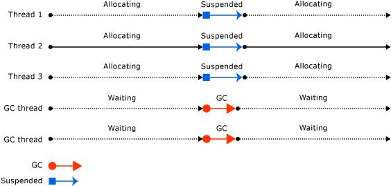

## 托管堆

#### 小对象堆，SOH

#### 大对象堆，LOH

#### 固定对象堆，POH

#### 冻结堆，FOH

## 后台回收和非并发回收

#### 非并发回收

GC期间，会挂起所有其他线程直到GC完成。

#### 后台回收

针对第2代托管堆的GC，后台回收有专门的线程来执行，不会挂起其他线程。

在后台垃圾回收期间对临时代（0和1代托管堆）的回收称为*前台*垃圾回收。当发生前台垃圾回收时，所有其他的托管线程（包括后台GC线程）都将挂起。

## 服务器模式

可以充分利用多核CPU的优势，高吞吐

> :bulb:GC语义下的吞吐指单位时间内能回收的内存大小或处理内存分配的效率。如，GC 每秒能回收 1GB 内存，或每秒能处理 1 百万次小对象分配

####　非并发回收

每个逻辑处理器对应一个托管堆和大对象堆，并有一个专门的高优先级线程负责GC。所有堆都可以通过用户代码访问，不同堆上的对象可以相互引用。

当触发垃圾回收时，所有GC线程同时运行，每个线程负责回收自己对应堆上的垃圾对象。

#### 后台回收

在非并发GC的基础上，针对第二代堆的GC有**额外的**专门线程执行，通常每个逻辑处理器一个线程。

与工作站后台垃圾回收线程不同，后台服务器 GC 线程不会超时。

服务器后台回收图示：

#### 性能

服务器垃圾回收可能会占用大量资源。例如，假设有 12 个进程使用服务器 GC 运行在具有四个逻辑 CPU 的计算机上。如果所有进程碰巧同时回收垃圾，它们将相互干扰，因为在同一个逻辑 CPU 上调度了 12 个线程。如果这些进程处于活动状态，则让它们都使用服务器 GC 并不是一个好主意。

如果您正在运行应用程序的数百个实例，请考虑在禁用并发垃圾回收的情况下使用工作站垃圾回收。这将减少上下文切换，从而提高性能。

## 工作站模式

只使用一个CPU核心而不论CPU有多少核心，低延迟

#### 非并发回收

哪个用户线程触发GC有哪个线程来执行GC，GC期间挂起其他线程。

#### 后台回收

针对第二代堆的GC有**一个**专门线程执行，Full GC期间针对0/1代堆的回收有用户线程执行，且会挂起其他线程。

工作站后台回收图示：

## DATAS GC

.NET 8中新增了Dynamic adaptation to application sizes（DATAS）的GC模式，该模式在.NET 9中默认开启。

该模式会根据长期数据大小设置在触发下一个 GC 之前允许的最大分配量，这有助于限制堆大小。托管堆的数量也不固定，会根据需要增加或减少堆的数量，力求在内存占用和吞吐量之间取得平衡。

它从一个堆开始，这意味着如果分配了许多线程，一些线程将需要等待。这会对吞吐量产生负面影响。

DATAS是现有 GC 模式之间的混合体，能够使用尽可能少的一个堆（如工作站 GC）和尽可能多的匹配机器核心计数（如服务器 GC）。

DATAS显著降低内存使用，同时增加了GC次数，**DATAS是内存效率优化器而非性能加速器**：

## 推荐阅读

[JDK11升级后竟让内存利用率飙升到90%以上？](https://mp.weixin.qq.com/s/-GcKchuSEjn46BEDM8bnGA?vid=1688855298418017&deviceid=f0774475-543e-4258-85a3-7234d867a804&version=4.1.0.6011&platform=win)  

[Dynamic adaptation to application sizes (DATAS) - .NET | Microsoft Learn](https://learn.microsoft.com/en-us/dotnet/standard/garbage-collection/datas)  

