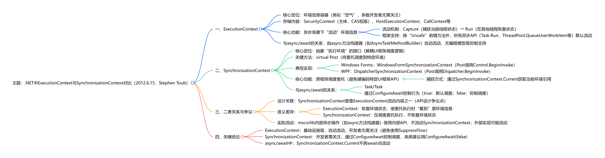

## Task状态机

#### 状态机介绍

编译器会为每个async方法会创建一个状态机：`IAsyncStateMachine`

```c#
public interface IAsyncStateMachine
{
    void MoveNext();
    void SetStateMachine(IAsyncStateMachine stateMachine);
}
```

`async`/`await` 是 .NET 提供的一种语法糖，它让开发者能够用同步的思维方式编写异步代码，而编译器负责将这些代码转换为高效的回调机制。所以，本质上也是通过回调来完成异步通知，只不过这个回调有编译器来生成。

```
[状态机] 
    ↓ 注册回调
[Awaiter] 
    ↓ 持有回调引用  
[异步操作] (Timer/Network/File I/O)
    ↓ 操作完成时
[底层系统] (OS Kernel/IOCP)
    ↓ 发送完成通知
[线程池] 
    ↓ 调用回调
[状态机.MoveNext()] ← 运行时就知道了！
```


1. **async/await的本质**：它是一种编译器的语法糖，将异步方法转换为一个状态机。这个状态机在遇到await时，会检查异步操作是否已经完成。如果已经完成，则同步继续执行；如果未完成，则注册一个回调，并返回。当异步操作完成时，回调会被调用，状态机从之前离开的地方继续执行。
2. **回调的注册**：通过awaiter模式，状态机调用awaiter的OnCompleted（或UnsafeOnCompleted）方法来注册回调。这个回调就是状态机的MoveNext方法。当异步操作完成时，这个MoveNext方法会被调用，从而恢复执行。
3. **与传统回调的区别**：传统回调需要手动编写回调函数，容易陷入回调地狱（Callback Hell）。而async/await通过状态机和编译器生成的代码，让我们可以用同步的编码方式写异步代码，避免了回调地狱。
4. **性能优化**：async/await机制中，如果异步操作已经完成，则不会注册回调，而是直接继续执行，这提高了性能。另外，状态机通过重用同一个MoveNext方法，避免了每次都要创建新的回调委托。
5. **与线程的关系**：async/await并不直接创建新线程，它只是利用现有的异步操作（如I/O完成端口、计时器等）并在操作完成时恢复执行。恢复执行时，默认情况下会在原始上下文（如UI线程）上恢复，这通过SynchronizationContext来实现。如果没有SynchronizationContext，则在线程池线程上恢复。


#### 结构体和状态机引发的BUG

```c#
var d1 = new StructDemo();
d1.SetTag();
// 执行该方法后，d1._tag的值不会发生变化
// 异步方法状态机会拷贝d1到堆上，异步方法中对于字段的修改不会影响到变量d1
await d1.SetTagAsync(); 


file struct StructDemo
{
    private int _tag = 0;

    public StructDemo()
    {
    }

    public void SetTag()
    {
        _tag = 1;
    }

    public async Task SetTagAsync()
    {
        _tag = 100;
        await Task.CompletedTask;
    }
}
```


[c# - Struct's private field value is not updated using an async method - Stack Overflow](https://stackoverflow.com/questions/31642535/structs-private-field-value-is-not-updated-using-an-async-method)


## 上下文

#### ExecutionContext 

数据上下文，实现数据在异步流程中流动，解决ThreadLocal无法穿越异步流程的问题；

#### SynchronizationContext

执行上下文，主要用于UI编程中，ASP.NET Core中没有该上下文。





| 对比维度            | ExecutionContext                                   | SynchronizationContext                                    |
| ------------------- | -------------------------------------------------- | --------------------------------------------------------- |
| 核心语义            | 恢复环境状态，使委托执行时 “看到” 原线程的环境信息 | 调度委托执行，仅决定 “在哪里 / 何时” 执行，不恢复环境状态 |
| 开发者感知度        | 基础设施级，多数开发者无需关注                     | 应用级，需关注（如 UI 线程调度）                          |
| 与 async/await 关联 | 自动流动，无编程模型级抑制支持                     | 需通过`ConfigureAwait`控制，有明确编程模型支持            |
| 框架角色            | 维持异步环境下的 “状态一致性”                      | 实现跨环境的 “执行调度”                                   |


总结：

- `ExecutionContext` 解决"我看到什么数据"的问题
- `SynchronizationContext` 解决"我在哪里执行"的问题


> [ExecutionContext vs SynchronizationContext - .NET Blog](https://devblogs.microsoft.com/dotnet/executioncontext-vs-synchronizationcontext/)


## IAsyncLocal

ExecutionContext 保存了AsyncLocal的值，Thread又保存了ExecutionContext


```
Thread (物理执行单元)
  ↓ 持有
ExecutionContext (逻辑执行上下文) 
  ↓ 持有
IAsyncLocalValueMap (不可变字典)
  ↓ 存储
AsyncLocal<T> → Value (你的数据)
```


## Task调度

```c#
using System.Diagnostics;


var sw = new Stopwatch();
sw.Start();
var tasks = new Task[3];
var maxSecs = tasks.Length;

// await LongDelay(tasks);
await ShortDelayAsync(tasks);

sw.Stop();
Console.WriteLine(sw.ElapsedMilliseconds);

Console.WriteLine();
return;

// 等待时间为所有Task等待时间的总和
async Task LongDelayAsync(Task[] inputTasks)
{
    for (var i = 0; i < inputTasks.Length; i++)
    {
        var secs = maxSecs - i;
        await SleepAsync(secs);
    }
}

// 等待时间为所有Task中的最长等待时间
async Task ShortDelayAsync(Task[] inputTasks)
{
    // 先调度
    for (var i = 0; i < inputTasks.Length; i++)
    {
        var secs = maxSecs - i;
        inputTasks[i] = SleepAsync(secs);
    }

    // 再等待
    foreach (var task in inputTasks)
    {
        await task;
    }
}

async Task SleepAsync(int secs)
{
    // return Task.Delay(secs * 1_000);
    await Task.Delay(secs * 1_000);
    Console.WriteLine($"等待：{secs}秒");
}
```

### 对比Python中的异步编程

```python
import asyncio
import time


async def block(secs):
    await asyncio.sleep(secs)


async def main():
    # 等待时间为所有task等待时间的总和
    # for i in range(1, 4):
    #     await asyncio.create_task(block(i))

    # 等待时间为所有task中的最长等待时间
    tasks = [asyncio.create_task(block(secs)) for secs in range(1, 4)]
    for task in tasks:
        await task


if __name__ == '__main__':
    start_time = int(time.time())
    asyncio.run(main())
    end_time = int(time.time())
    print(end_time - start_time)
```

Python中的异步模型是基于时间循环（event loop），通过task来调度协程（coroutines）。JavaScript中的异步编程与此类似，详情可参考：[异步与协程](../../JavaScript/异步与协程/异步与协程.md)。


Task.Yield作用

让渡控制权

[Consuming the Task-based Asynchronous Pattern - .NET | Microsoft Learn](https://learn.microsoft.com/en-us/dotnet/standard/asynchronous-programming-patterns/consuming-the-task-based-asynchronous-pattern#configuring-suspension-and-resumption-with-yield-and-configureawait)  

[Internal Mechanisms of **Tasks** in .NET](https://medium.com/net-under-the-hood/internal-mechanisms-of-tasks-in-net-ef461956d4a7)  

[.NET ThreadPool starvation, and how queuing makes it worse | by Kevin Gosse | Criteo R&D Blog | Medium](https://medium.com/criteo-engineering/net-threadpool-starvation-and-how-queuing-makes-it-worse-512c8d570527)  