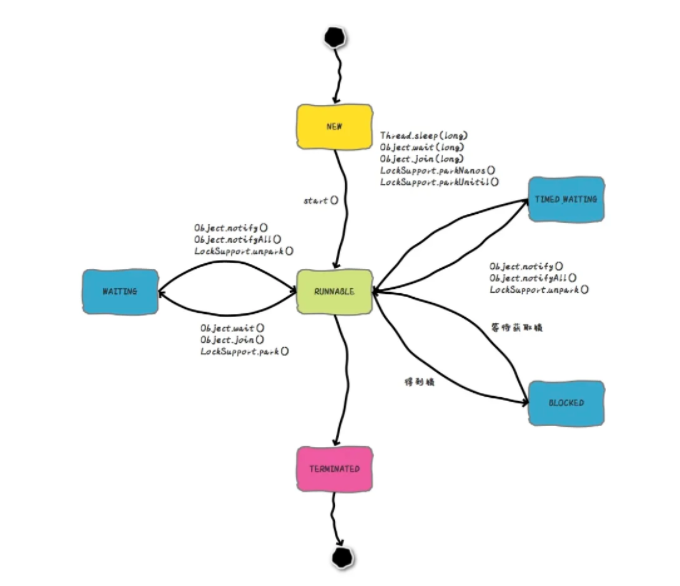
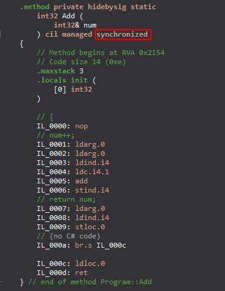

本文分为异步编程、线程安全、并发编程三部分

### 异步

问：async void和async Task/async Task<T>的区别？

答：

问：什么是async/sync？什么是block/non-block？

答：根据任务发起者所在线程是否会被任务阻塞分为block和non-block，block模式，任务发起线程在获取到结果之前线程就等着，啥也不干。non-block则是任务发起线程会立即获得一个结果，这个结果不一定是任务计算后的实际值，实际任务的执行则有其他线程负责。 通常提到block和non-block时多指I/O操作。

​        根据任务发起者所在线程是否会等待任务结束分为async/sync。

> [AspNetCoreDiagnosticScenarios/AsyncGuidance.md](https://github.com/davidfowl/AspNetCoreDiagnosticScenarios/blob/master/AsyncGuidance.md)

### 多线程

问：.NET中线程有哪几种状态？状态间如何转换？

答：.NET中线程状态转换如下所示


问：Thread.Yield与Thread.Sleep的区别

答：Thread.Yield会让出当前线程的剩余时间片，处理器会调度其他已就绪的且和当前线程处于**同一处理器**的线程。Thread.Sleep(0)允许处理器调度和当前线程具有**相同或更高优先级**的已就绪线程，如果没有，则当前线程继续执行。Thread.Sleep(1)和Thread.Sleep(0)相比，不用考虑其他已就绪线程的优先级。

[Thread.Sleep(0) vs Sleep(1) vs Yeild](https://www.cnblogs.com/stg609/p/3857242.html)

阻塞、等待、挂起什么区别？这三种状态下的线程是否还能被用于执行其他任务？对线程池的影响？

block vs waiting

[漫话：如何给女朋友解释为什么Java线程没有Running状态？](https://mp.weixin.qq.com/s/Vr5E68TEcU2tu7-5K03MBA)




问：I/O thread 和 Worker thread有什么区别

答：本质上没区别，只是用处不同。主要用于防范线程池中线程都用于等待I/O操作而导致系统无法响应。


### 线程安全

问：什么是线程安全？

答：[Thread safety - Wikipedia](https://en.wikipedia.org/wiki/Thread_safety)

.NET provides a range of types that you can use to synchronize access to a shared resource or coordinate thread interaction: [Overview of synchronization primitives](https://docs.microsoft.com/en-us/dotnet/standard/threading/overview-of-synchronization-primitives)


#### 多线程操作文件

问：系统使用如NLog之类日志组件记录日志文件时，属于多线程场景。那么，NLog是如何避免多线程写冲突的？

答：


问：多线程读写文件如何做？

答：

```c#
// 运行这段代码，同时用记事本打开1.txt修改文件内容然后保存，控制台打印出新的文本内容
using var fs = new FileStream(@"C:\Users\eason\Desktop\1.txt", FileMode.Open, FileAccess.ReadWrite, FileShare.ReadWrite);
using var fr = new StreamReader(fs, Encoding.UTF8);
while (true)
{
    Console.WriteLine(fr.ReadToEnd());
    fs.Position = 0;
    Thread.Sleep(1 * 1000);
}
```


#### ThreadStatic vs ThreadLocal vs AsyncLocal


#### lock/Monitor vs SemaphoreSlim vs WaitHandle


问：lock语句中能不能使用await？若不能，为什么？

答：哪个线程使用lock加锁，就要有哪个线程负责释放。await/Task默认的调度机制是线程池，会有线程的切换，有可能导致锁无法释放。

```c#
class Program
{
    private static readonly object _obj = new object();

    static async Task Main(string[] args)
    {
        await LockAsync();
        Console.ReadKey();
    }
    
    static async Task LockAsync()
    {
        lock (_obj)
        {
            Console.WriteLine("lock");
            // Error CS1996: Cannot await in the body of a lock statement
            await Task.CompletedTask;
        }
    }
}
```

问：lock的实现原理？

答：通过引用类型对象的同步块索引来实现。

问：lock中所使用的对象，有哪些限制？

答：引用类型对象，因为lock实际调用的是`Monitor.Enter`方法，使用值类型会导致装箱操作，同一个值类型每次装箱后产生的对象是不同的，不能保证临界区线程安全；

不能是字符串，字符串有可能已被暂存，使用字符串会导致锁竞争甚至死锁；

不能是类型，其他地方也有可能使用类型信息，如：typeof操作符或反射；

同一临界区域lock所使用的对象必须是同一个，不同临界区域lock应使用不同的对象。

> 一句话总结，每个临界区lock所使用的对象必须是**专用且唯一**的，否则就会存在锁竞争，甚至导致死锁。

#### synchronized

JAVA语言层面有synchronized关键字，.NET则通过[MethodImplOptions](https://docs.microsoft.com/en-us/dotnet/api/system.runtime.compilerservices.methodimploptions?view=net-6.0)在IL层面提供了synchronized：

```c#
[MethodImpl(MethodImplOptions.Synchronized)]
static int Add(ref int num)
{
    num += 1;
    return num;
}
```

IL代码如下：



> :warning: Locking on the instance or on the type, as with the `Synchronized` flag, is not recommended for public types, because code other than your own can take locks on public types and instances. This might cause deadlocks or other synchronization problems.

#### 锁

> 锁的目的是为了保护**可变资源**，或者换句话说，是为了避免可变资源的多个潜在用户访问资源已被破坏的版本。[原文](https://www.infoq.cn/article/2009/03/CSharpDeadlockFixed?source=app_share)

可重入锁、读写锁、公平锁、乐观锁、分布式锁(RedLock)

问：什么是死锁

答：多个逻辑单元（代码片段）之间互相等待对方释放临界资源（变量、文件等），使系统进入阻塞状态

问：什么情况下会出现死锁

答：出现死锁的四个条件：

+ 临界资源
+ 多个代码片段并发访问临界资源
+ 每个代码片段访问临界资源的过程不可打断，直到使用完毕释放
+ 代码片段间互相等待对方释放临界资源

经典死锁场景，[两个线程两把锁](https://learn.microsoft.com/en-us/archive/msdn-magazine/2006/april/avoiding-and-detecting-deadlocks-in-net-apps-with-csharp-and-c)：

```tex
To further illustrate how a deadlock might occur, imagine the following sequence of events:

Thread 1 acquires lock A.
Thread 2 acquires lock B.
Thread 1 attempts to acquire lock B, but it is already held by Thread 2 and thus Thread 1 blocks until B is released.
Thread 2 attempts to acquire lock A, but it is held by Thread 1 and thus Thread 2 blocks until A is released.
```

```c#
object lockA = new object(); 
object lockB = new object(); 
// Thread 1 
void t1() { lock (lockA) { lock (lockB) { /* ... */ } } } 
// Thread 2 
void t2() { lock (lockB) { lock (lockA) { /* ... */ } } }
```


问：单线程能否出现死锁现象？

答：使用不可重入锁

```c#
var semaphore = new SemaphoreSlim(1, 1);
semaphore.Wait();
semaphore.Wait();

semaphore.Release();
semaphore.Release();
```


问：只有一把锁（一个用来锁定的对象）能否造成死锁？

答：https://github.com/dotnet/docs/issues/7704#issuecomment-1260509154

> 参考：.NET多线程博客/ConcurrentDictionary GetOrAdd/AddOrUpdate 非线程安全

```c#
var over = 0;
var demo = new Demo();
demo.Deadlock(() =>
{
    // 使用另一个线程尝试获取锁
    Task.Run(() =>
    {
        Console.WriteLine($"Another thread({Thread.CurrentThread.ManagedThreadId}) executing");
        new Demo().Deadlock(() =>
        {
            for (var i = 0; i < 20; i++)
            {
                over++;
                Thread.Sleep(1_000);
            }
        });
    });
    // 依赖另一个线程的执行结果
    while (true)
    {
        if (over > 15)
        {
            break;
        }
    }
});

class Demo
{
    private static readonly object _obj = new();

    public void Deadlock(Action action)
    {
        Console.WriteLine($"Thread({Thread.CurrentThread.ManagedThreadId}) will get lock");
        lock (_obj)
        {
            Console.WriteLine($"Thread({Thread.CurrentThread.ManagedThreadId}) got lock");

            action();
        }

        Console.WriteLine($"Thread({Thread.CurrentThread.ManagedThreadId}) release lock");
    }
}
```


问：如何避免死锁

答：不同线程获取多个资源的顺序保持一致；持有锁的时间尽可能短（锁的粒度尽可能细）；获取锁等待设置超时时间；

#### 无锁编程

CAS与自旋锁


#### 并发集合

[System.Collections.Concurrent Namespace](https://docs.microsoft.com/en-us/dotnet/api/system.collections.concurrent?view=net-5.0)


> 参考 [不可不说的Java“锁”事 - 美团技术团队](https://tech.meituan.com/2018/11/15/java-lock.html)