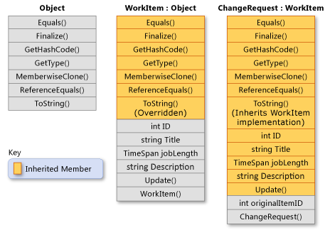

## 技术敏感度

当前用的.NET哪个版本？.NET最新版本是哪个？最新版本有哪些亮点？

C#语言发展到哪个版本了？C#最新版本特性有哪些？

接触过哪些开源项目？

除C#之外还使用过哪些编程语言？

问：听说过哪些开源基金会？他们有什么代表性项目？

答：

| 基金会  | 项目名  |
| ------- | ------- |
| APACHE  | Kafka   |
| APACHE  | JMeter  |
| OpenJS  | Node.js |
| OpenJS  | jQuery  |
| .NET    | .NET    |
| .NET    | Roslyn  |
| Mozilla |         |
| Linux   |         |


## 基础


问：值类型、引用类型区别

答：引用类型占用空间包括：数据+其他（同步快索引、引用类型指针等），值类型占用空间：数据；值类型属于非托管类型([Unmanaged types](https://docs.microsoft.com/en-us/dotnet/csharp/language-reference/builtin-types/unmanaged-types))；引用类型分配在托管堆上，值类型即可以在栈上也可以在托管堆上，分配到栈上的值类型无需GC；值类型传递时把数据拷贝一份进行传递，引用类型只传递引用。

](imgs/ref_type_vs_value_type_in_mem.png)

### 继承

问：.NET中子类可以继承父类中的哪些成员？

答：子类会继承父类中除构造函数和析构函数之外的所有成员，包括私有成员。不能在子类中访问父类的私有成员是因为访问修饰符的限制。可参考：[Inheritance - derive types to create more specialized behavior](https://docs.microsoft.com/en-us/dotnet/csharp/fundamentals/object-oriented/inheritance)



#### 对象实例化机制

问：抽象类是否可以被实例化？是否可以有实例构造函数？不能实例化为什么要有实例构造函数？

答：抽象类不能被实例化，可以有实例构造函数。抽象类中可以包含实例成员，子类在初始化时会调用父类的实例构造函数初始化实例成员。

#### 重写

##### 语法规范

方法签名不能变更

[Beginning with C# 9.0, read-only overriding properties support covariant return types.](https://docs.microsoft.com/en-us/dotnet/csharp/language-reference/keywords/override)

针对protected internal的方法进行跨程序集override时，访问修饰符需变更为protected，参考示例重写EF Core中DbContext的OnModelCreating或OnConfiguring方法。参考文档：[Override methods](https://docs.microsoft.com/en-us/dotnet/csharp/language-reference/language-specification/classes#override-methods)

##### new 和 override的区别

override只能用于virtual或者override成员

可使用sealed禁止子类再override

new 可以是任意成员

参考：[Knowing When to Use Override and New Keywords (C# Programming Guide)](https://docs.microsoft.com/en-us/dotnet/csharp/programming-guide/classes-and-structs/knowing-when-to-use-override-and-new-keywords)


### 泛型

问：为什么需要泛型约束？泛型约束存在的意义是什么？

答：如果没有泛型约束，那么泛型就退化为了Object类型，泛型也就没有了存在的意义。正是因为有了泛型约束，我们在编码时，在不知道实参的情况下可以抽象出部分公共逻辑代码，从而减少我们的编码工作量；泛型约束还可以避免装箱、拆箱操作，从而提高性能；最后，泛型约束可以在编译时进行类型检查，确保类型安全，以免运行时出现异常。

问：编译器如何编译泛型代码，和非泛型代码相比，编译后有什么不同？

答：泛型代码编译后代码量会比非泛型多。


## 进阶

### 设计模式

问：实际工作中使用过哪些设计模式？请举例说明

答：

### GC

问：什么是托管资源和非托管资源？

答：

问：如何清理非托管资源？

答：通常通过实现[dispose pattern](https://docs.microsoft.com/en-us/dotnet/standard/garbage-collection/implementing-dispose)来释放非托管资源，也可以通过[析构函数](https://docs.microsoft.com/en-us/dotnet/csharp/programming-guide/classes-and-structs/finalizers)的方式来实现对非托管资源的释放。 [Cleaning up unmanaged resources](https://docs.microsoft.com/en-us/dotnet/standard/garbage-collection/unmanaged)。

问：IDisposable接口的作用？

答：

有哪几种模式？如何切换？workstation vs. server GC

Background vs Concurrent GC

参考：[Fundamentals of garbage collection](https://docs.microsoft.com/en-us/dotnet/standard/garbage-collection/fundamentals)

运行时如何配置，[Run-time configuration options for garbage collection](https://docs.microsoft.com/en-us/dotnet/core/run-time-config/garbage-collector)

问：内存泄漏问题排查思路

答：

> 参考 [垃圾回收算法](https://github.com/CwjXFH/StudyNotes/blob/master/Blogs/垃圾回收算法.md)


### 性能与问题排查

#### 性能

性能问题分析通用套路
有哪些工具

#### 问题排查
dump文件


## 框架

### 配置


### IoC

[Dependency injection in .NET](https://docs.microsoft.com/en-us/dotnet/core/extensions/dependency-injection)

.NET provides a built-in service container, [IServiceProvider](https://docs.microsoft.com/en-us/dotnet/api/system.iserviceprovider). Services are typically registered at the app's start-up, and appended to an [IServiceCollection](https://docs.microsoft.com/en-us/dotnet/api/microsoft.extensions.dependencyinjection.iservicecollection). Once all services are added, you use [BuildServiceProvider](https://docs.microsoft.com/en-us/dotnet/api/microsoft.extensions.dependencyinjection.servicecollectioncontainerbuilderextensions.buildserviceprovider) to create the service container.


[Disposal of services](https://docs.microsoft.com/en-us/dotnet/core/extensions/dependency-injection-guidelines#disposal-of-services)

> The container is responsible for cleanup of types it creates, and calls Dispose on [IDisposable](https://docs.microsoft.com/en-us/dotnet/api/system.idisposable) instances. Services resolved from the container should never be disposed by the developer. If a type or factory is registered as a singleton, the container disposes the singleton automatically.


[Scope validation](https://docs.microsoft.com/en-us/dotnet/core/extensions/dependency-injection#scope-validation)

Scoped services are disposed by the container that created them. If a scoped service is created in the root container, the service's lifetime is effectively promoted to singleton because it's only disposed by the root container when the app shuts down. Validating service scopes catches these situations when `BuildServiceProvider` is called.

#### lifetime、scope、GC


### EF Core

#### DbContext

问：是否可以在async void方法中调用DbContext实例的异步方法？

答：不可用，DbContext不是线程安全的。async void方法无法被等待，有可能造成DbContext实例提前释放或者被多个线程使用的情况。

#### Model Configure


#### Migrations


#### CRUD


#### Change Tracking

[Change Tracking in EF Core](https://docs.microsoft.com/en-us/ef/core/change-tracking/)

Identity Resolution

问：Entity有几种状态？如何追踪Entity状态变化？

[Accessing Tracked Entities](https://docs.microsoft.com/en-us/ef/core/change-tracking/entity-entries)

#### 事务


#### 内部原理


### ASP.NET Core

#### Host

问：WebHost和Generic Host的区别？

答：https://docs.microsoft.com/en-us/aspnet/core/fundamentals/host/generic-host?view=aspnetcore-6.0


#### 配置读取

问：ASP.NET Core中如何读取配置信息？

答：ASP.NET Core中配置信息的读取可使用IConfiguration接口，或者Options Pattern。Options Pattern提供了三个接口如下：

+ IOptions<TOptions>，生命周期是Singleton，应用启动后，无法感知配置信息的变化
+ IOptionsSnapshot<TOptions>，生命周期是Scope，每次使用时重新计算配置信息
+ IOptionsMonitor<TOptions>，生命周期是Singleton，可感知配置信息的变化

要告知配置信息的变化，在构建Host时要指定配置文件发生变化时重新加载配置文件：

```c#
public class Program
{
    public static void Main(string[] args)
    {
        new HostBuilder()
            .UseContentRoot(Directory.GetCurrentDirectory())
            .ConfigureAppConfiguration((hostBuilderContext, cfgBuilder) =>
            {
                // reloadOnChange参数设为true
                cfgBuilder.AddJsonFile("appsettings.json", false, true);
                cfgBuilder.AddJsonFile($"appsettings.{hostBuilderContext.HostingEnvironment.EnvironmentName}.json", false, true);
            })
            .ConfigureLogging(logBuilder =>
            {
                logBuilder.AddConsole();
                logBuilder.SetMinimumLevel(LogLevel.Information);
            })
            .ConfigureWebHostDefaults(hostBuilder =>
            {
                hostBuilder.UseStartup<Startup>();
            })
            .Build()
            .Run();
    }
}
```


>  IConfigureOptions<TOptions> vs IPostConfigureOptions<TOptions>


#### 环境变量

https://docs.microsoft.com/en-us/aspnet/core/fundamentals/configuration/?view=aspnetcore-5.0#environment-variables

#### IoC

问：内置IoC容器有哪几种生命周期？

答：Singleton、Scope、Transient

问：不同生命周期的对象分别在什么时候被GC回收？

答：Scope对象在Http请求结束后可以被GC回收、Transient对象在使用完后即可被GC回收，Scope对象和Transient对象的回收时机不确定。Signleton对象在整个应用生命周期内不会被GC回收。


#### Middleware


#### 认证授权

Open Id/OAuth

JWT

ClaimIdentity


#### 打包发布


## 中间件

#### Redis

缓存

限流

分布式锁

简单消息队列

排行榜

计数器

布隆过滤器

#### MQ

异步

解耦

削峰填谷

消息通讯，如：分布式事务（发件箱模式、可靠消息投递）

并行请求串行化

## 数据库

参考 [StudyNotes/Database at master · CwjXFH/StudyNotes (github.com)](https://github.com/CwjXFH/StudyNotes/tree/master/Database)

## Linux

参考《开发人员Linux面试》