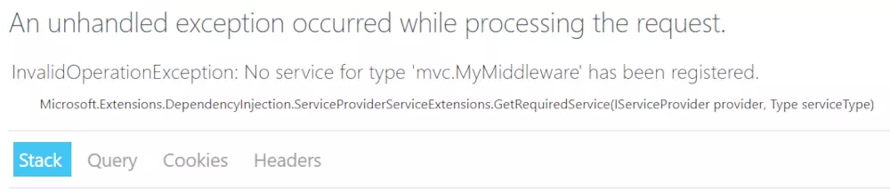
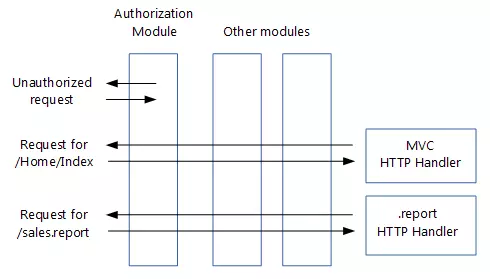

# [ASP.NET Core Middleware](https://www.cnblogs.com/Cwj-XFH/p/9690728.html)

中间件(Middleware)是ASP.NET Core中的一个重要特性。所谓中间件就是嵌入到应用管道中用于处理请求和响应的一段代码。ASP.NET Core Middleware可以分为两种类型：

- [Conventional Middleware](https://docs.microsoft.com/en-us/aspnet/core/fundamentals/middleware/?view=aspnetcore-2.1)
- [IMiddleware](https://docs.microsoft.com/en-us/aspnet/core/fundamentals/middleware/extensibility?view=aspnetcore-2.1)

## **Conventional Middleware**

这种中间件没有实现特定的接口或者继承特定类，它更像是Duck Typing (你走起路来像个鸭子, 叫起来像个鸭子, 那么你就是个鸭子)。有两种表现形式：

#### **匿名方法**

这种方式又称为内联中间件（in-line middleware），可以使用[Run](https://docs.microsoft.com/dotnet/api/microsoft.aspnetcore.builder.runextensions.run), [Map](https://docs.microsoft.com/dotnet/api/microsoft.aspnetcore.builder.mapextensions.map), [Use](https://docs.microsoft.com/dotnet/api/microsoft.aspnetcore.builder.useextensions.use),[MapWhen](https://docs.microsoft.com/en-us/dotnet/api/microsoft.aspnetcore.builder.mapwhenextensions)等扩展方法来实现。如：

```c#
public class Startup
{
    public void Configure(IApplicationBuilder app)
    {
        app.Use(async (context, next) =>
        {
            // Do work that doesn't write to the Response.
            await next.Invoke();
            // Do logging or other work that doesn't write to the Response.
        });
    }
}
```

`IApplicationBuilder`的扩展方法：`Run`、`Map`、`MapWhen`及
`Use(this IApplicationBuilder app, Func<HttpContext, Func<Task>, Task> middleware)`，最终都会调用`IApplicationBuilder`接口中的`Use(Func<RequestDelegate, RequestDelegate> middleware)`方法来实现向请求处理管道中注入中间件，后面会对源码做分析。

#### **自定义中间件类**

这种形式利于代码的复用，如：

```c#
public class XfhMiddleware
{
    private readonly RequestDelegate _next;

    //在应用程序的生命周期中，中间件的构造函数只会被调用一次
    public XfhMiddleware(RequestDelegate next)
    {
        this._next = next;
    }

    public async Task InvokeAsync(HttpContext context)
    {
        // Do something...
        await _next(context);
    }
}

public static class XfhMiddlewareExtension
{
    public static IApplicationBuilder UseXfhMiddleware(this IApplicationBuilder builder)
    {
        // 使用UseMiddleware将自定义中间件添加到请求处理管道中
        return builder.UseMiddleware<XfhMiddleware>();
    }
}
```

将自定义中间件配置到请求处理管道中

```c#
public void Configure(IApplicationBuilder app, IHostingEnvironment env)
{
    app.UseXfhMiddleware();
}
```

## **IMiddleware**

`IMiddleware`提供了强类型约束的中间件，其默认实现是[MiddlewareFactory](https://docs.microsoft.com/en-us/dotnet/api/microsoft.aspnetcore.http.middlewarefactory)，接口定义如下：

```c#
public interface IMiddleware
{
    Task InvokeAsync(HttpContext context, RequestDelegate next);
}
```

`IMiddlewareFactory`用于创建`IMiddleware`实例及对实例进行回收，接口定义：

```c#
public interface IMiddlewareFactory
{
    public IMiddleware Create (Type middlewareType);
    
    public void Release (IMiddleware middleware);
}
```

自定义`IMiddleware`类型中间件

```c#
public class MyMiddleware : IMiddleware
{
    public async Task InvokeAsync(HttpContext context, RequestDelegate next)
    {
        await next(context);
    }
}


public static class MyMiddlewareExtensions
{
    public static IApplicationBuilder UseMyMiddleware(this IApplicationBuilder builder)
    {
        return builder.UseMiddleware<MyMiddleware>();
    }
}
```

将中间件注入到请求处理管道：

```c#
public void Configure(IApplicationBuilder app, IHostingEnvironment env)
{
    app.UseMyMiddleware();
}
```

 使用`IMiddleware`类型的中间件需要在容器中进行注册，否则抛异常，具体原因下面分析：

 



 将中间件注入到容器中：

```c#
public void ConfigureServices(IServiceCollection services)
{
    services.AddSingleton<MyMiddleware>();
    services.AddMvc();
}
```

 

## **一段警告**

下面贴一段微软文档中的警告，大意是不要试图去改变已发往客户端的响应内容，否则可能会引发异常。实在是太懒了，不想翻译就把原文贴出来了：

> Warning
>
> Don't call `next.Invoke` after the response has been sent to the client. Changes to [HttpResponse](https://docs.microsoft.com/dotnet/api/microsoft.aspnetcore.http.httpresponse) after the response has started throw an exception. For example, changes such as setting headers and a status code throw an exception. Writing to the response body after calling next:
>
> - May cause a protocol violation. For example, writing more than the stated Content-Length.
> - May corrupt the body format. For example, writing an HTML footer to a CSS file.
>
> [HasStarted](https://docs.microsoft.com/dotnet/api/microsoft.aspnetcore.http.httpresponse.hasstarted) is a useful hint to indicate if headers have been sent or the body has been written to.


## **UseMiddleware**

前面将自定义中间件注入到请求处理管道时用到了[UseMiddleware](https://docs.microsoft.com/en-us/dotnet/api/microsoft.aspnetcore.builder.usemiddlewareextensions.usemiddleware?view=aspnetcore-2.1#Microsoft_AspNetCore_Builder_UseMiddlewareExtensions_UseMiddleware_Microsoft_AspNetCore_Builder_IApplicationBuilder_System_Type_System_Object___)方法，从方法签名中可以看到`UserMiddleware`可以[接受多个参数](https://docs.microsoft.com/en-us/aspnet/core/fundamentals/middleware/index?view=aspnetcore-2.1#per-request-dependencies)：

```c#
public static class UseMiddlewareExtensions
{
    public static IApplicationBuilder UseMiddleware<TMiddleware>(this IApplicationBuilder app,  
            params object[] args);
   
    public static IApplicationBuilder UseMiddleware(this IApplicationBuilder app, 
            Type middleware, params object[] args);
}
```

接下来我们看下`UserMiddleware`方法的具体实现，由于该方法代码量较大，所以这里只看其中的关键部分，方法整体流程如下：

```c#
public static IApplicationBuilder UseMiddleware(this IApplicationBuilder app, Type middleware,
    params object[] args)
{
    // IMiddleware类型
    if (typeof(IMiddleware).GetTypeInfo().IsAssignableFrom(middleware.GetTypeInfo()))
    {
        // IMiddleware doesn't support passing args directly since it's
        // activated from the container
        if (args.Length > 0)
        {
            throw new NotSupportedException(
                Resources.FormatException_UseMiddlewareExplicitArgumentsNotSupported(typeof(IMiddleware)));
        }
        return UseMiddlewareInterface(app, middleware);
    }
    
    // Conventional Middleware
    var applicationServices = app.ApplicationServices;
    return app.Use(next =>
    {
        // 判断传入的中间件是否符合约束
    });
}
```

- 该方法首先判断传入的middleware是否是`IMiddleware`类型，如果是则调用`UseMiddlewareInterface`

从这段代码中可以看到`IMiddlewareFactory`负责创建并回收`IMiddleware`对象

```c#
public static class UseMiddlewareExtensions
{
    private static IApplicationBuilder UseMiddlewareInterface(IApplicationBuilder app, Type middlewareType)
    {
        return app.Use(next =>
        {
            return async context =>
            {
                // 从容器中获取IMiddlewareFactory实例
                var middlewareFactory =
                    (IMiddlewareFactory) context.RequestServices.GetService(typeof(IMiddlewareFactory));
                if (middlewareFactory == null)
                {
                    // No middleware factory
                    throw new InvalidOperationException(
                 Resources.FormatException_UseMiddlewareNoMiddlewareFactory(typeof(IMiddlewareFactory)));
                }
                
                var middleware = middlewareFactory.Create(middlewareType);
                if (middleware == null)
                {
                    // The factory returned null, it's a broken implementation
                    throw new InvalidOperationException(
                        Resources.FormatException_UseMiddlewareUnableToCreateMiddleware(middlewareFactory.GetType(),
                            middlewareType));
                }
                
                try
                {
                    await middleware.InvokeAsync(context, next);
                }
                finally
                {
                    middlewareFactory.Release(middleware);
                }
            };
        });
    }
}
```

从`MiddlewareFactory`的`Create`方法中可以看到，`IMiddleware`实例是从容器中获取的，若容器中找不到则会抛出异常：

```c#
public class MiddlewareFactory : IMiddlewareFactory
{
    private readonly IServiceProvider _serviceProvider;
    
    public MiddlewareFactory(IServiceProvider serviceProvider)
    {
        this._serviceProvider = serviceProvider;
    }
    
    public IMiddleware Create(Type middlewareType)
    {
        return ServiceProviderServiceExtensions.GetRequiredService(this._serviceProvider, middlewareType) as IMiddleware;
    }
    
    public void Release(IMiddleware middleware)
    {
    }
}
```

- 若是`Conventional Middleware`则判断传入的middleware是否符合约束

首先判断传入的middleware中是否仅包含一个名称为Invoke或InvokeAsync的公共实例方法

```c#
// UseMiddlewareExtensions类中的两个常量
internal const string InvokeMethodName = "Invoke";
internal const string InvokeAsyncMethodName = "InvokeAsync";

// UserMiddleware方法
var methods = middleware.GetMethods(BindingFlags.Instance | BindingFlags.Public);
var invokeMethods = methods.Where(m =>
    string.Equals(m.Name, InvokeMethodName, StringComparison.Ordinal)
    || string.Equals(m.Name, InvokeAsyncMethodName, StringComparison.Ordinal)
).ToArray();
if (invokeMethods.Length > 1)
{
    throw new InvalidOperationException(
        Resources.FormatException_UseMiddleMutlipleInvokes(InvokeMethodName, InvokeAsyncMethodName));
}
if (invokeMethods.Length == 0)
{
    throw new InvalidOperationException(
        Resources.FormatException_UseMiddlewareNoInvokeMethod(InvokeMethodName, InvokeAsyncMethodName,
            middleware));
}
```

其次判断方法的返回类型是否是`Task`：

```c#
var methodInfo = invokeMethods[0];
if (!typeof(Task).IsAssignableFrom(methodInfo.ReturnType))
{
    throw new InvalidOperationException(
        Resources.FormatException_UseMiddlewareNonTaskReturnType(InvokeMethodName,
            InvokeAsyncMethodName, nameof(Task)));
}
```

然后再判断，方法的第一个参数是否是`HttpContext`类型：

```c#
var parameters = methodInfo.GetParameters();
if (parameters.Length == 0 || parameters[0].ParameterType != typeof(HttpContext))
{
    throw new InvalidOperationException(
        Resources.FormatException_UseMiddlewareNoParameters(InvokeMethodName, InvokeAsyncMethodName,
            nameof(HttpContext)));
}
```

对于`Invoke`或`InvokeAsync`仅包含一个`HttpContext`类型参数的情况用到了反射([ActivatorUtilities.CreateInstance](https://github.com/aspnet/DependencyInjection/blob/master/shared/Microsoft.Extensions.ActivatorUtilities.Sources/ActivatorUtilities.cs)方法中)来构建`RequestDelegate`

```c#
var ctorArgs = new object[args.Length + 1];
ctorArgs[0] = next;
Array.Copy(args, 0, ctorArgs, 1, args.Length);
var instance = ActivatorUtilities.CreateInstance(app.ApplicationServices, middlewa
if (parameters.Length == 1)
{
    return (RequestDelegate) methodInfo.CreateDelegate(typeof(RequestDelegate), in
}
```

对于包含多个参数的情况，则使用了表达式树来构建`RequestDelegate`

```c#
var factory = Compile<object>(methodInfo, parameters);
return context =>
{
    var serviceProvider = context.RequestServices ?? applicationServices;
    if (serviceProvider == null)
    {
        throw new InvalidOperationException(
            Resources.FormatException_UseMiddlewareIServiceProviderNotAvailable(
                nameof(IServiceProvider)));
    }
    return factory(instance, context, serviceProvider);
};
```

完整的代码可以在[Github](https://github.com/aspnet/HttpAbstractions/blob/master/src/Microsoft.AspNetCore.Http.Abstractions/Extensions/UseMiddlewareExtensions.cs)上看到。

## **Use(Func<RequestDelegate, RequestDelegate> middleware)**

上述所有中间件，最终都会调用`IApplicationBuilder`接口中的`Use(Func<RequestDelegate, RequestDelegate> middleware)`方法来实现向请求处理管道中注册中间件，该方法在[ApplicationBuilder](https://github.com/aspnet/HttpAbstractions/blob/master/src/Microsoft.AspNetCore.Http/Internal/ApplicationBuilder.cs)类的实现如下：

```c#
public class ApplicationBuilder : IApplicationBuilder
{
    private readonly IList<Func<RequestDelegate, RequestDelegate>> _components =
        new List<Func<RequestDelegate, RequestDelegate>>();

    public IApplicationBuilder Use(Func<RequestDelegate, RequestDelegate> middleware)
    {
        this._components.Add(middleware);
        return this;
    }
}
```

从上面代码中可以看到，中间件是一个`RequestDelegate`类型的委托，请求处理管道其实是一个委托列表，请求委托签名如下：

```c#
public delegate Task RequestDelegate(HttpContext context);
```

 

## **与ASP.NET处理管道的区别**

 



 

传统的ASP.NET的处理管道是基于事件模型的，处理管道有多个`IHttpModule`和一个`IHttpHandler`组成。请求处理管道中各个模块被调用的顺序取决于两方面：

- 模块所注册事件被触发的先后顺序
- 注册同一事件的不同模块执行先后顺序有`Web.config`中的配置顺序决定


 

 

ASP.NET Core的请求处理管道则是有一堆中间件组成，相对ASP.NET更简单。

中间件处理请求和响应的顺序只与其在代码中的注册顺序有关：处理请求按注册顺序依次执行，处理响应按注册顺序反方向依次执行。

其次，在ASP.NET Core中只需使用代码，而无需使用`Global.asax`和`Web.config`来配置请求处理管道。

## **小结**

所谓中间件就是嵌入到应用管道中用于处理请求和响应的一段代码，它主要有两个作用：

- 处理请求和响应
- 可以阻止请求发往请求处理管道中的下一个中间件

在ASP.NET Core中，中间件是以`RequestDelegate`委托的形式体现的。

ASP.NET Core中整个请求处理管道的创建是围绕这种`IApplicationBuilder`接口进行的，请求处理管道是一个`List<RequestDelegate>`类型的列表。

## **推荐阅读**

[ASP.NET Core Middleware](https://docs.microsoft.com/en-us/aspnet/core/fundamentals/middleware/?view=aspnetcore-2.1)
[Factory-based middleware activation in ASP.NET Core](https://docs.microsoft.com/en-us/aspnet/core/fundamentals/middleware/extensibility?view=aspnetcore-2.1)
[Migrate HTTP handlers and modules to ASP.NET Core middleware](https://docs.microsoft.com/en-us/aspnet/core/migration/http-modules?view=aspnetcore-2.1)
[用ASP.NET Core 2.0 建立规范的 REST API -- 预备知识](https://www.cnblogs.com/cgzl/p/9010978.html)

[ASP.NET MVC 5 APPLICATION LIFECYCLE – HIGH-LEVEL VIEW（强烈推荐）](https://www-asp.azureedge.net/v-2016-09-01-001/media/4773381/lifecycle-of-an-aspnet-mvc-5-application.pdf)
[ASP.NET WEB API 2: HTTP MESSAGE LIFECYLE（墙裂推荐）](https://www.asp.net/media/4071077/aspnet-web-api-poster.pdf)
[ASP.NET MVC5请求处理管道和生命周期](https://www.jianshu.com/p/848fda7f79e0)