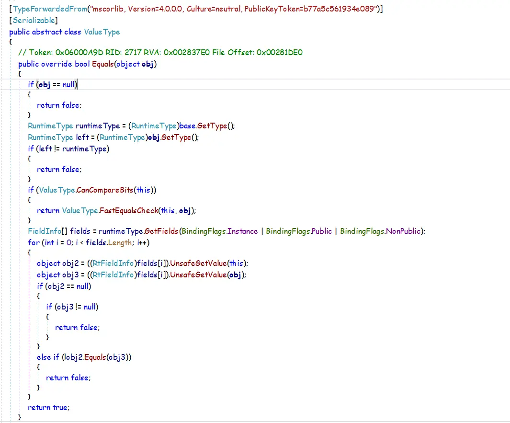
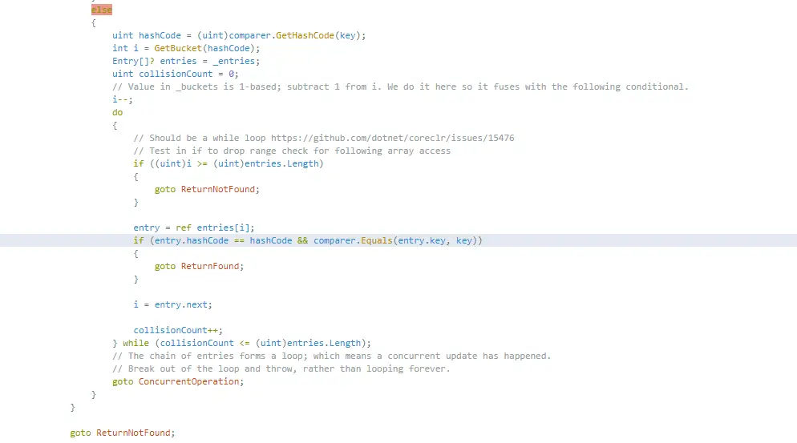

- [Object.Equals(Object)](#objectequalsobject)
    - [Object](#object)
    - [ValueType](#valuetype)
    - [重写Equals](#重写equals)
- [==](#)
- [Object.GetHashCode()](#objectgethashcode)
    - [Object](#object-1)
    - [ValueType](#valuetype-1)
    - [重写GetHashCode](#重写gethashcode)
- [系统优化思路](#系统优化思路)
- [推荐阅读](#推荐阅读)


公司系统中有一接口访问量大，内部计算逻辑较为复杂。在优化时打算把Request中的参数做为Key，Response做为Value放到进程内缓存中，以降低服务器压力，提高接口响应速度。因为Response中一些数据时效性要求较高，所以缓存设置一个较短的过期时间（比如10s）。

但这里牵涉到一个问题，如何有效的判断两次请求的参数是相等的。C#中自定义类型会从Object类继承Equals和GetHashCode两个方法，可以根据实际需求来重写这两个方法实现对象相等性比较。

## [Object.Equals(Object)](https://links.jianshu.com/go?to=https%3A%2F%2Fdocs.microsoft.com%2Fen-us%2Fdotnet%2Fapi%2Fsystem.object.equals%3Fview%3Dnetcore-3.0)

.NET 中不同类型对于Equals方法的默认实现如下：

| Type category                                                                                                                                                      | Equality defined by                                                                                                                                                                                | Comments                                                                                                                                                                                                          |
| ------------------------------------------------------------------------------------------------------------------------------------------------------------------ | -------------------------------------------------------------------------------------------------------------------------------------------------------------------------------------------------- | ----------------------------------------------------------------------------------------------------------------------------------------------------------------------------------------------------------------- |
| Class derived directly from [Object](https://links.jianshu.com/go?to=https%3A%2F%2Fdocs.microsoft.com%2Fen-us%2Fdotnet%2Fapi%2Fsystem.object%3Fview%3Dnetcore-3.0) | [Object.Equals(Object)](https://links.jianshu.com/go?to=https%3A%2F%2Fdocs.microsoft.com%2Fen-us%2Fdotnet%2Fapi%2Fsystem.object.equals%3Fview%3Dnetcore-3.0%23System_Object_Equals_System_Object_) | Reference equality; equivalent to calling [Object.ReferenceEquals](https://links.jianshu.com/go?to=https%3A%2F%2Fdocs.microsoft.com%2Fen-us%2Fdotnet%2Fapi%2Fsystem.object.referenceequals%3Fview%3Dnetcore-3.0). |
| Structure                                                                                                                                                          | [ValueType.Equals](https://links.jianshu.com/go?to=https%3A%2F%2Fdocs.microsoft.com%2Fen-us%2Fdotnet%2Fapi%2Fsystem.valuetype.equals%3Fview%3Dnetcore-3.0)                                         | Value equality; either direct byte-by-byte comparison or field-by-field comparison using reflection.                                                                                                              |
| Enumeration                                                                                                                                                        | [Enum.Equals](https://links.jianshu.com/go?to=https%3A%2F%2Fdocs.microsoft.com%2Fen-us%2Fdotnet%2Fapi%2Fsystem.enum.equals%3Fview%3Dnetcore-3.0)                                                   | Values must have the same enumeration type and the same underlying value.                                                                                                                                         |
| Delegate                                                                                                                                                           | [MulticastDelegate.Equals](https://links.jianshu.com/go?to=https%3A%2F%2Fdocs.microsoft.com%2Fen-us%2Fdotnet%2Fapi%2Fsystem.multicastdelegate.equals%3Fview%3Dnetcore-3.0)                         | Delegates must have the same type with identical invocation lists.                                                                                                                                                |
| Interface                                                                                                                                                          | [Object.Equals(Object)](https://links.jianshu.com/go?to=https%3A%2F%2Fdocs.microsoft.com%2Fen-us%2Fdotnet%2Fapi%2Fsystem.object.equals%3Fview%3Dnetcore-3.0%23System_Object_Equals_System_Object_) | Reference equality.                                                                                                                                                                                               |

#### Object

通过源码，可以看到Object中Equals方法的实现，即.NET中所有类型的默认实现：


#### ValueType

反编译之后，可以看到ValueType中Equals方法的实现，即值类型的默认实现，它重写了Object.Equals方法：



上面可以看到，ValueType中Equals实现思路如下：

- obj==null返回false
- 若this和obj的运行时类型不同则返回false
- 如果值类型中包含的字段均是值类型则逐字节比较字段值
- 若含有引用类型字段，则使用**使用反射**获取字段信息，然后调用字段的Equals方法来逐字段比较相等性

#### 重写Equals

Object的Equals仅通过引用来比较相等性。应该说是identity而非equality，与Python中的is、== 操作符类似;ValueType的Equals中使用了反射性能较差。这种默认实现通常不能满足需求，自定义实现Equals思路如下：

- obj为null，返回false，因为Equals是实例方法，this不会为null
- 对于引用类型，this和obj引用同一个对象返回true
- 调用GetType方法来判断this和obj在运行时是否是相同类型
- 必要时调用基类的Equals方法来比较基类中字段的相等性（通常不调用Object类的Equals）
- 调用Equals方法逐字段进行比较

根据上述思路，实现自定义类型的Equals方法：


```c#
public class Entity
{
    public Entity(string tag, int count, IDictionary<string, string> descriptioins)
    {
        this.Tag = tag;
        this.Count = count;
        this.Descriptions = descriptioins;
    }

    public string Tag { private set; get; }

    public int Count { private set; get; }

    public IDictionary<string, string> Descriptions { private set; get; }
    /// <summary>
    /// 逐字段比较相等性
    /// </summary>
    public override bool Equals(object obj)
    {
        if (obj == null)
        {
            return false;
        }

        if (object.ReferenceEquals(this, obj))
        {
            return true;
        }

        // 这里判断this与obj在运行时类型是否一样
        // 使用is关键字进行类型判断的话，如果obj是Entity的子类也会返回true
        // 如果类型被标记为sealed，可以使用is来判断
        if (this.GetType().Equals(obj.GetType()) == false)
        {
            return false;
        }

        var other = obj as Entity;
        if (other == null)
        {
            return false;
        }
        if (this.Tag != other.Tag)
        {
            return false;
        }
        if (this.Count != other.Count)
        {
            return false;
        }
        if (this.Descriptions.FieldsEquales(other.Descriptions) == false)
        {
            return false;
        }

        return true;
    }
    /// <summary>
    /// 得到的哈希值应在对象生命周期中保持不变
    /// </summary>
    public override int GetHashCode() => this.ToString().GetHashCode();
    /// <summary>
    /// 含义同Equals(object obj)
    /// </summary>
    public static bool operator ==(Entity left, Entity right)
    {
        // The null keyword is a literal that represents a null reference, one that does not refer to any object. 
        // null is the default value of reference - type variables.Ordinary value types cannot be null, except for nullable value types.
       if (object.ReferenceEquals(left, null))
       {
           return object.ReferenceEquals(right, null);
       }

       return left.Equals(right);
    }
    /// <summary>
    /// 含义与==相反
    /// </summary>
    public static bool operator !=(Entity left, Entity right) => !(left == right);

    public override string ToString() => JsonConvert.SerializeObject(this);
}
```


```c#
public static class DictionaryExtension
{
    /// <summary>
    /// 调用Object.Equals(Object)方法逐个字段进行相等性比较
    /// <para>双方均为null时返回true，一方为null是返回false</para>
    /// </summary>
    public static bool FieldsEquals<TKey, TValue>(this IDictionary<TKey, TValue> source, IDictionary<TKey, TValue> target)
    {
        if (source == null && target == null)
        {
            return true;
        }
        if (source == null || target == null)
        {
            return false;
        }
        if (object.ReferenceEquals(source, target))
        {
            return true;
        }
        if (source.Keys.Count != target.Keys.Count)
        {
            return false;
        }
        foreach (var key in source.Keys)
        {
            if (target.ContainsKey(key) == false)
            {
                return false;
            }
            var sourceValue = source[key];
            var targetValue = target[key];
            if (object.ReferenceEquals(sourceValue, null))
            {
               if (object.ReferenceEquals(targetValue, null))
               {
                   continue;
               }

                return false;
            }

           if (sourceValue.Equals(targetValue))
           {
                continue;
           }
           return false;
        }
        return true;
    }
}
```

> ⚠️ 要调用GetType方法来判断this与obj在运行时类型是否相同。若使用is关键字进行类型判断的话，如果obj是Entity的子类也会返回true。当类型不能做为基类时，如被标记为sealed或值类型（struct、enum），可以使用is来判断。

重写Equals方法应满足以下几点：

- 自反：x.Equals(x)返回true
- 对称：x.Equals(y)==y.Equals(x)
- 可传递：若x.Equals(y)==true且y.Equals(z)==true，则x.Equals(z)==true
- 一致性：x,y的值不发生变化，则x.Equals(y)的结果也不变
- x.Equals(null) 返回false
- x.Equals(y)返回true，如果x,y都是`NaN`的话
- Equals方法不要抛出异常

有关String及StringBuilder对于Equals的实现，或更多重写Equals方法的细节可参考：[Object.Equals](https://links.jianshu.com/go?to=https%3A%2F%2Fdocs.microsoft.com%2Fen-us%2Fdotnet%2Fapi%2Fsystem.object.equals%3Fview%3Dnetcore-3.0)。

## ==

有关==操作符，请参阅：[Equality operators](https://links.jianshu.com/go?to=%5Bhttps%3A%2F%2Fdocs.microsoft.com%2Fen-us%2Fdotnet%2Fcsharp%2Flanguage-reference%2Foperators%2Fequality-operators)

## [Object.GetHashCode()](https://links.jianshu.com/go?to=https%3A%2F%2Fdocs.microsoft.com%2Fen-us%2Fdotnet%2Fapi%2Fsystem.object.gethashcode%3Fview%3Dnetcore-3.0)

#### Object

默认实现根据对象在内存中的地址，即引用来计算哈希码。换言之， [ReferenceEquals](https://links.jianshu.com/go?to=https%3A%2F%2Fdocs.microsoft.com%2Fen-us%2Fdotnet%2Fapi%2Fsystem.object.referenceequals%3Fview%3Dnetcore-3.0)方法返回true的两个对象的哈希码也相同。

#### ValueType

默认实现通过反射基于字段的值来计算哈希码。换言之，两个值类型实例的所有字段值都相等，那么它们的哈希码也相等。

#### 重写GetHashCode

重写Equals方法后，通常也需要重写GetHashCode方法，反之亦然。因为在哈希结构（如字典）中，存取数据时需要用到键的哈希码。如下图是[Github](https://links.jianshu.com/go?to=https%3A%2F%2Fgithub.com%2Fdotnet%2Fcorefx%2Fblob%2Fmaster%2Fsrc%2FCommon%2Fsrc%2FCoreLib%2FSystem%2FCollections%2FGeneric%2FDictionary.cs)上Dictionary根据key获取value的一段源码，代码中先比较了hashCode是否相等，然后再调用Enquals方法对key做相等性判断：



重写GetHashCode方法应注意以下事项：

- 算法至少使用对象的一个实例字段，不要使用静态字段

  保证哈希码和实例对象相关

- 算法使用的实例字段应尽可能保持不变

  尽可能保证在对象生命周期中哈希码保持不变

- 两个相等的对象（使用Equals方法判断）应返回相同的哈希码，但反过来则不成立

- 如果影响到Euqals方法的字段值未发生变化，GetHashCode返回的哈希码也不应变化

- 生成的哈希值随机均匀分布

- 良好的性能

通常，对于可变引用对象，应重写GetHashCode方法，除非能保证以下两点：

- 用于计算哈希码的字段不可变
- 对象存储在依赖哈希码的集合中，对象的哈希码不变

如果要重写可变对象的GetHashCode方法，尽可能在文档中指出：如果对象要用作哈希结构的key，尽可能不要修改该对象，否则，在读取数据时可能会引发KeyNotFoundException。

> ⚠️ **不同的.NET版本、不同的平台（32位、64位系统）对于GetHashCode的默认实现可能会有差异**。因此，若使用默认的GetHashCode方法，须注意以下两点:
>
> - 不能仅通过哈希码来判断对象是否相等
>
> - 因为对象可以在应用程序域、进程、平台间传递，不要持久化或在生成哈希码的应用程序域之外使用哈希码

下面是[微软官方文档](https://links.jianshu.com/go?to=https%3A%2F%2Fdocs.microsoft.com%2Fen-us%2Fdotnet%2Fapi%2Fsystem.object.gethashcode%3Fview%3Dnetcore-3.0%23notes-to-inheritors)中对于GetHashCode的一段总结，人太懒水平又差，就不翻译了，抄录在这里备以后查询：

> A hash function must have the following properties:
>
> - If two objects compare as equal, the GetHashCode() method for each object must return the same value. However, if two objects do not compare as equal, the GetHashCode() methods for the two objects do not have to return different values.
>
> - The GetHashCode() method for an object must consistently return the same hash code as long as there is no modification to the object state that determines the return value of the object's [System.Object.Equals](https://links.jianshu.com/go?to=xref%3ASystem.Object.Equals*) method. Note that this is true only for the current execution of an application, and that a different hash code can be returned if the application is run again.
>
> - For the best performance, **a hash function should generate an even distribution for all input, including input that is heavily clustered**. An implication is that small modifications to object state should result in large modifications to the resulting hash code for best hash table performance. - Hash functions should be inexpensive to compute.
>
> - The GetHashCode() method should not throw exceptions.
>
> For example, the implementation of the GetHashCode() method provided by the String class returns identical hash codes for identical string values. Therefore, two String objects return the same hash code if they represent the same string value. Also, the method uses all the characters in the string to generate reasonably randomly distributed output, even when the input is clustered in certain ranges (for example, many users might have strings that contain only the lower 128 ASCII characters, even though a string can contain any of the 65,535 Unicode characters).
>
> Providing a good hash function on a class can significantly affect the performance of adding those objects to a hash table. In a hash table with keys that provide a good implementation of a hash function, searching for an element takes constant time (for example, an O(1) operation).
>
> In a hash table with a poor implementation of a hash function, the performance of a search depends on the number of items in the hash table (for example, an O(`n`) operation, where `n` is the number of items in the hash table).
>
> A malicious user can input data that increases the number of collisions, which can significantly degrade the performance of applications that depend on hash tables, under the following conditions:
>
> - When hash functions produce frequent collisions.
>
> - When a large proportion of objects in a hash table produce hash codes that are equal or approximately equal to one another.
>
> - When users input the data from which the hash code is computed.
>
> Derived classes that override GetHashCode() must also override Equals(Object) to guarantee that two objects considered equal have the same hash code; otherwise, the Hashtable type might not work correctly.

## 系统优化思路

- 性能满足当前需求就好，莫要追求极致性能

- 性能与代码可读性之间要有一个权衡，丧失了可读性也就增加了维护成本

- 减少I/0（磁盘、网络）

  优化数据库查询，只查询必要的字段，即可减少磁盘I/O又能节省带宽资源；

  合理使用缓存；

  适当拆分一次返回大量数据的请求为多个请求（如，分页查询）。适当合并多次结果集较小的查询（如，Redis中的Pipline）；

- 避免计算机做无用功

  使用合理的数据结构；

  尽可能减少循环次数；

- 充分利用CPU（多线程、并行运算）

  将一次运算拆分为多个独立的运算单元，但要注意，不是所有的运算任务都能拆分。同时，也要在单线程的简单安全运行较慢和多线程的复杂较为高效之间做适当取舍。

- 异步替换同步，避免线程阻塞

- 适当重构代码，尽可能降低代码的混乱程度以保持系统的简洁

## 推荐阅读

[RuntimeHelpers.GetHashCode(Object) Method](https://links.jianshu.com/go?to=https%3A%2F%2Fdocs.microsoft.com%2Fen-us%2Fdotnet%2Fapi%2Fsystem.runtime.compilerservices.runtimehelpers.gethashcode%3Fview%3Dnetcore-3.0)