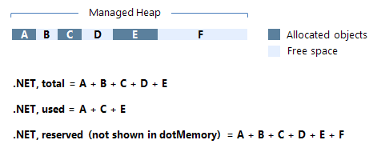

## 基础知识

#### 三个堆

小对象堆（SOH）、大对象堆（LOH）和.NET5中添加的[固定对象堆（POH）](https://devblogs.microsoft.com/dotnet/internals-of-the-poh/)


#### 进程占用内存大小

每个进程都有自己独立的、连续的虚拟地址空间，同一台计算机上的不同进程共享物理内存和页文件（如果有）。

[虚拟内存的三种状态](https://learn.microsoft.com/en-us/dotnet/standard/garbage-collection/fundamentals#fundamentals-of-memory)

| State     | Description                                                  |
| :-------- | :----------------------------------------------------------- |
| Free      | The block of memory has no references to it and is available for allocation. |
| Reserved  | The block of memory is available for your use and can't be used for any other allocation request. However, you can't store data to this memory block until it's committed. |
| Committed | The block of memory is assigned to physical storage.         |




> 图片原文地址：https://www.jetbrains.com/help/dotmemory/Analysis_Overview_Page.html#collected-snapshots


[Collected snapshots](https://www.jetbrains.com/help/dotmemory/Analysis_Overview_Page.html#collected-snapshots)

GC的基础知识，可参考：[Fundamentals of garbage collection](https://learn.microsoft.com/en-us/dotnet/standard/garbage-collection/fundamentals)


#### 对象占用内存大小预估

[What is retained size for an object on heapdump?](https://stackoverflow.com/questions/3635787/what-is-retained-size-for-an-object-on-heapdump)

[Shallow and retained sizes](https://www.yourkit.com/docs/java/help/sizes.jsp)

[Group by Types](https://www.jetbrains.com/help/dotmemory/Type_List.html#example)


## GC机制

Workstation

Server

Background GC

CPU逻辑核心数、操作系统位数、[GC自身配置](https://learn.microsoft.com/en-us/dotnet/core/runtime-config/garbage-collector)都会影响托管内存分配和回收。

## 减少LOH分配

大对象堆（Large Object Heap），.NET中默认对象大小>=85KB（[可配置](https://learn.microsoft.com/en-us/dotnet/core/runtime-config/garbage-collector#large-object-heap-threshold)）的对象会被分配到LOH上，LOH上的对象只有Full GC时才会被回收，且通常GC不压缩LOH。

> 通常是Array, List, Dictionary, StringBuilder, MemoryStream等可以动态调整大小的类型会产生大对象


[ArrayPool\<T\>](https://learn.microsoft.com/en-us/dotnet/api/system.buffers.arraypool-1?view=net-7.0)


### 压缩LOH

通过[GCSettings.LargeObjectHeapCompactionMode](https://learn.microsoft.com/en-us/dotnet/api/system.runtime.gcsettings.largeobjectheapcompactionmode?view=net-7.0)来压缩（一次）LOH

```c#
GCSettings.LargeObjectHeapCompactionMode = GCLargeObjectHeapCompactionMode.CompactOnce;
GC.Collect();
```

也可以通过[配置](https://learn.microsoft.com/en-us/dotnet/core/runtime-config/garbage-collector#conserve-memory)来压缩LOH，此外，.NET针对容器使用场景，做了[内存优化](https://devblogs.microsoft.com/dotnet/using-net-and-docker-together-dockercon-2019-update/)。

## 问答环节


**问：**GC之后，托管内存占用明显减少，进程整体占用内存变化不明显或略微减少，非托管内存占用增加。

**答：**

> [GC does not free memory, but causes decrease in managed and increase in unmanaged memory](https://stackoverflow.com/questions/64705136/gc-does-not-free-memory-but-causes-decrease-in-managed-and-increase-in-unmanage)
> [【please help】Unmanaged memory only increases but does not decrease](https://github.com/dotnet/orleans/issues/6556)


---


**问：**程序运行从MSSQL拉取大量数据导致内存占用快速增长，数据读取结束后内存不释放

**答：**[Microsoft.Data.SqlClient](https://www.nuget.org/packages/Microsoft.Data.SqlClient) 5.0.1版本使用CancellationToken存在CancellationTokenSource无法释放问题，升级到5.1.1可以解决。EFCore7恰巧使用了Microsoft.Data.SqlClient 5.0.1版本。

> https://github.com/dotnet/efcore/issues/30691
> https://github.com/dotnet/SqlClient/issues/1810


## 推荐阅读

[Garbage collection and performance](https://learn.microsoft.com/en-us/dotnet/standard/garbage-collection/performance)

[Fix memory issues](https://www.jetbrains.com/help/rider/2022.3/Fixing_Issues_Found_by_DPA.html)
