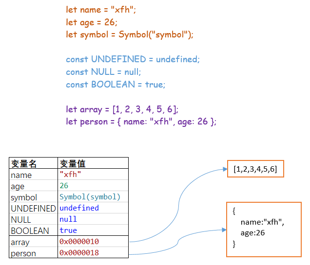

#### this指向

全局对象中的this指向全局变量。

函数中的this，在函数被执行时才能确定this指向：
+ 通过对象调用函数时，this指向调用者
+ 函数被单独调用时
  - 严格模式下，this指向undefined
  - 非严格模式下，this指向全局变量。浏览器环境中全局对象是window，Node中全局对象是global


> :warning: 箭头函数中的this在函数声明时确定，在运行期间不会改变

#### 原型

原型用于**对象属性**的查找。画出下面代码中的原型链图示：

```typescript
class Person {
    private _name: string;

    constructor(name: string) {
        this._name = name;
    }

    get getName(): string {
        return this._name;
    }
}

let person = new Person("xfh");
```


> The **instanceof** operator tests whether the `prototype` property of a constructor appears anywhere in the prototype chain of an object.
>
> *Syntax:*
>
> *object* instanceof *constructor*

```javascript
// 所有的函数（包括构造函数及Function自身）都是是Function的实例
Function instanceof Function // true，Function是自己的实例
Object instanceof Function // true，构造函数是Function的实例
// 实例和构造函数的原型对象是同一个对象
Function.__proto__===Function.prototype // true
// 所有的对象终归是Object的实例
Function.prototype instanceof Object // true
Function instanceof Object // true
Object instanceof Object // true
// 原型链的终点是null
Object.prototype.__proto__===null // true
Object.prototype instanceof Object // false
```

> :information_source:原型链的终点是null


#### 成员类型及继承

JS中成员分为三类：实例、静态、原型。实例成员绑定到this上，静态成员绑定到构造函数上，原型成员就存在原型对象上。

###### TypeScript实现 

下面用TypeScript写一段示例代码（与ES6+书写方式类似)：

```javascript
class Person {
    name: string;
    age: number;
    constructor(name: string, age: number) {
        // 只能在构造函数中使用this关键字
        this.name = name;
        this.age = age;
    }
	// 静态方法中调用本类中的另一个静态方法时，可以使用this.methodName的形式
	// 在外部调用时只能类名.方法名的形式，所以此时方法内部，this是指向构造函数的
  	// 即，this.methodName等价于类名.方法名
    static static_method() {
        // 这里this指向Person类，typeof this=function
        // 可以看出class Person本质上是构造函数，class只是语法糖
        console.log(`static method, this=${this}, typeof this=${typeof this}`);
    }
}

// 使用extends继承
class Chinese extends Person {
    constructor(name: string, age: number) {
        // 必须调用父类构造函数，且需要在子类构造函数使用this关键字之前调用，否则会产生错误：
        // A 'super' call must be the first statement in the constructor when a class contains initialized properties or has parameter properties.
        super(name, age);
    }

    sayHello() {
        console.log(`I'm ${this.name}, I'm ${this.age} years old.`)
    }
}


let cn = new Chinese('xfh', 26);

cn.sayHello();
Chinese.static_method();
```

输出：

```shell
I'm xfh, I'm 26 years old.
static method, this=class Chinese extends Person {
    constructor(name, age) {
        super(name, age);
    }
    sayHello() {
        console.log(`I'm ${this.name}, I'm ${this.age} years old.`);
    }
}, typeof this=function
```

画出上述代码原型图：

静态方法的继承

###### ES5实现

上面是TS代码，为了进一步了解三类成员及继承，下面使用ES5语法来演示。首先，实现对三类成员的继承：

```javascript
/**
 * 从基类继承成员
 * @param child 子类构造函数或实例
 * @param base 基类构造函数或实例
 */
function inheritMembers(child, base) {
    let ignorePropertyNames = ["name", "caller", "prototype", "__proto__", "length", "arguments"];
    let propertyNames = Object.getOwnPropertyNames(base);
    for (let propertyName of propertyNames) {
        if (ignorePropertyNames.includes(propertyName)) {
            continue;
        }
        let descriptor = Object.getOwnPropertyDescriptor(base, propertyName);
        if (!descriptor) {
            continue;
        }
        Object.defineProperty(child, propertyName, descriptor);
    }
}
/**
 * 从基类继承原型及静态成员
 * @param thisCtor 子类构造函数
 * @param baseCtor 基类构造函数
 */
function inheritSharedMembers(thisCtor, baseCtor) {
    if (typeof thisCtor !== "function" || typeof baseCtor !== "function") {
        throw TypeError("参数必须是函数：thisCtor,baseCtor");
    }
    // 继承原型成员
    thisCtor.prototype = Object.create(baseCtor.prototype);
    thisCtor.proptotype.constructor = thisCtor;
    // 继承静态成员
    inheritMembers(thisCtor, baseCtor);
}
/**
 * 调用子类及父类构造函数创建子类实例，并继承父类实例成员（这也是调用父类构造函数的原因）
 * @param thisInstance 子类实例
 * @param baseInstance 父类实例
 */
function createInstance(thisInstance, baseInstance) {
    inheritMembers(thisInstance, baseInstance);
    return thisInstance;
}
```

示例代码：

```javascript
// 构造函数
function Animal(tag) {
    // 实例属性
    this.tag = tag;
}
// 静态方法，需通过构造函数来调用
Animal.bark = function () {
    console.log("static func, this= " + this + ", typeof this=" + typeof this);
};
// 原型方法，需通过实例来调用
Animal.prototype.getInfo = function () {
    console.log("property func, tag:" + this.tag);
};

function Dog() {
}
// 继承父类原型及静态成员
inheritSharedMembers(Dog, Animal);
// 添加子类原型方法
Dog.prototype.dogBark = function () {
    console.log("dog bark");
};

var animal = new Animal('animal');
Animal.bark();
// TypeError: animal.bark is not a function
// animal.bark();
animal.getInfo();
// property getInfo not exist on type 'typeof Animal'
// Animal.getInfo();

let dog = createInstance(new Dog(), new Animal("dog"));
dog.getInfo();
dog.dogBark();
Dog.bark();
```

输出：

```shell
static func, this= function Animal(tag) {
    // 实例属性
    this.tag = tag;
}, typeof this=function
property func, tag:animal
property func, tag:dog
dog bark
static func, this= function Dog() {
}, typeof this=function
```

> :information_source: [Object.create()](https://developer.mozilla.org/zh-CN/docs/Web/JavaScript/Reference/Global_Objects/Object/create) 方法创建一个新对象，使用现有的对象来提供新创建的对象的__proto__
>
> [Object.defineProperty()](https://developer.mozilla.org/zh-CN/docs/Web/JavaScript/Reference/Global_Objects/Object/defineProperty)方法会直接在一个对象上定义一个新属性，或者修改一个对象的现有属性， 并返回这个对象
>
> [Object.getOwnPropertyDescriptor()](https://developer.mozilla.org/zh-CN/docs/Web/JavaScript/Reference/Global_Objects/Object/getOwnPropertyDescriptor)方法返回指定对象上一个自有属性对应的属性描述符。（自有属性指的是直接赋予该对象的属性，不需要从原型链上进行查找的属性）

**实例成员的继承通过调用父类构造函数来实现**


###### 推荐阅读

[Static Properties in JavaScript Classes with Inheritance](http://thecodebarbarian.com/static-properties-in-javascript-with-inheritance.html)

#### 对象相等性


#### 变量对象

变量对象，VO（variable object）是执行上下文的一个属性（VO is a property of an execution context），它存储在当前上下文中声明的变量、函数及函数的形参。

JavaScript中有7种原始数据类型([primitive type](https://developer.mozilla.org/en-US/docs/Glossary/Primitive))：`number`, `string`, `boolean`, `bigint`, `symbol`, `null`,  `undefined`和1中引用类型：`object`。

在变量对象中，基本数据类型的值直接保存在变量对象中，引用类型在变量对象中保存地址：

```typescript
let name = "xfh";
let age = 26;
let symbol = Symbol("symbol");

const UNDEFINED = undefined;
const NULL = null;
const BOOLEAN = true;

let array = [1, 2, 3, 4, 5, 6];
let person = { name: "xfh", age: 26 };
```




函数变量对象，Variable Object

#### 作用域

作用域是用来描述**变量、函数**可访问范围的一套规则，注意和原型用处的区别。

###### var

使用`var`声明的变量，要么是局部变量（函数内声明），要么是全局变量（函数外声明）。使用var声明的变量会进行变量提升：

```javascript
console.log(name); // 输出：undefined
var name = "xfh";
```

上段代码等价于：

```javascript
var name = undefined;
console.log(name); 
name = "xfh";
```

> :warning:变量提升指，编译器/解释器隐式的将变量和函数的声明放到了作用域顶部，允许在变量/函数声明之前使用变量，但此时变量的值被初始化为undefined

###### undeclared variables

未声明直接赋值的变量（undeclared variables）是全局变量（不建议使用）：

```javascript
// "use strict"

if (true) {
    name = "xfh"; // 严格模式下报错：ReferenceError: name is not defined
} 

console.log(name);
```
未声明变量在执行赋值操作之前是不存在的：

```javascript
console.log(name); // ReferenceError: name is not defined

if (true) {
    name = "xfh"; 
} 
```

> :information_source:有关var和undeclared variables的对比，可参考：[var](https://developer.mozilla.org/en-US/docs/Web/JavaScript/Reference/Statements/var)

###### let/const

ES6引入了块级作用域。

非严格模式下，**使用let/const声明的变量**作用域是基于块，函数声明和使用var声明的变量不受影响，严格模式下，var不受块级作用域影响。从ES6开始，不再推荐使用var声明变量，而是使用let/const代替。

```javascript
if (true) {
   let name = "xfh";
} 

console.log(name); // ReferenceError: name is not defined
```

将上文中的let改为var：

```javascript
if (true) {
   var name = "xfh";
} 

console.log(name); // 输出 xfh
```

使用let/const声明的变量依然会出现变量提升但不会初始化（ **hoisted but not initialized**），在let/const声明变量之前引用该变量会报`ReferenceError`，这种现象称为暂时性死区（**temporal dead zone**）。

> :information_source:有关变量提升可参考：[Grammar and types](https://developer.mozilla.org/en-US/docs/Web/JavaScript/Guide/Grammar_and_Types)中的Declarations一节

###### 作用域链

当前上下文与上层上下文（上层的上层......）的变量对象组成，作用域链的最末端是全局变量对象。可以将作用域链看作一个单向链表，可以从当前上下文往上单方向查找，不能反向查找。


#### 闭包

函数执行时使用了上层（及上层的上层......）作用域中变量对象中的值，形成闭包。

###### 为什么使用闭包

+ 避免使用全局变量，提升程序安全性
+ 封装仅当前函数中需要多次用到的逻辑，提升代码可读性及性能
+ 模块的基础


###### 闭包的缺点

通常，上下文执行完毕后，内部的所有内容会因为失去引用而被垃圾回收机制回收。但闭包会导致上下文执行结束后，内部变量依然[被根引用](https://developer.mozilla.org/en-US/docs/Web/JavaScript/Memory_Management)而无法进行垃圾回收。

#### JavaScript/Node中的模块实现机制


#### 全局对象

全局对象（global object）是在进入任何执行上下文中之前创建的对象。在整个应用中全局对象只有一份拷贝，可以在程序的任何地方访问它，它的生命周期自创建开始至应用停止运行为止。不同的宿主环境，全局对象也有所不同。如：浏览器中的window，Node.js中的global。


#### 执行上下文


#### 简单说明下jQuery中$的封装实现


#### 事件循环与任务队列


#### 推荐阅读

《JavaScript核心技术开发解密》

[ECMA-262-3 in detail. Chapter 2. Variable object](http://dmitrysoshnikov.com/ecmascript/chapter-2-variable-object/)

[Memory Management](https://developer.mozilla.org/en-US/docs/Web/JavaScript/Memory_Management)

[Concurrency model and the event loop](https://developer.mozilla.org/en-US/docs/Web/JavaScript/EventLoop)

