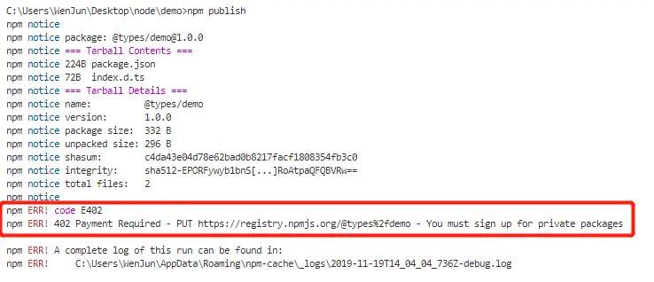

> 最近发布了[@types/node-observer](https://www.npmjs.com/package/@types/node-observer)包到npm，这里记录下发布过程

TS类型文件的包名通常以`@types`开头，使用`npm publish`发布以`@types`开头的包时需要使用付费账号。
我们无需自己注册付费账号，可以将自己的代码`merge`到开源项目[DefinitelyTyped](https://github.com/DefinitelyTyped/DefinitelyTyped)中，然后发布到npm上。


## DefinitelyTyped
fork仓库[DefinitelyTyped](https://github.com/DefinitelyTyped/DefinitelyTyped)，拉取到本地（项目比较大，拉下来比较耗时）添加自己的代码、提交，然后创建[Pull requests](https://github.com/DefinitelyTyped/DefinitelyTyped/pull/40450)。勾选`Pull requests`模板中的选项：


发起`Pull requests`，会走一个CI流程，这个阶段耗费时间比较长，不知道是不是因为有墙的原因。期间出现几个错误记录记录如下：

#### index.d.ts头部解析错误

index.d.ts头部模板可参考:[dt-header](https://github.com/Microsoft/dtslint/blob/master/docs/dt-header.md)。这里出现两个错误：
```shell
Error: Could not parse version: line is '// TypeScript Version: 3.3.3'

Error parsing header. Expected: foo MAJOR.MINOR (patch version not allowed). See: https://github.com/Microsoft/dtslint/blob/master/docs/dt-header.md
```
这两个错误属于同一类，注释中只能使用`主版本号.次版本号`不能使用补丁版本号。修改后如下：


#### 文件格式错误
*.d.ts和*.ts文件末尾要空一行


#### 代码错误

`export = observer;`等号两边要有空格：


`const obj = new Demo();`这一行最初写的是`let obj = new Demo();`，报`ERROR: 9:5  prefer-const  Identifier 'obj' is never reassigned; use 'const' instead of 'let'.`错误。
类定义`Demo`的方法`sayHello`不能使用`public`修饰符，否则报`ERROR: 4:5    member-access  'public' is implicit.`错误。


消除所有错误后，会交由人工处理`merge`，完成`merge`后就会发布到npm了。


## 小结
以上是自己合并代码到主分支时遇到的错误，解决问题花费时间不算太长，倒是花费了大量时间等待CI结果。整体感觉，CI流程对文件内容的格式要求很严格。**代码的提交、合并的详细流程可以点击此处查看：[#40450](https://github.com/DefinitelyTyped/DefinitelyTyped/pull/40450)，所有的构建历史记录可以在[此处查看](https://travis-ci.org/DefinitelyTyped/DefinitelyTyped/pull_requests?utm_medium=notification&utm_source=github_status)**。

