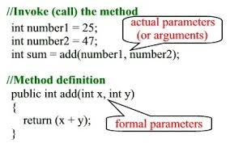
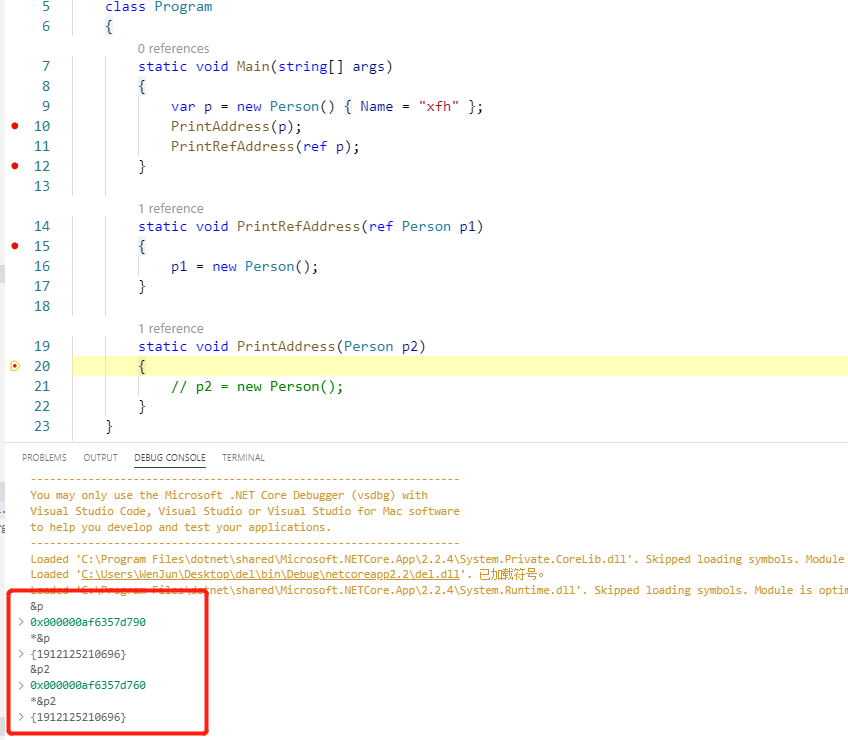
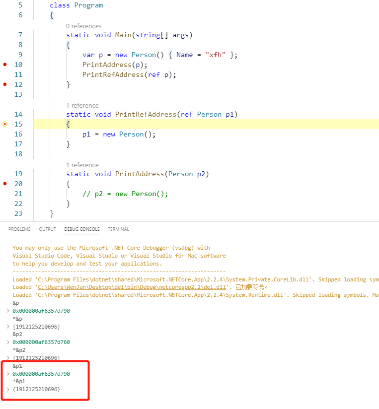
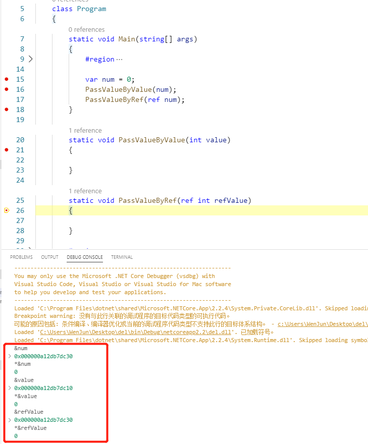

[Python文档](https://docs.python.org/3/faq/programming.html#how-do-i-write-a-function-with-output-parameters-call-by-reference)中有一段话：

Remember that arguments are **passed by assignment** in Python. Since assignment just creates references to objects, **there’s no alias** between an argument name in the caller and callee, and so no call-by-reference per se. 

我们常说参数的传递分为按值传递与按引用传递，Python中的**passed by assignment**该如何理解？

## argument vs parameter

[stackoverflow](https://stackoverflow.com/questions/156767/whats-the-difference-between-an-argument-and-a-parameter)上关于paramter 和 argument的解释：

 A parameter is a variable in a method definition. When a method is called, the arguments are the data you pass into the method's parameters.

 - **P**ARAMETER → **P**LACEHOLDER (This means a placeholder belongs to the function naming and be used in the function body)
 - **A**RGUMENT → **A**CTUAL VALUE (This means an actual value which is passed by the function calling)




## .NET值传递与引用传递

> .NET中类型分为值类型和引用类型两种，默认使用值传递，若使用引用传递，需明确使用`ref`、`in`、`out`关键字。
>
> In C#, arguments can be passed to parameters either by value or by reference. **Passing by reference enables function members, methods, properties, indexers, operators, and constructors to change the value of the parameters and have that change persist in the calling environment.** To pass a parameter by reference with the intent of changing the value, use the `ref`, or `out` keyword. To pass by reference with the intent of avoiding copying but not changing the value, use the `in` modifier. 

#### [Passing Reference-Type Parameters](https://docs.microsoft.com/en-us/dotnet/csharp/programming-guide/classes-and-structs/passing-reference-type-parameters)

 When you pass a reference-type parameter by value, **it is possible to change the data belonging to the referenced object**, such as the value of a class member. However, **you cannot change the value of the reference itself**; for example, you cannot use the same reference to allocate memory for a new object and have it persist outside the method. To do that, pass the parameter using the [ref](https://docs.microsoft.com/en-us/dotnet/csharp/language-reference/keywords/ref) or [out](https://docs.microsoft.com/en-us/dotnet/csharp/language-reference/keywords/out-parameter-modifier) keyword. For simplicity, the following examples use `ref`.

###### Passing Reference Types by Value

```c#
class PassingRefByVal 
{
    static void Change(int[] pArray)
    {
        pArray[0] = 888;  // This change affects the original element.
        pArray = new int[5] {-3, -1, -2, -3, -4};   // This change is local.
        System.Console.WriteLine("Inside the method, the first element is: {0}", pArray[0]);
    }

    static void Main() 
    {
        int[] arr = {1, 4, 5};
        System.Console.WriteLine("Inside Main, before calling the method, the first element is: {0}", arr [0]);

        Change(arr);
        System.Console.WriteLine("Inside Main, after calling the method, the first element is: {0}", arr [0]);
    }
}
/* Output:
    Inside Main, before calling the method, the first element is: 1
    Inside the method, the first element is: -3
    Inside Main, after calling the method, the first element is: 888
*/
```

In the preceding example, the array, `arr`, which is a reference type, is passed to the method without the `ref` parameter. In such a case, **a copy of the reference, which points to `arr`, is passed to the method**. The output shows that it is possible for the method to change the contents of an array element, in this case from `1` to `888`. However, allocating a new portion of memory by using the [new](https://docs.microsoft.com/en-us/dotnet/csharp/language-reference/operators/new-operator) operator inside the `Change` method makes the variable `pArray` reference a new array. Thus, any changes after that will not affect the original array, `arr`, which is created inside `Main`. In fact, two arrays are created in this example, one inside `Main` and one inside the `Change` method.

###### Passing Reference Type by Reference

The following example is the same as the previous example, except that the `ref` keyword is added to the method header and call. Any changes that take place in the method affect the original variable in the calling program.

```c#
class PassingRefByRef 
{
    static void Change(ref int[] pArray)
    {
        // Both of the following changes will affect the original variables:
        pArray[0] = 888;
        pArray = new int[5] {-3, -1, -2, -3, -4};
        System.Console.WriteLine("Inside the method, the first element is: {0}", pArray[0]);
    }
        
    static void Main() 
    {
        int[] arr = {1, 4, 5};
        System.Console.WriteLine("Inside Main, before calling the method, the first element is: {0}", arr[0]);

        Change(ref arr);
        System.Console.WriteLine("Inside Main, after calling the method, the first element is: {0}", arr[0]);
    }
}
/* Output:
    Inside Main, before calling the method, the first element is: 1
    Inside the method, the first element is: -3
    Inside Main, after calling the method, the first element is: -3
*/
```

All of the changes that take place inside the method affect the original array in `Main`. In fact, the original array is reallocated using the `new` operator. Thus, after calling the `Change` method, any reference to `arr` points to the five-element array, which is created in the `Change` method.

> :warning:Do not confuse the concept of **passing by reference** with the concept of **reference types**. The two concepts are not the same. A method parameter can be modified by `ref` regardless of whether it is a value type or a reference type. **There is no boxing of a value type when it is passed by reference**.

#### [Passing Value-Type Parameters](https://docs.microsoft.com/en-us/dotnet/csharp/programming-guide/classes-and-structs/passing-value-type-parameters)

Passing a value-type variable to a method by value means passing **a copy of the variable to the method**. Any changes to the parameter that take place inside the method have no affect on the original data stored in the argument variable. If you want the called method to change the value of the argument, you must pass it by reference, using the [ref](https://docs.microsoft.com/en-us/dotnet/csharp/language-reference/keywords/ref) or [out](https://docs.microsoft.com/en-us/dotnet/csharp/language-reference/keywords/out-parameter-modifier) keyword. You may also use the [in](https://docs.microsoft.com/en-us/dotnet/csharp/language-reference/keywords/in-parameter-modifier) keyword to pass a value parameter by reference to avoid the copy while guaranteeing that the value will not be changed. For simplicity, the following examples use `ref`.

###### Passing Value Types by Value

```c#
class PassingValByVal
{
    static void SquareIt(int x)
    // The parameter x is passed by value.
    // Changes to x will not affect the original value of x.
    {
        x *= x;
        System.Console.WriteLine("The value inside the method: {0}", x);
    }
    static void Main()
    {
        int n = 5;
        System.Console.WriteLine("The value before calling the method: {0}", n);

        SquareIt(n);  // Passing the variable by value.
        System.Console.WriteLine("The value after calling the method: {0}", n);

        // Keep the console window open in debug mode.
        System.Console.WriteLine("Press any key to exit.");
        System.Console.ReadKey();
    }
}
/* Output:
    The value before calling the method: 5
    The value inside the method: 25
    The value after calling the method: 5
*/
```

The variable `n` is a value type. It contains its data, the value `5`. When `SquareIt` is invoked, the contents of `n` are copied into the parameter `x`, which is squared inside the method. In `Main`, however, the value of `n` is the same after calling the `SquareIt` method as it was before. The change that takes place inside the method only affects the local variable `x`.

###### Passing Value Types by Reference

The following example is the same as the previous example, except that the argument is passed as a `ref` parameter. The value of the underlying argument, `n`, is changed when `x` is changed in the method.

```c#
class PassingValByRef
{
    static void SquareIt(ref int x)
    // The parameter x is passed by reference.
    // Changes to x will affect the original value of x.
    {
        x *= x;
        System.Console.WriteLine("The value inside the method: {0}", x);
    }
    static void Main()
    {
        int n = 5;
        System.Console.WriteLine("The value before calling the method: {0}", n);

        SquareIt(ref n);  // Passing the variable by reference.
        System.Console.WriteLine("The value after calling the method: {0}", n);

        // Keep the console window open in debug mode.
        System.Console.WriteLine("Press any key to exit.");
        System.Console.ReadKey();
    }
}
/* Output:
    The value before calling the method: 5
    The value inside the method: 25
    The value after calling the method: 25
*/
```

In this example, it is not the value of `n` that is passed; rather, a reference to `n` is passed. **The parameter `x` is not an [int](https://docs.microsoft.com/en-us/dotnet/csharp/language-reference/builtin-types/integral-numeric-types); it is a reference to an `int`**, in this case, a reference to `n`. Therefore, when `x` is squared inside the method, what actually is squared is what `x` refers to, `n`.

#### 图解按引用传递

曾在Github上提过一个[issue](https://github.com/dotnet/docs/issues/9111)，用几幅图描述了按引用传递的情况。

## Python passed by assignment

说了这么多，Python中的passed by assignment该怎么理解？Python中类型没有像.NET那样分为值类型与引用类型。Python中所有类型的值都是对象，这些对象分为可变对象与不可变对象两种：

+ 不可变类型

  `float`、`int`、`str`、`tuple`、`bool`等

+ 可变类型

  `list`、`dict`、`set`等

Python中，所有的数据类型都是对象，在传参时，传递的是对象的引用。与.NET中按值传递引用类型类似。对于不可变类型：

```python
num = 9

def changeValue(value: int):
    # int类型是不可变类型，改变value的值会让value指向新的对象8，不会改变num
    value = 8

print(num)
changeValue(num)
print(num)

"""
输出：
9
9
"""
```

对于可变类型：

```python
l = [9, 8, 7]

def createNewList(l1: list):
    # l1+[0]会创建一个新的list对象，只是改变了局部变量l1的引用地址，不会影响变量l
    # 注意：Python中l1=l1+[0]与l1+=[0]并不等价，+=操作符会扩展原列表，作用和append方法相同
    # 更多详细信息可参考【Python中可变对象与不可变对象】博客
    l1 = l1+[0]

def changeList(l1: list):
    # 在列表末尾添加一个元素，因为l1和l引用同一个对象，所以l也会改变
    l1.append(0)

print(l)
createNewList(l)
print(l)
changeList(l)
print(l)

"""
输出：
[9, 8, 7]
[9, 8, 7]
[9, 8, 7, 0]
"""
```


## 小结

按值传递就是拷贝出变量值的一个副本，所有的操作都是针对这个副本的，对原始数据没有影响。

> :warning:对于.NET中的值类型，原始数据就是变量的值；对于.NET中的引用类型，原始数据也是值变量的值，只不过这个值存储的是内存地址

从下图中可以看到，按值传递引用类型，变量p2和p在内存中的地址不同，但存储的值相同：



按引用传递相当于给变量起了个别名，所有的操作都相当于操作原变量。从下图可以看到，按引用传递引用类型，p1和p在内存中的地址相同，存储的内容也相同：



对于按引用传递值类型和按值传递值类型，也是一样的：



## 推荐阅读

[Passing Parameters (C# Programming Guide)](https://docs.microsoft.com/en-us/dotnet/csharp/programming-guide/classes-and-structs/passing-parameters)

[Method Parameters (C# Reference)](https://docs.microsoft.com/en-us/dotnet/csharp/language-reference/keywords/method-parameters)

[The address-of operator](https://docs.microsoft.com/en-us/dotnet/csharp/language-reference/language-specification/unsafe-code#the-address-of-operator)

[Python中可变对象与不可变对象](../Python中可变对象与不可变对象.md)