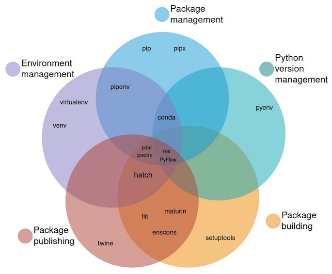

> 原图地址：[An unbiased evaluation of environment management and packaging tools](https://alpopkes.com/posts/python/packaging_tools/)

[pyenv](https://github.com/pyenv/pyenv): 用来安装和管理多个不同版本的Python

[Python Launcher](https://docs.python.org/3/using/windows.html#launcher): 用于定位和执行不同版本的Pythonn，Unix系统上可使用[The Python Launcher for Unix](https://python-launcher.app/)

[Pipenv](https://pipenv.pypa.io/en/latest/): 虚拟环境及包管理工具