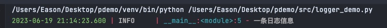
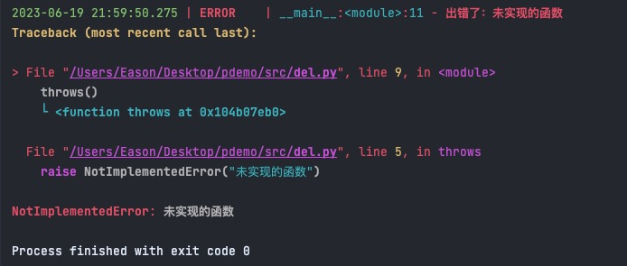
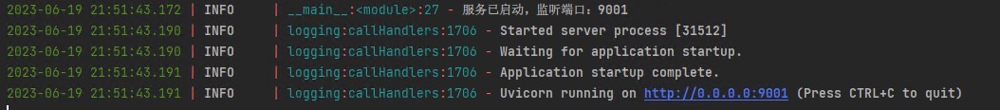

日志和配置是应用不可缺少的部分，本文用于介绍Python中的第三方日志和配置库。

## [dynaconf](https://github.com/dynaconf/dynaconf) 

dynaconf是一个配置管理包，支持多种配置文件格式，如：toml、yaml、json、ini及环境变量等

```shell
pip install dynaconf

mkdir config
cd config
dynaconf init -f toml
```

命令生成的目录结构如下：

```shell
config
├── .gitignore
├── .secrets.toml
├── config.py
└── settings.toml
```

**.secrets.toml**用于存放敏感信息，默认被添加到**.gitignore**中，不会提交到代码仓库。

从环境变量读取配置：
```shell
# 环境变量前缀在config.py中设置
export PYDEMO_tag=dynaconf
```

```python
from src.config.config import settings
print(settings.tag) # dynaconf
```

**config.py**中可以指定读取的配置文件：

```python
from dynaconf import Dynaconf

settings = Dynaconf(
    # 环境变量前缀
    envvar_prefix="PYDEMO",
    # 可以指定多个配置文件，如：settings.dev.toml
    settings_files=['settings.toml', '.secrets.toml'],
)
```

在**settinngs.toml**中写入配置：
```toml
[person]
name = "eason"
age = 30
```

读取配置数据：

```python
from dataclasses import dataclass
from src.config.config import settings

print(settings.person) # 输出：{'name': 'eason', 'age': 30}
```

### 绑定配置到类型

也可以定义具体的类型来绑定配置数据，这样在使用时更方便

```python
from dataclasses import dataclass
from src.config.config import settings


@dataclass
class Person:
    name: str
    age: int


p = Person(**settings.person)
print(p.name)
```

### 多环境配置

不同环境读取不同的配置：

```toml
[production]
person = { name = "prod", age = 100 }
[development]
person = { name = "dev", age = 100 }
```

config.py中设置**environments**的值是True
```python
settings = Dynaconf(
    envvar_prefix="PYDEMO",
    settings_files=['settings.toml', '.secrets.toml'],
    environments=True
)
```

环境变量**settings.ENV_FOR_DYNACONF**的值默认是development，dynaconf会读取[development]节点下的配置

```shell
# 设置环境变量，从production节点下读取配置
export ENV_FOR_DYNACONF=production
# unset ENV_FOR_DYNACONF
```


```python
from src.config.config import settings

print(settings.ENV_FOR_DYNACONF)

p = Person(**settings.person)
print(p.name)
```


## [loguru](https://github.com/Delgan/loguru)

loguru是一个易于配置和使用的Python日志库

安装：`pip install loguru`

默认输出日志到控制台：

```python
from loguru import logger

logger.info("一条日志信息")
```

日志输出结果如下：

```shell
2023-06-07 21:06:04.154 | INFO     | __main__:<module>:3 - 一条日志信息
```

loguru输出的日志带有颜色，不仅美观，还易于阅读，如下图所示



### 结构化日志

除了简单输出日志外，还可以记录结构化日志，示例如下：

```python
from dataclasses import dataclass

from loguru import logger


@dataclass
class Person:
    name: str
    age: int


person = Person("eason", 30)
logger.info("人员信息：{p}", p=person)
```

日志输出结果：

```shell
2023-06-19 20:48:10.900 | INFO     | __main__:<module>:14 - 人员信息：Person(name='eason', age=30)
```

对于异常，loguru也可以输出详细的调用堆栈：

```python
from loguru import logger


def throws():
    raise NotImplementedError("未实现的函数")


try:
    throws()
except Exception as err:
    logger.exception("出错了：{err}", err=err)
```

输出日志：



### 滚动日志

在生产环境，日志通常会记录到文本中而非仅仅打印到控制台。文本日志要考虑到磁盘占用问题，通常会采用滚动日志，配置如下：

```python
# 禁用控制台日志
logger.remove(0)
logger.add("/Users/Eason/Desktop/pdemo/logs/log.log"
           , encoding="utf-8"
           , level="INFO"        # 输出的最小日志级别
           , rotation="1 MB"     # 每个日志文件的大小，超过该大小则创建新文件
           , retention=10        # 保留的日志文件数量，不超过10个
           , enqueue=True)       # 多进程安全
```

### 替换FastAPI中的日志模块

[FastAPI](https://fastapi.tiangolo.com/)是Python中用于开发API的web框架，默认使用内置的[logging](https://docs.python.org/3.10/library/logging.html)模块，为了统一使用loguru来记录日志，需要对日志模块进行替换。下面我们结合dynaconf来实现一个自定义的可配置日志，项目目录如下：

```shell
.
├── README.md
├── docs
│   └── dev
│       └── local.http
├── mypy.ini
├── requirements.txt
├── ruff.toml
├── src
    ├── config
    │   ├── _config.py
    │   ├── app_options.py
    │   └── settings.yaml
    ├── my_logger.py
    └── main.py
```

配置如下：

```yaml
server:
  port: 9001

log:
  level: INFO
  encoding: utf-8
  rotation: 10 MB
  retention: 20
  enqueue: True
  file_path: /Users/Eason/Desktop/pdemo/logs/log.log
```

在**app_options.py**中定义配置模型：

```python
from __future__ import annotations

from dataclasses import dataclass

from src.config._config import settings


@dataclass
class AppOptions:
    log: LogOptions
    server: ServerOptions

@dataclass
class LogOptions:
    level: str
    file_path: str
    enqueue: bool
    rotation: int | str
    retention: int
    encoding: str


@dataclass
class ServerOptions:
    port: int


options = AppOptions(log=LogOptions(**settings.log), server=ServerOptions(**settings.server))
```

在**my_logger.py**中添加配置相关代码：

```python
import copy
import logging
from typing import Any

from loguru import logger

from src.config.app_options import options


def init_log():
    log_opt = options.log

    if not __debug__:
        # 禁用控制台日志
        logger.remove(0)
        logger.add(log_opt.file_path,
                   encoding=log_opt.encoding, level=log_opt.level, rotation=log_opt.rotation,
                   retention=log_opt.retention,
                   enqueue=log_opt.enqueue)


def replace_uvicorn_log(raw_cfg: dict[str, Any]):
    """
    （使用loguru）替换uvicorn日志模块
    :param raw_cfg: uvicorn中原有的日志配置
    """
    # # https://github.com/tiangolo/fastapi/issues/1508
    # uvicorn日志配置源码
    # https://github.com/encode/uvicorn/blob/master/uvicorn/config.py
    log_config = copy.deepcopy(raw_cfg)
    loggers: dict = log_config["loggers"]
    for name, cfg in loggers.items():
        cfg["handlers"] = ["default"]
        # if name == "uvicorn.error":
        #     cfg["level"] = "ERROR"
    # 避免日志重复输出
    del loggers["uvicorn"]

    log_config["handlers"] = {
        "default": {
            "formatter": "default",
            "class": "src.convertor_logger.InterceptHandler"
        }
    }

    return log_config


class InterceptHandler(logging.Handler):
    loglevel_mapping = {
        50: 'CRITICAL',
        40: 'ERROR',
        30: 'WARNING',
        20: 'INFO',
        10: 'DEBUG',
        0: 'NOTSET',
    }

    def emit(self, record):
        try:
            level = logger.level(record.levelname).name
        except AttributeError:
            level = self.loglevel_mapping[record.levelno]

        try:
            frame, depth = logging.currentframe(), 2
            while frame.f_code.co_filename == logging.__file__:
                frame = frame.f_back
                depth += 1

            logger.opt(depth=depth, exception=record.exc_info).log(level, record.getMessage())
        except Exception:
            self.handleError(record)
```

在**main.py**文件中定义API：

```python
import uvicorn
from fastapi import FastAPI, Response, status

import src.my_logger as mylogger
from src.config.app_options import options


app = FastAPI(title="API-Demo", debug=__debug__)


@app.get("/healthcheck")
@app.head("/healthcheck")
def health_check():
    return "healthcheck"


if __name__ == "__main__":
    mylogger.init_log()
    log_config = mylogger.replace_uvicorn_log(uvicorn.config.LOGGING_CONFIG)
    mylogger.logger.info("服务已启动，监听端口：{port}", port=options.server.port)
    uvicorn.run(app, host="0.0.0.0", port=options.server.port, log_config=log_config)
```

启动API服务，输出如下日志：



可以看到，已经使用loguru成功替换掉了内置的logging模块。

