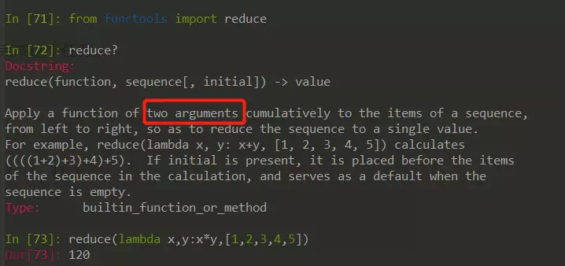

## 极简教程

 

 

 

## 数据类型

我们可以使用`type()`函数类获取对象的类型，Python3中内置数据类型包括:`None,int,float,complex,str,list,dict,tuple,set,frozenset,range`等，Python2中还有`long`类型，Python中并没有内置数组类型。

`dict,list,set`这些是可变类型（用户自定义类型也可变），可以改变类型对象的值；数值和字符串类型则是不可变的。

- [str](https://docs.python.org/3/tutorial/introduction.html#strings)
  与js一样，python中字符串即可用单引号也可用双引号表示

- [numbers](https://docs.python.org/3/tutorial/introduction.html#numbers)
  Python3中数值类型有：`int`和`float`两种

- [list](https://docs.python.org/3/tutorial/introduction.html#lists)
  字面量表示：[1,1.0,False,'list']
  [列表推导式](http://www.pythondoc.com/pythontutorial3/datastructures.html#tut-listcomps)，创建列表的一种简易方法：

   

  

   

- [tuple](https://docs.python.org/3/tutorial/datastructures.html#tuples-and-sequences)
  字面量表示：(1,1.0,False,'tuple')

- [range](https://docs.python.org/3/library/stdtypes.html#ranges)

> list、tuple、range均属于[序列类型(Sequence Types）](https://docs.python.org/3/library/stdtypes.html#typesseq)

- [dict](https://docs.python.org/3/tutorial/datastructures.html#dictionaries)

   

  

   

   

- [set/frozenset](https://docs.python.org/3/tutorial/datastructures.html#sets)
  集合是不包含重复元素的数据集，frozenset是不可变的，set是可变的，可以使用字面量构建一个集合`{1,2,2,4,5}`会输出`{1,2,4,5}`

   

  

#### 类型转换

Python中[类型转换](https://www.digitalocean.com/community/tutorials/how-to-convert-data-types-in-python-3)只需调用相关函数即可


## [函数](https://docs.python.org/3/tutorial/controlflow.html#pass-statements)

```python
# 函数定义模板
def func_name([self,][args]):
    pass

def say_hello():
    print('hello python!')

# python3.5之后，定义函数时可以添加类型说明
# 这里只是提供一个说明文档而非强制类型约束
def type_instruction(num:int)->int:
    return num
```


定义[多返回值](https://eastlakeside.gitbooks.io/interpy-zh/content/global_return/)函数

```python
# 多返回值函数，返回一个tuple对象
def multi_returns():
    return 0,1
```

 

#### 内置函数

Python中有许多[内置函数](https://docs.python.org/3/library/functions.html#built-in-functions)：

- [dir](https://docs.python.org/3/library/functions.html#dir)
  我们可以使用`dir()`函数来查看对象都含有哪些成员：

   

  

   

   

- [map](https://eastlakeside.gitbooks.io/interpy-zh/content/Map_n_Filter/Map.html)

   

  

   

- [filter](https://eastlakeside.gitbooks.io/interpy-zh/content/Map_n_Filter/Filter.html)

   

  

   

- [reduce](https://eastlakeside.gitbooks.io/interpy-zh/content/Map_n_Filter/Reduce.html)不是内置函数，但也很有用

   

  

   

#### lambda

Python中使用`lambda`关键字即可创建lambda表达式：

 


 

#### \*args 与 \**kvargs

`*args`和`**kvargs`都用于函数中接收多个参数，这里`args`和`kvargs`只是约定俗成的写法，可以换成其它的名称，但`*`和`**`则是必须的。
`*args`和`**kvargs`的区别是，`*args`用于接受普通参数，`**kvargs`用于接受键值对参数。

 


 


 

 

 


## [三元运算符](https://eastlakeside.gitbooks.io/interpy-zh/content/ternary_operators/ternary_operators.html)

 


 

## 面向对象

Python中一切皆对象（这句话理解起来并不是那么容易），包括函数（C#,JAVA中函数不能独立存在）。这里贴一篇以前写的文章：[Python中的类、对象、继承](https://www.jianshu.com/p/8922a77151ee)

[Python按赋值传递参数](https://www.cnblogs.com/Cwj-XFH/p/11878259.html)，对于不可变对象在修改时会产生新的对象；而对于可变对象，所有的修改都会反映在原有对象上。

[魔术方法](https://www.python-course.eu/python3_magic_methods.php)是Python[对象模型](http://marco-buttu.github.io/pycon_objmodel/)的重要部分。

 

可以动态的给对象/类型添加属性，若给类型添加属性，则该属性在已产生的实例上也是可见的：

 


 

 

## [异常与错误](https://docs.python.org/3/tutorial/errors.html)

Python中异常与错误类间关系如下：

 


 


自定义异常只需继承`Exception`或各种`Error`类即可

> [Built-in Exceptions](https://links.jianshu.com/go?to=https%3A%2F%2Fdocs.python.org%2F3%2Flibrary%2Fexceptions.html%23exception-hierarchy)

#### 异常处理


```python
try:
    raise IOError('使用raise语句抛出异常')
except IOError as err:
    print(err)
else:
    print('未发生异常则执行')
finally:
    pass
```

 

捕获多个异常类型：

```python
try:
    raise IOError()
except (IOError,TypeError):
    pass
```

 

#### [with语句](https://www.ibm.com/developerworks/cn/opensource/os-cn-pythonwith/index.html)

`with...as...`语句等价于`try...finally...`，与C#中的`using`语句类似


## [命名规范](https://zh-google-styleguide.readthedocs.io/en/latest/google-python-styleguide/python_style_rules/#id16)

> module_name, package_name, ClassName, method_name, ExceptionName, function_name, GLOBAL_VAR_NAME, instance_var_name, function_parameter_name, local_var_name.

#### 应该避免的名称

1. 单字符名称, 除了计数器和迭代器.
2. 包/模块名中的连字符(-)
3. 双下划线开头并结尾的名称(Python保留, 例如init)

#### 命名约定

1. 所谓”内部(Internal)”表示仅模块内可用, 或者, 在类内是保护或私有的.
2. 用单下划线(_)开头表示模块变量或函数是protected的(使用import * from时不会包含).
3. 用双下划线(__)开头的实例变量或方法表示类内私有.
4. 将相关的类和顶级函数放在同一个模块里. 不像Java, 没必要限制一个类一个模块.
5. 对类名使用大写字母开头的单词(如CapWords, 即Pascal风格), 但是模块名应该用小写加下划线的方式(如lower_with_under.py). 尽管已经有很多现存的模块使用类似于CapWords.py这样的命名, 但现在已经不鼓励这样做, 因为如果模块名碰巧和类名一致, 这会让人困扰.

#### Python之父Guido推荐的规范

| Type                       | Public             | Internal                                                     |
| -------------------------- | ------------------ | ------------------------------------------------------------ |
| Modules                    | lower_with_under   | _lower_with_under                                            |
| Packages                   | lower_with_under   |                                                              |
| Classes                    | CapWords           | _CapWords                                                    |
| Exceptions                 | CapWords           |                                                              |
| Functions                  | lower_with_under() | _lower_with_under()                                          |
| Global/Class Constants     | CAPS_WITH_UNDER    | _CAPS_WITH_UNDER                                             |
| Global/Class Variables     | lower_with_under   | _lower_with_under                                            |
| Instance Variables         | lower_with_under   | _lower_with_under (protected) or __lower_with_under (private) |
| Method Names               | lower_with_under() | _lower_with_under() (protected) or __lower_with_under() (private) |
| Function/Method Parameters | lower_with_under   |                                                              |
| Local Variables            | lower_with_under   |                                                              |

> [Name mangling in Python](https://www.geeksforgeeks.org/name-mangling-in-python/)

## 包与模块

- [模块](https://docs.python.org/3/tutorial/modules.html#modules)
  包含Python语句或定义的文件就是一个模块，文件名就是模块名。在一个模块中，模块名是全局变量`__name__`的值。
- [包](https://docs.python.org/3/tutorial/modules.html#packages)
  包含`__init__.py`文件的文件夹即可视为一个包，包用于管理模块，可以防止模块命名冲突。如：`A.C`和`B.C`，分别表示A包中的C模块和B包中的C模块。
- [导入模块](https://docs.python.org/3/tutorial/modules.html#more-on-modules)：

​     import 模块名 [as 别名]、from 模块名 import [*][类/方法名[,类/方法名]] [as 别名]

`　　 `Python解释器会先从内置模块中寻找导入的模块，然后从`sys.path`中指定的[模块搜索路径](https://docs.python.org/3/tutorial/modules.html#the-module-search-path)寻找模块

## 测试

编写一个文件操作类，文件名为`file_operator.py`：


```python
# coding=utf-8

import codecs

class FileOperator:
    def save_file(self, file_path, content, encoding="utf-8"):
        with codecs.open(file_path, "w", encoding) as f:
            f.write(content)
```


编写测试用例，文件名为`test_file_operator.py`：

```python
# coding=utf-8

import unittest

class TestFileOperator(unittest.TestCase):
    def test_save_file(self):
        content = "file content \r\n 文本内容"
        opt = file.FileOperator()
        opt.save_file("1.txt", content)


if __name__ == "__main__":
    unittest.main()
```

 

## 工具推荐

- [iPython](https://ipython.readthedocs.io/en/stable/)
- [VS Code](https://code.visualstudio.com/)
- [PyCharm](https://www.jetbrains.com/pycharm/)

## 小结

以上是自己近期学习Python的一些总结，全文的主要关注点在Python语言本身。掌握以上内容后，便可以用Python写些脚本，辅以其他第三方包或框架就可以干更多更复杂的事了。如，爬虫、数据分析、后端开发以及现在比较热的人工智能（其实，我是不建议追热点的）。

用了一段时间的Python后，会觉着Python挺有意思的。

最后附上一张，个人总结的语言学习套路：

 

 


 

## 推荐阅读

[人生苦短，为什么我要用Python？](https://mp.weixin.qq.com/s/YsS07r3JEJ4TNEZp6rO_IQ)
[Python风格规范](https://zh-google-styleguide.readthedocs.io/en/latest/google-python-styleguide/python_style_rules/#)
[Python语言规范](https://zh-google-styleguide.readthedocs.io/en/latest/google-python-styleguide/python_language_rules/)
[[Python\]内存管理](https://chenrudan.github.io/blog/2016/04/23/pythonmemorycontrol.html)
[Python进阶](https://eastlakeside.gitbooks.io/interpy-zh/content/)
[Python 入门指南](http://www.pythondoc.com/pythontutorial3/index.html)
[Python 3.7.0 documentation](https://docs.python.org/3/)