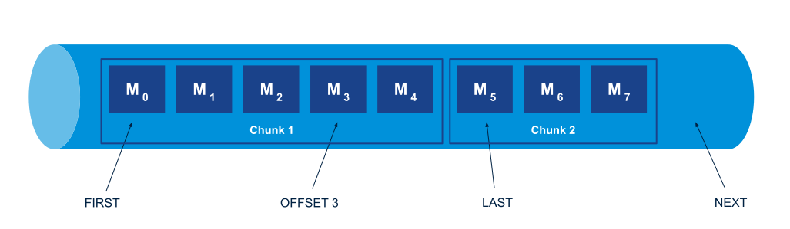

RabbitMQ提供了三种类型的队列：

+ Classic
+ Quorum
+ [Stream](https://www.rabbitmq.com/streams.html)

[官方文档](https://www.rabbitmq.com/streams.html#retention) 对于流队列的描述是：高性能、可持久化、可复制、非破坏性消费、只追加写入的日志

使用场景：

+ 一个队列将同一条消息分发给不同消费者
+ 可重复消费消息
+ 更高的性能
  - 存储大量消息而不影响性能
  - 更高的吞吐

## 基本使用

生产消息：

```python
import pika
from pika import BasicProperties
from pika.adapters.blocking_connection import BlockingChannel
from pika.spec import Basic


STREAM_QUEUE = "stream_queue"

connection = pika.BlockingConnection(pika.ConnectionParameters("localhost", 5672, "/"))
channel = connection.channel()
channel.queue_declare(queue=STREAM_QUEUE, durable=True, arguments={"x-queue-type": "stream"})

for i in range(500, 600):
    msg = f"{i}".encode()
    channel.basic_publish("", STREAM_QUEUE, msg)

channel.close()
connection.close()
```

消费消息：

```python
import pika
from pika import BasicProperties
from pika.adapters.blocking_connection import BlockingChannel
from pika.spec import Basic


def msg_handler(channel: BlockingChannel, method: Basic.Deliver, properties: BasicProperties, body: bytes):
    msg = f"获取消息：{body.decode()}"
    print(msg)
    channel.basic_ack(method.delivery_tag)


STREAM_QUEUE = "stream_queue"

connection = pika.BlockingConnection(pika.ConnectionParameters("localhost", 5672, "/"))
channel = connection.channel()
channel.queue_declare(queue=STREAM_QUEUE, durable=True, arguments={"x-queue-type": "stream"})

channel.basic_qos(prefetch_count=50)
channel.basic_consume(STREAM_QUEUE, on_message_callback=msg_handler, arguments={"x-stream-offset": 290})
channel.start_consuming()

channel.close()
connection.close()
```

### Offset参数

可以通过**[x-stream-offset](https://www.rabbitmq.com/streams.html#consuming)**来控制读取消息的位置，对于改参数值的释义见下图，详情可参考：[Offset Tracking with RabbitMQ Streams](https://blog.rabbitmq.com/posts/2021/09/rabbitmq-streams-offset-tracking/)。



### chunk

上图中有个chunk的概念，chunk就是stream队列中用于存储和传输消息的单元，一个chunk包含几条到几千条不等的消息。

---

## Stream 插件

以上只是对Stream类型队列的简单使用，API和普通队列没有差异。若要体验完整的Stream队列特性，如：服务端消息偏移量追踪，需要启用[stream插件](https://www.rabbitmq.com/stream.html)。

不启用和启用流插件功能特性对比，可参考： [Stream Core vs Stream Plugin](https://www.rabbitmq.com/stream-core-plugin-comparison.html)。

### 服务端消息偏移量追踪

Stream提供了[服务端消息偏移量追踪](https://blog.rabbitmq.com/posts/2021/09/rabbitmq-streams-offset-tracking/)，客户端断开重连后可以从上次消费的下一个位置开始消费消息。

> :warning: 有些客户端不支持[dedicated binary 协议](https://github.com/rabbitmq/rabbitmq-server/blob/v3.12.x/deps/rabbitmq_stream/docs/PROTOCOL.adoc)，无法提供完整的流队列特性支持

使用docker启动一个rabbitmq服务并启用stream插件:

```shell
docker run \
 -d --name rabbitmq \
 --hostname=node1 \
 --env=RABBITMQ_NODENAME=r1 \
 --env=RABBITMQ_SERVER_ADDITIONAL_ERL_ARGS='-rabbitmq_stream advertised_host localhost' \
 --volume=rabbit_erl:/var/lib/rabbitmq \
 -p 15672:15672 -p 5672:5672 -p 5552:5552 \
 rabbitmq:3-management
 
docker exec rabbitmq rabbitmq-plugins enable rabbitmq_stream
```

这里使用[rstream](https://github.com/qweeze/rstream)客户端来收发消息：

```python
import asyncio

from rstream import (
    Producer
)

STREAM_QUEUE = "stream_queue"
CONSUMER_NAME = "py"


async def pub():
    async with Producer("localhost", 5552, username="guest", password="guest") as producer:
        await producer.create_stream(STREAM_QUEUE)
        for i in range(100, 300):
            await producer.send(STREAM_QUEUE, f"{i}".encode())


if __name__ == "__main__":
    asyncio.run(pub())
```

消费消息：

```python
import asyncio

from rstream import (
    AMQPMessage,
    Consumer,
    ConsumerOffsetSpecification,
    MessageContext,
    OffsetType, OffsetNotFound
)

STREAM_QUEUE = "stream_queue"
CONSUMER_NAME = "py"


async def msg_handler(msg: AMQPMessage, context: MessageContext):
    print(msg)
    await context.consumer.store_offset(STREAM_QUEUE, CONSUMER_NAME, context.offset)


async def sub():
    consumer = Consumer("localhost", 5552, username="guest", password="guest")
    await consumer.start()
    try:
        offset = await consumer.query_offset(STREAM_QUEUE, CONSUMER_NAME)
    except OffsetNotFound:
        offset = 1
    await consumer.subscribe(STREAM_QUEUE, msg_handler,
                             offset_specification=ConsumerOffsetSpecification(OffsetType.OFFSET, offset),
                             subscriber_name=CONSUMER_NAME)
    await consumer.run()


if __name__ == "__main__":
    asyncio.run(sub())
```


---

## Kafka简单对比

|              | rabbitmq | kafka     |
| ------------ | -------- | --------- |
| 生产/消费者  | queue    | topic     |
| 底层消息存储 | chunk    | partition |


## 推荐阅读

[Streams](https://www.rabbitmq.com/streams.html#retention)

[Offset Tracking with RabbitMQ Streams](https://blog.rabbitmq.com/posts/2021/09/rabbitmq-streams-offset-tracking/)

[RabbitMQ 端口](https://www.rabbitmq.com/networking.html#ports)
