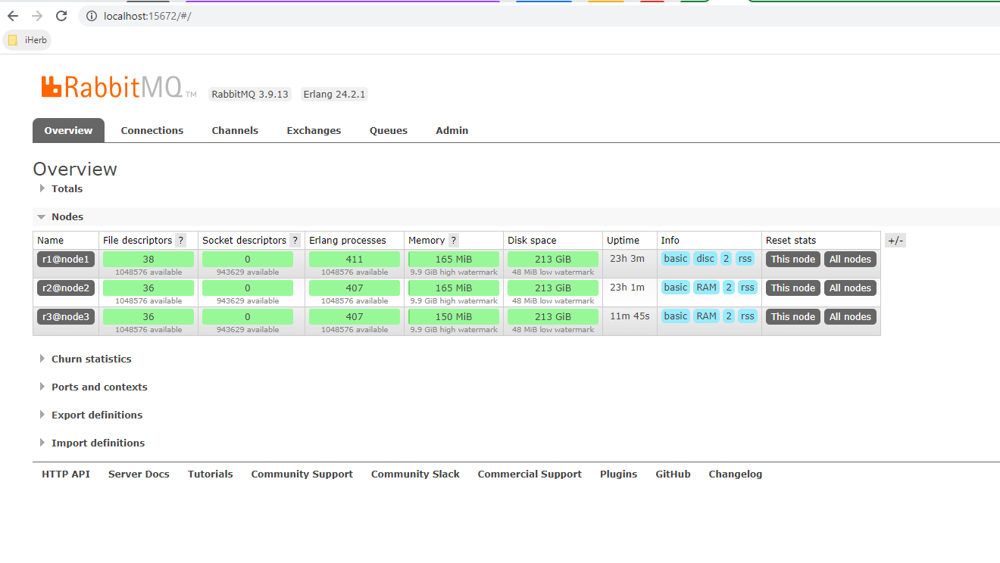

本文用于演示如何在本地使用Docker搭建RabbitMQ集群。

### erlang cookie
erlang节点间通讯需要具有相同的erlang cookie值，erlang cookie的值在`.erlang.cookie`文件中，位置在家目录下，
通常是`/var/lib/rabbitmq`。这里通过Docker volume来共享erlang cookie：```docker volume create rabbit_erl```

erlang cookie可参考：[The Erlang Cookie](https://www.rabbitmq.com/clustering.html#erlang-cookie) 。

### 节点
#### node name
rabbitmq集群通过节点名（node name）来识别节点，节点名格式为：`prefix@hostname`，确保集群中节点名不重复。
Docker容器的hostname默认为容器id，可在运行容器是通过--hostname参数来制定hostname。

#### RAM vs Disc
集群节点分为两种类型，磁盘节点(disc)和内存节点(ram)，磁盘节点会将元数据（队列、交换机及绑定关系的定义和vhost）写入到磁盘，内存节点则将元数据放置在内存中，单节点的rabbitmq实例默认是磁盘节点。  
在新增或移除节点时，所有的磁盘节点必须在线；在修改集群信息时（如，新增队列、用户权限变更等），要求至少有一个磁盘节点在线。

### 创建网络
```docker network create rabbit_cluster```

我们这里是在本机创建的rabbitmq集群，所以使用Docker bridge网络即可。但要注意，不能使用Docker默认的bridge网络，默认的bridge网络只支持容器通过ip进行通讯，
而rabbitmq节点则是通过hostname来加入集群，而自定义bridge网络则支持这点。[点击此处](https://docs.docker.com/network/bridge/#differences-between-user-defined-bridges-and-the-default-bridge) 了解Docker默认bridge网络和自定义bridge网络区别。

### 创建容器
创建的第一个容器会将自己的erlang cookie值写入到rabbit_erl volume中
```shell
docker run -d --name rabbitmq --hostname node1 --network rabbit_cluster -v rabbit_erl:/var/lib/rabbitmq -p 5672:5672 -p 15672:15672 -e RABBITMQ_NODENAME=r1 rabbitmq:3-management
```

运行第二个容器并将容器加入到集群中：
```shell
docker run -d --name rabbitmq2 --hostname node2 --network rabbit_cluster -v rabbit_erl:/var/lib/rabbitmq -p 5673:5672 -p 15673:15672 -e RABBITMQ_NODENAME=r2 rabbitmq:3-management

# 将第二个容器加入到集群中
docker exec -it rabbitmq2 /bin/bash
# 进入容器后执行以下命令
rabbitmqctl stop_app
# reset命令用于清空节点的元数据和状态信息，以便于同步集群中的数据信息
rabbitmqctl reset
rabbitmqctl join_cluster --ram r1@node1
rabbitmqctl start_app
```
重复执行上述命令可以添加第3个、第4个...节点到集群中：


需要注意的是，对于默认类型的队列(classic queue)，rabbitmq集群中队列的数据只存于一个节点上，若该节点挂掉，那么消费者就无法继续获取队列中的数据了，为避免这种情况可以使用[quorum queue](https://www.rabbitmq.com/quorum-queues.html)。


>  [本地创建rabbitmq集群脚本](./rabbit_cluster.sh)

### 节点离开集群
和加入集群的步骤一样，节点离开集群也需要`stop_app`、`reset`、`start_app`三步，若直接将容器删除，集群会认为该节点故障，并不会将该节点信息从集群中删除。
