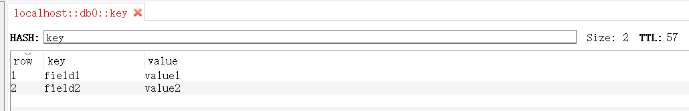

Redis中提供了原子性命令[SETEX](https://redis.io/commands/setex)或SET来写入STRING类型数据并设置Key的过期时间：

```shell
> SET key value EX 60 NX
ok
> SETEX key 60 value
ok
```

但对于HASH结构则没有这样的命令，只能先写入数据然后设置过期时间：

```shell
> HSET key field value
ok
> EXPIRE key 60
ok
```

这样就带了一个问题：HSET命令执行成功而EXPIRE命令执行失败，那么数据将不会过期。针对这个问题，本文提供两种解决方案：

#### Lua脚本

向Redis中写入HASH结构的Lua脚本如下：

```lua
local fieldIndex=1
local valueIndex=2
local key=KEYS[1]
local fieldCount=KEYS[2]
local expired=KEYS[3]
for i=1,fieldCount,1 do
  redis.pcall('HSET',key,ARGV[fieldIndex],ARGV[valueIndex])
  fieldIndex=fieldIndex+2
  valueIndex=valueIndex+2
end
redis.pcall('EXPIRE',key,expired)
```

[使用Redis命令行工具执行Lua脚本](https://redis.io/commands/eval)，需要将脚本内容单行化，并以分号间隔不同的命令：

```shell
>  SCRIPT LOAD "local fieldIndex=1;local valueIndex=2;local key=KEYS[1];local fieldCount=KEYS[2];local expired=KEYS[3];for i=1,fieldCount,1 do redis.pcall('HSET',key,ARGV[fieldIndex],ARGV[valueIndex]) fieldIndex=fieldIndex+2 valueIndex=valueIndex+2 end;redis.pcall('EXPIRE',key,expired);"
"00bfad4f66e549fc57df9cc5f98022c34ada3ef1"
> EVALSHA 00bfad4f66e549fc57df9cc5f98022c34ada3ef1 3 key 2 60 field1 value1 field2 value2
nil
```

写入结果：



使用[StackExchange.Redis](https://github.com/StackExchange/StackExchange.Redis)执行Lua脚本:

```csharp
public async Task WriteAsync(string key, IDictionary<string, string> valueDict, TimeSpan expiry)
{
    async Task func()
    {
        if (valueDict.Empty())
        {
            return;
        }
        // 可以将脚本内容缓存下来以避免多起读取脚本文件
        var luaScriptPath = $"{AppDomain.CurrentDomain.BaseDirectory}/Lua/HSET.lua";
        var script = File.ReadAllText(luaScriptPath);
        var seconds = (int)Math.Ceiling(expiry.TotalSeconds);
        var fieldCount = valueDict.Count;
        var redisValues = new RedisValue[fieldCount * 2];
        var i = 0;
        foreach (var item in valueDict)
        {
            redisValues[i] = item.Key;
            redisValues[i + 1] = item.Value;
            i += 2;
        }
        await Database.ScriptEvaluateAsync(script, new RedisKey[] { key, fieldCount.ToString(), seconds.ToString() }, redisValues);
    }

    await ExecuteCommandAsync(func, $"redisError:hashWrite:{key}");
}
```

#### 占位符

思路如下，共分为4步，每一步都有可能失败：

+ 先写入一个特殊的值，如Nil表示无数据
+ 若第一步操作成功，则Key被写入Redis。然后对Key设置过期时间。若第一步失败，则Key未写入Redis，设置过期时间会失败
+ 若成功设置Key的过期时间则像Redis中写入有效数据
+ 删除第一步中设置的特殊值

在读取Hash的值时，判断读到的field的值是否是Nil，若是则删除并忽略，若不是则处理。

代码如下：

```csharp
namespace RedisClient.Imples
{
    public class RedisHashOperator : RedisCommandExecutor, IRedisHashOperator
    {
        private readonly string KeyExpiryPlaceHolder = "expiryPlaceHolder";

        public RedisHashOperator(ILogger<RedisHashOperator> logger, IRedisConnection redisConnection)
            : base(logger, redisConnection)
        {
        }

        public async Task WriteAsync(string key, IDictionary<string, string> valueDict, TimeSpan expiry)
        {
            async Task action()
            {
                if (valueDict.Empty())
                {
                    return;
                }
                var hashList = new List<HashEntry>();
                foreach (var value in valueDict)
                {
                    hashList.Add(new HashEntry(value.Key, value.Value));
                }
                await Database.HashSetAsync(key, hashList.ToArray());
            }

            async Task successed()
            {
                await ExecuteCommandAsync(action, $"redisEorror:hashWrite:{key}");
            }

            await SetKeyExpireAsync(key, expiry, successed);
        }


        public async Task<RedisReadResult<IDictionary<string, string>>> ReadAllFieldsAsync(string key)
        {
            async Task<RedisReadResult<IDictionary<string, string>>> func()
            {
                var redisReadResult = new RedisReadResult<IDictionary<string, string>>();
                if (Database.KeyExists(key) == false)
                {
                    return redisReadResult.Failed();
                }
                var resultList = await Database.HashGetAllAsync(key);
                if (resultList == null)
                {
                    return redisReadResult.Failed();
                }
                var dict = new Dictionary<string, string>();
                if (resultList.Any())
                {
                    foreach (var result in resultList)
                    {
                        if (result.Name == KeyExpiryPlaceHolder || result.Value == KeyExpiryPlaceHolder)
                        {
                            await RemoveKeyExpiryPlaceHolderAsync(key);
                            continue;
                        }
                        dict[result.Name] = result.Value;
                    }
                }
                return redisReadResult.Success(dict);
            }

            return await ExecuteCommandAsync(func, $"redisError:hashReadAll:{key}");
        }


        #region private
        /// <summary>
        /// 设置HASH结构KEY的过期时间
        /// </summary>
        /// <param name="successed">设置过期时间成功之后的回调函数</param>
        private async Task SetKeyExpireAsync(string key, TimeSpan expiry, Func<Task> successed)
        {
            // 确保KEY的过期时间写入成功之后再执其它的操作
            await Database.HashSetAsync(key, new HashEntry[] { new HashEntry(KeyExpiryPlaceHolder, KeyExpiryPlaceHolder) });
            if (Database.KeyExpire(key, expiry))
            {
                await successed();
            }
            await Database.HashDeleteAsync(key, KeyExpiryPlaceHolder);
        }

        private async Task RemoveKeyExpiryPlaceHolderAsync(string key)
        {
            await Database.HashDeleteAsync(key, KeyExpiryPlaceHolder);
        }
        #endregion

    }
}
```

文中多次出现的ExecuteCommandAsync方法主要目的是实现针对异常情况的统一处理，实现如下：

```csharp
namespace RedisClient.Imples
{
    public class RedisCommandExecutor
    {
        private readonly ILogger Logger;
        protected readonly IDatabase Database;

        public RedisCommandExecutor(ILogger<RedisCommandExecutor> logger, IRedisConnection redisConnection)
        {
            Logger = logger;
            Database = redisConnection.GetDatabase();
        }

        protected async Task ExecuteCommandAsync(Func<Task> func, string errorMessage = null)
        {
            try
            {
                await func();
            }
            catch (Exception ex)
            {
                if (string.IsNullOrEmpty(errorMessage))
                {
                    errorMessage = ex.Message;
                }
                Logger.LogError(errorMessage, ex);
            }
        }

        protected async Task<T> ExecuteCommandAsync<T>(Func<Task<T>> func, string errorMessage = null)
        {
            try
            {
                return await func();
            }
            catch (Exception ex)
            {
                if (string.IsNullOrEmpty(errorMessage))
                {
                    errorMessage = ex.Message;
                }
                Logger.LogError(errorMessage, ex);
                return default(T);
            }
        }
    }
}
```