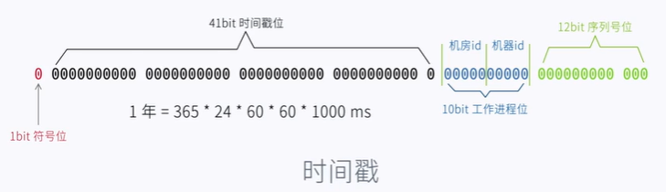
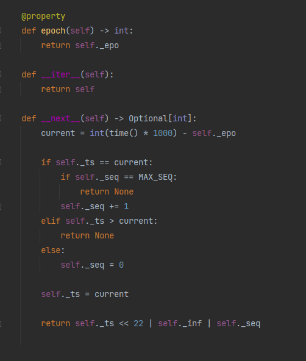

在分布式系统中，全局唯一id算是一个基本需求，对于全局唯一id通常要求：

+ 全局唯一

+ 趋势递增

  id的值递增但可以不连续

+ 单调递增

  后面产生的id值一定大于前面的id值

+ 信息安全

  id值不能暴露出业务数据信息

> :warning: 许多餐馆中的订单号通常是当天唯一且连续递增，通过订单号就可以知道这家餐馆卖出了多少单

本文主要对比以下几种方案：

+ UUID

+ 雪花算法

+ 号段模式

## UUID

截至目前UUID有5个版本，第二个版本DCE（Distributed Computing Environment）安全的UUID不推荐使用，它时间戳的低部分被代表本地标识符的32位整数替换，这会导致精度损失。Python包[uuid](https://pypi.org/project/uuid/)中就没提供第二个版本的实现。

UUID可以实现信息安全，但是无序，存储到数据库中不利于数据检索，且因无序会增加索引维护成本：B+树为了保持平衡有序，会移动部分数据到新的数据页导致页分裂，进而影响读写性能降低空间利用率。此外，UUID占用空间比较大。

最后，不同版本的UUID也不一定能保证唯一性。如uuid1基于时间戳和机器信息来生成uuid，多进程并发情况下会导致重复uuid值出现。

综上，不推荐使用UUID作为分布式环境中唯一id。

## 雪花算法

Twitter开源基于时间戳（精确到毫秒）的分布式id算法，使用一个64位的long类型数字表示全局唯一id，id结构如下图，12位序列号支持同一机房同一服务器在1ms内生成2^12个id，超出这个范围需等待下一毫秒：

雪花算法主要步骤如下：

1. 获取当前时间戳
2. 对比当前时间戳和上次生成id的时间戳
3. 若二者相等，则序列号加1
4. 若小于当前时间戳，则将序列号重置为0
5. 若大于当前时间戳，则说明发生了时钟回拨
6. 更新最后生成id时间戳为当前时间戳

图中是Python[snowflake-id](https://github.com/vd2org/snowflake)库雪花算法的实现：

雪花算法最大的问题在于服务器时钟回拨问题，出现时钟回拨会导致生成重复id。

对于时钟回拨问题的处理，主要有以下几种思路：

+ 直接抛出异常，简单粗暴
+ 设置时间回拨最大容忍毫秒数阈值，在范围之内可以等待时间到达最后生成id的时间，若超出范围则抛异常
+ 设置偏移量，出现时钟回拨，在生成新的id时可传入一个时间偏移量

## 号段模式

我们可以在库中创建一张全局id表，每次需要id时请求一次数据库获取一个递增的id。对这个过程可以做下简单优化：一次获取一批id，如：1000个，即步长为1000，然后放到应用本地缓存中，这样就可以大大减少请求数据库的次数，从而提高性能，这1000个id就是id号段。

需要注意的是，一次请求1000个id，没必要在数据库中真的就存储1000个id值，而是存储更新后的最大id值，如：

| id   | key  | VALUE | timestamp  |
| ---- | ---- | ----- | ---------- |
| 1    | ord  | 1001  | 1630756741 |
| ...  | ...  | ...   | ...        |

多个服务并发请求号段，会有竞争问题，可以借助数据库锁（悲观锁或乐观锁）来解决。

#### 双号段
应用服务缓存的号段用完后会到数据库请求新号段，那么在性能监控上就会看到有毛刺的出现。可以使用双号段模式来解决这个问题，双号段就是应用服务本地缓存连个号段，当一个号段快用完时，异步加载新的号段缓存起来，保证本地缓存中一直有号段可用。

#### 单点故障

部署一主多从数据库架构可以一定程度避免数据库单点故障，但需要考虑到主从同步的延时，有可能导致数据不一致。

此外，可以部署多个主库实例来避免点单故障，同时给不同的主库设置不同的id初始值、步长等来避免生成重复的号段。

该模式有以下几个问题：

+ 应用服务重启，会重新去申请号段，导致之前未使用的号段被浪费

  要选择一个合适的步长来兼顾性能与避免号段浪费

+ 号段模式下生成的id不够随机，有可能暴露业务信息

## 其它方案

除了上述集中方法外，还可以借助于redis自身的[incr](https://redis.io/commands/incr)、[incrby](https://redis.io/commands/incrby)等原子性命令来生成唯一id，以及mongo中[ObjectId](https://docs.mongodb.com/manual/reference/method/ObjectId/)。还有一些成熟的开源库，如：美团的[Leaf](https://github.com/Meituan-Dianping/Leaf)、百度的[UidGenerator](https://github.com/baidu/uid-generator)等。

## 推荐阅读

[Leaf——美团点评分布式ID生成系统](https://tech.meituan.com/2017/04/21/mt-leaf.html)  

[Mongo ObjectId](https://docs.mongodb.com/manual/reference/method/ObjectId/)

