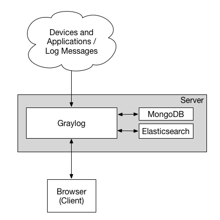
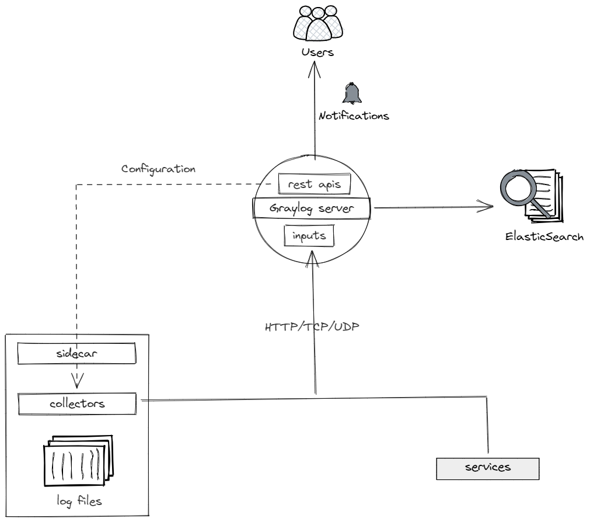
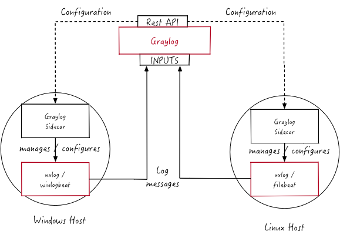

### 架构

下图是Graylog最小架构，Graylog**仅使用**Elasticsearch存储日志，Mongo存储配置信息。更多架构信息可参考：[Architectural Considerations](https://docs.graylog.org/docs/architecture)




### 集成

Graylog支持多种集成方式，可在代码中将日志直接发送至Graylog，也可通过Sidecar模式收集日志：

| 集成方式 | 优势                       | 缺点                                    |
| :------- | :------------------------- | :-------------------------------------- |
| 代码     | 现有部署方式不变           | 需修改现有代码，脚本语言支持有限，如Lua |
| Sidecar  | 语言无关，代码逻辑无需修改 | 部署较为繁琐                            |





[Graylog Sidecar](https://docs.graylog.org/docs/sidecar)是轻量级log收集器配置管理工具，Graylog节点通过Sidecar管理log收集器来实现对日志的收集，架构图如下：



可通过Beats类型Input结合filebeat来实现读取服务器上日志文件内容并发送至Graylog，详情可参考：[Graylog Sidecar](https://docs.graylog.org/docs/sidecar)。


### 部署


**shell脚本**

```shell
docker volume rm graylog_mongo_db
docker volume rm graylog_mongo_cfg
 
docker stack deploy -c ./graylog.yml graylog
```


**graylog stack脚本**

```yaml
version: '3.8'
 
services:
    # MongoDB: https://hub.docker.com/_/mongo/
    mongo:
      image: mongo:latest
      networks:
        - graylog
      # environment:
      #   MONGO_INITDB_ROOT_USERNAME: root
      #   MONGO_INITDB_ROOT_PASSWORD: example
      ports:
        - '27017:27017'
      volumes:
        - graylog_mongo_db:/data/db
        - graylog_mongo_cfg:/data/configdb
 
 
    # Elasticsearch: https://www.elastic.co/guide/en/elasticsearch/reference/7.10/docker.html
    elasticsearch:
      image: docker.elastic.co/elasticsearch/elasticsearch-oss:7.10.2
      ports:
        - '9200:9200'
        - '9300:9300'
      environment:
        - http.host=0.0.0.0
        - transport.host=localhost
        - network.host=0.0.0.0
        - "ES_JAVA_OPTS=-Dlog4j2.formatMsgNoLookups=true -Xms512m -Xmx512m"
      ulimits:
        memlock:
          soft: -1
          hard: -1
      deploy:
        resources:
          limits:
            memory: 1g
      networks:
        - graylog
 
 
    # Graylog: https://hub.docker.com/r/graylog/graylog/
    graylog:
      image: graylog/graylog:4.3.3
      environment:
        # CHANGE ME (must be at least 16 characters)!
        - GRAYLOG_PASSWORD_SECRET=somepasswordpepper
        # Password: admin
        - GRAYLOG_ROOT_PASSWORD_SHA2=8c6976e5b5410415bde908bd4dee15dfb167a9c873fc4bb8a81f6f2ab448a918
        - GRAYLOG_HTTP_EXTERNAL_URI=http://127.0.0.1:9000/
        # - ELASTICSEARCH_HOSTS=http://127.0.0.1:9200
      entrypoint: /usr/bin/tini -- wait-for-it elasticsearch:9200 --  /docker-entrypoint.sh
      networks:
        - graylog
      ports:
        # Graylog web interface and REST API
        - 9000:9000
        # Syslog TCP
        - 1514:1514
        # Syslog UDP
        - 1514:1514/udp
        # GELF TCP
        - 12201:12201
        # GELF UDP
        - 12201:12201/udp
 
 
volumes:
  graylog_mongo_db:
    driver: local
    name: graylog_mongo_db # /data/db
  graylog_mongo_cfg:
    driver: local
    name: graylog_mongo_cfg # /data/configdb
 
networks:
  graylog:
    driver: overlay
    # name: graylog
    # external: true
```


### 参考文档

[Install Graylog with Docker](https://docs.graylog.org/v1/docs/docker)

[What is OpenSearch?](https://www.elastic.co/what-is/opensearch)

[GRAYLOG SIDECAR](https://docs.graylog.org/docs/sidecar)

[What are Beats?](https://www.elastic.co/guide/en/beats/libbeat/current/beats-reference.html)