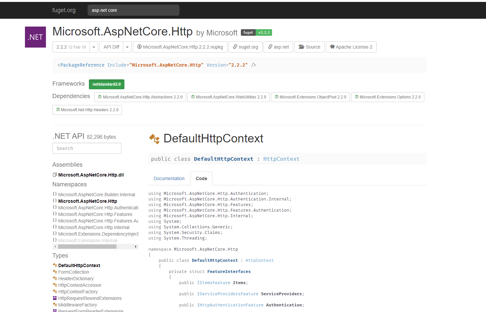
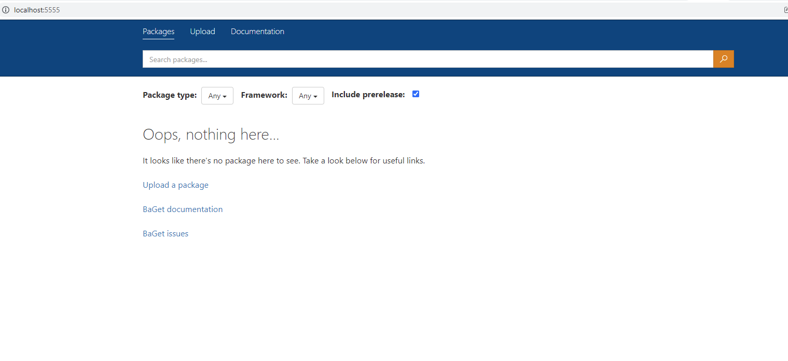
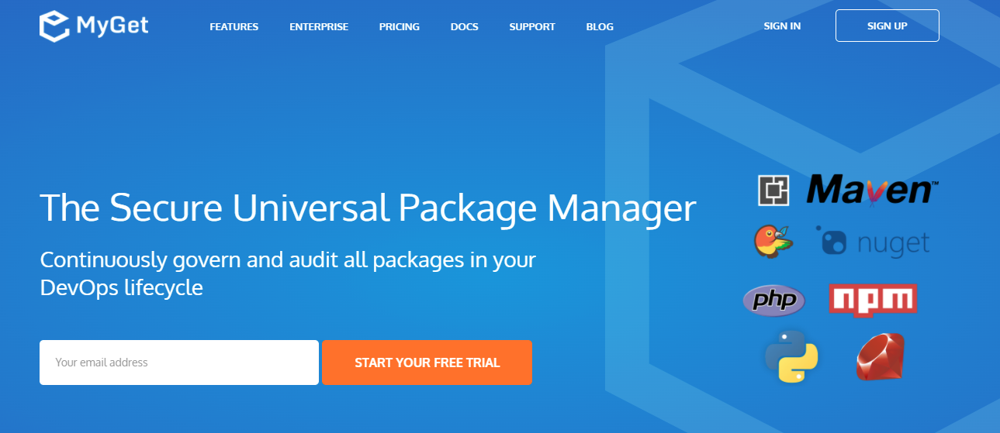
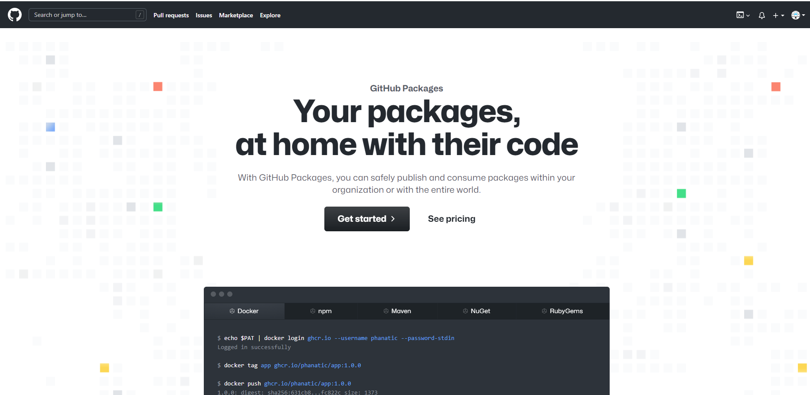

[NuGetGallery](https://github.com/NuGet/NuGetGallery) 基于.NET平台构建，.NET基金会提供的Nuget中央仓库，可以自己编译项目源码创建自己的仓库。

[FuGet](https://www.fuget.org/) 基于.NET平台构建，对Nuget.org的功能进行了增强，提供了在线浏览包的源代码功能，还可以比较不通版本修改了哪些内容，项目仓库地址[FuGetGallery](https://github.com/praeclarum/FuGetGallery)：

[BaGet](https://github.com/loic-sharma/BaGet) 基于.NET平台构建的轻量级Nuget和[Symbol](https://docs.microsoft.com/en-us/windows/win32/debug/symbol-servers-and-symbol-stores)服务，使用容器来运行十分方便：

[NuGet.Server](https://github.com/NuGet/NuGet.Server)也是轻量级的Nuget服务，不过和BaGet有这一些限制，如：NuGet.Server只能跑在Windows上，详情见：[BaGet vs NuGet](https://loic-sharma.github.io/BaGet/vs/nugetserver/)

不差钱也可以使用[MyGet](https://www.myget.org/)，MyGet兼容不同语言的包格式，如：nuget, maven, npm, pypi等等。

[Github](https://github.com/features/packages?WT.mc_id=-blog-scottha)也提供了针对不同格式包的管理功能，当然存储空间是要收费的。国内访问Github网络并不稳定，可以借助[FastGithub](https://github.com/dotnetcore/FastGithub)来加速访问：

## 推荐阅读

[Hosting your own NuGet Server and Feed for build artifacts with BaGet](https://www.hanselman.com/blog/hosting-your-own-nuget-server-and-feed-for-build-artifacts-with-baget)