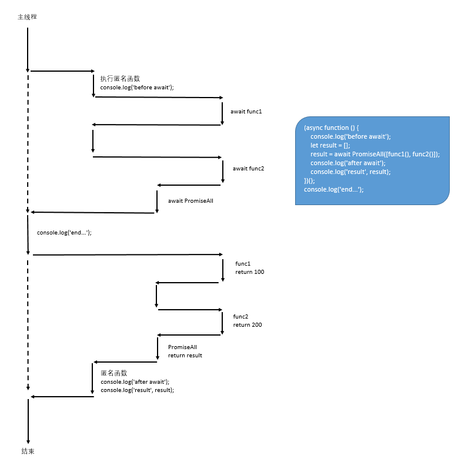
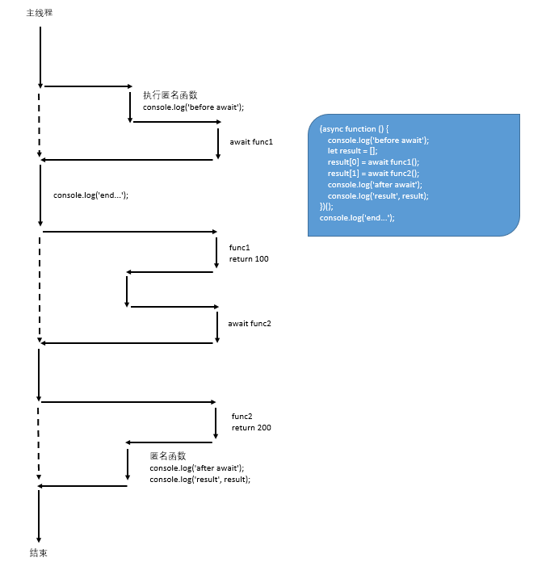

前段时间有同事问了一个问题：JavaScript是单线程运行代码，那么如下代码片段中，同样是执行`func1`和`func2`，为什么使用`Promise.all`相比于直接执行`await func1();await func2();`速度更快：

```javascript
async function func1() {
    await new Promise(resolve => {
        setTimeout(resolve, 3000);
    });
    return 100;
}

async function func2() {
    await new Promise(resolve => {
        setTimeout(resolve, 3000);
    });
    return 200;
}

(async function () {
    let result = [];
    // 约3秒返回结果
    result = await Promise.all([func1(), func2()]);
    // 约6秒返回结果
    // result[0] = await func1();
    // result[1] = await func2();
    console.log('result', result);
})();
```

当时并不能很好的回答这个问题，便查阅了相关资料整理如下：

## 并发模型

JavaScript使用基于事件循环的并发模型，这里并发指事件循环处理任务队列中回调函数的能力。该模型三大特点：**单线程、异步、非阻塞**。

单线程是指执行用户代码（或者说事件循环）的时候只有一个线程，即主线程。但JavaScript的Runtime不是单线程的。异步指主线程不用等待任务结果返回。非阻塞指任务执行过程不会导致事件循环停止，这里的非阻塞更多的是指I/O操作。JavaScript并发模型简化图示如下：


与此类似Node执行用户代码也是用单线程，但Node内部不是单线程。下面是网上找的一张Node架构图，原图地址：[Node.js event loop architecture](https://medium.com/preezma/node-js-event-loop-architecture-go-deeper-node-core-c96b4cec7aa4)。可以看到Node中可能阻塞事件循环的任务，如：[未提供异步API的I/O操作及CPU密集型任务](https://nodejs.org/en/docs/guides/dont-block-the-event-loop/#what-code-runs-on-the-worker-pool)会委托给`worker thread pool`来处理，不会影响到事件循环。


**Node event loop vs Browser event loop vs JavaScript event loop**

不同的宿主环境有着各自的事件循环实现，下面一段摘录自[JavaScript Event Loop vs Node JS Event Loop](https://blog.insiderattack.net/javascript-event-loop-vs-node-js-event-loop-aea2b1b85f5c)，介绍了v8、浏览器、Node三者事件循环区别：

> Both the browser and NodeJS implements an asynchronous event-driven pattern with JavaScript. However, the “Events”, in a browser’s context, are user interactions on web pages (e.g, clicks, mouse movements, keyboard events etc.), but in Node’s context, events are asynchronous server-side operations (e.g, File I/O access, Network I/O etc.). Due to this difference of needs, Chrome and Node have different Event Loop implementations, though they share the same V8 JavaScript engine to run JavaScript.
>
> Since “the event loop” is nothing but a programming pattern, V8 allows the ability to plug-in an external event loop implementation to work with its JavaScript runtime. Using this flexibility, the Chrome browser uses [**libevent**](https://libevent.org/) as its event loop implementation, and NodeJS uses [**libuv**](https://libuv.org/) to implement the event loop. Therefore, chrome’s event loop and NodeJS’s event loop are based on two different libraries and which have differences, but they also share the similarities of the common “Event Loop” programming pattern.

## 协程

JavaScript异步编程大致经历了如下几个阶段：Callback、Promise、async/await。

Callback大家都比较熟悉了，如：`SetTimeout`和`XMLHttpRequest`等API中使用回调来进行异步处理。

回调函数使用相对简单，但存在回调地狱问题，因此在ES6中引入了[Promise](https://developer.mozilla.org/en-US/docs/Web/JavaScript/Reference/Global_Objects/Promise)来解决该问题。但如果处理流程比较复杂的话，使用Promise代码中会用到大量的then方法，语义不清晰。

在ES7中引入了[await/async](https://developer.mozilla.org/en-US/docs/Web/JavaScript/Reference/Statements/async_function)，让我们可以用同步的方式来编写异步代码。一个async函数会隐式返回一个Promise对象，遇到await表达式会暂停函数执行，待await表达式计算完成后再恢复函数的执行（生成器中使用的yield也有相似功能），通过生成器来实现异步编程可以参考开源项目：[co](https://github.com/tj/co)。

await表达式分为两种情况：

+ 如果await后面是Promise对象，则当Promise对象的状态为fulfill/reject时， await表达式结束等待，await后面的代码将被执行
+ 如果await后面不是Promise对象，则隐式转换为状态为fulfill的Promise对象

代码的暂停和恢复执行用到了协程（Coroutine），async函数是有协程负责执行的，在遇到await时便暂停当前协程，等到await表达式计算完成再恢复。注意这里只是暂停协程，并不妨碍主线程执行其它代码。

最早接触协程的概念是在go中，后来发现好多语言都有，还是要多看多了解不能局限于一种语言。协程通常解释为**轻量级线程**，一个线程上可以存在多个协程，但每次只能执行一个协程。协程的调度不牵涉到线程上下文的切换，不存在线程安全问题、相比线程有着更好的性能。

## 实现Pomise.all

了解了异步方法调度原理，针对文章开头的场景，自己实现一个简化版的`PromiseAll`：

```javascript
async function PromiseAll(values) {
    // console.log('call promise all');
    let result = [];
    for (let i = 0; i < values.length; i++) {
        await Promise.resolve(values[i]).then(value => {
            let index = i;
            result[index] = value;
        });
    }

    // console.log('waiting result');
    if (result.length == values.length) {
        // console.log('promise all result', result);
        return result;
    }
}
```

使用`PromiseAll`来执行之前的异步函数：

```javascript
(async function () {
    console.log('before await');
    let result = [];
    // 不阻塞主线程
    result = await PromiseAll([func1(), func2()]);
    console.log('after await');
    console.log('result', result);
})();
console.log('end...');

// 输出如下：
// before await
// end...
// 间隔约3秒后输出
// after await
// result [ 100, 200 ]
```

`PromiseAll`执行流程如下：



使用串行await执行代码：

```javascript
(async function () {
    console.log('before await');
    let result = [];
    result[0] = await func1();
    result[1] = await func2();
    console.log('after await');
    console.log('result', result);
})();
console.log('end...');

// 输出如下：
// before await
// end...
// 间隔约6秒后输出
// after await
// result [ 100, 200 ]
```

串行await执行流程如下：



从流程图中可以比较清晰的看到，`PromiseAll`之所以会更快的得到结果，是因为`func1`和`func2`近似并行执行。

##　对比其它语言中的异步

其它编程平台如：.NET、Python也提供了async/await特性。在.NET中默认基于线程池来执行异步方法，Python则和JavaScript一样使用了协程。

Python中使用async/await需要导入[asyncio](https://docs.python.org/3/library/asyncio.html)包，从包的名字可以感受到，asyncio主要针对的就是I/O场景。异步I/O操作最终会委托操作系统来完成工作，不会阻塞应用线程从而提升应用响应能力。与JavaScript类似，**asyncio通过事件循环机制+协程+task来实现异步编程**。此外，Python代码主流程也是有单线程执行，在实际运行中也可能会有多线程操作，但因为GIL的存在，Python中即使使用多线程也不会并行执行代码，想要并行需使用多进程方式。

JavaScript、.NET、Python的异步编程在经历了不断演化后，最终都提供了async/await特性，算是殊途同归。

## 参考文章

[Node.js event loop architecture](https://medium.com/preezma/node-js-event-loop-architecture-go-deeper-node-core-c96b4cec7aa4)

[Javascript — single threaded, non-blocking, asynchronous, concurrent language](https://theflyingmantis.medium.com/javascript-single-threaded-non-blocking-asynchronous-concurrent-language-ffae97c57bef)

[Concurrency model and Event Loop](http://www-lia.deis.unibo.it/materiale/JS/developer.mozilla.org/en-US/docs/Web/JavaScript/EventLoop.html)

[JavaScript Event Loop vs Node JS Event Loop](https://blog.insiderattack.net/javascript-event-loop-vs-node-js-event-loop-aea2b1b85f5c)

[What code runs on the Worker Pool?](https://nodejs.org/en/docs/guides/dont-block-the-event-loop/#what-code-runs-on-the-worker-pool)

[Redis 多线程网络模型全面揭秘](https://segmentfault.com/a/1190000039223696)

[终于懂了：协程思想的起源与发展](https://mp.weixin.qq.com/s/Wy-_J9TlU3aSAJt24ZT5hw)

[彻底理解什么是协程！](https://mp.weixin.qq.com/s/mMVx31oQSYHE89gbwc12yw)

