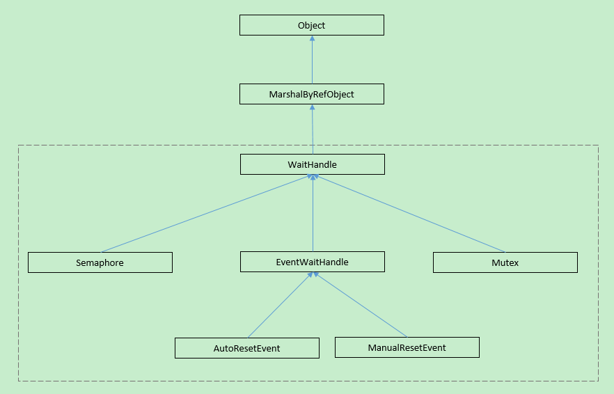
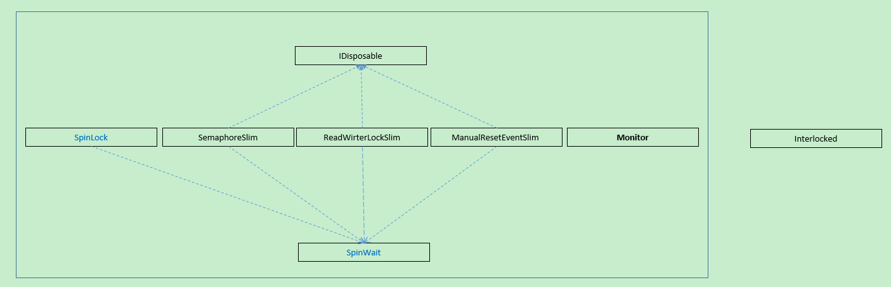

简答概括什么是线程安全：多线程并发访问的情况下得到的结果和单线程访问一样，就可以认为是线程安全，否则就不是线程安全。

[线程安全](https://en.wikipedia.org/wiki/Thread_safety)分为以下几个等级：

+ 线程安全

  可以多线程并发访问，如：只读资源、一些原子性操作等

+ 有条件安全

  在特定条件下，如：锁，可以多线程并发访问

+ 非线程安全

  不能多线程访问

## .NET中的同步原语（synchronization primitives）

相关类源码地址：[System.Threading](https://github.com/dotnet/runtime/tree/main/src/libraries/System.Private.CoreLib/src/System/Threading)目录下

#### 跨进程

因[WaitHandle](https://docs.microsoft.com/en-us/dotnet/api/system.threading.waithandle?view=net-5.0)继承自[MarshalByRefObject](https://docs.microsoft.com/en-us/dotnet/api/system.marshalbyrefobject?view=net-5.0)，所以在.NET Framework中可以跨应用程序域使用。在.NET Framework、.NET Core、.NET5+中，以下几种类型提供了

#### 多线程

## 推荐阅读

[Thread safety](https://en.wikipedia.org/wiki/Thread_safety)

[Overview of synchronization primitives](https://docs.microsoft.com/en-us/dotnet/standard/threading/overview-of-synchronization-primitives)

[图解Java中那18 把锁](https://mp.weixin.qq.com/s/GfYU8zK7-_aDng_o2Alcog)

[不可不说的Java“锁”事 - 美团技术团队](https://tech.meituan.com/2018/11/15/java-lock.html)