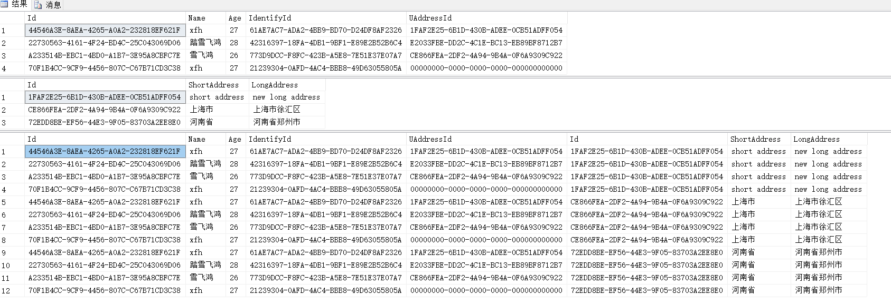
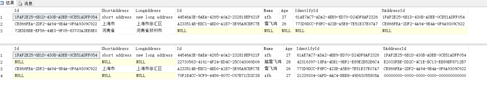
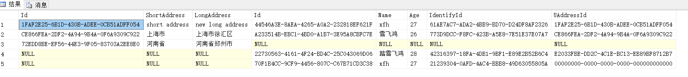
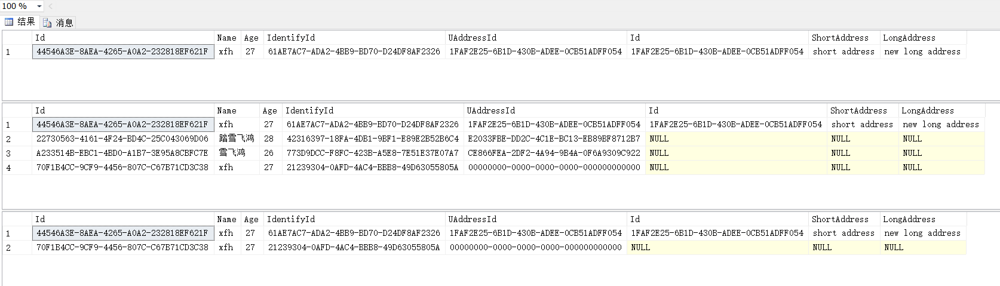

在上篇博文中介绍了[T-SQL查询的基础知识](https://www.cnblogs.com/Cwj-XFH/p/9898835.html)，本篇主要介绍稍微复杂的查询形式。

## 表运算符

表运算符的作用是把为其提供的表作为输入，经过逻辑查询处理，返回一个表结果。SQL Server支持四个表运算符：JOIN、APPLY、PIVOT、UNPIVOT，其中JOIN是标准SQL中的运算符，APPLY、PIVOT和UNPIVOT是T-SQL的扩展。

JOIN：联接查询时使用

APPLY：用于FROM子句中，分为`CROSS APPLY`和`OUTER APPLY`两种形式

PIVOT：用于行转列

UNPIVOT：用于列传行

##  联接查询

联接查询分为外联接、内联接、交叉联接，三者的区别在于如何应用逻辑查询处理阶段：

+ 交叉联接仅应用一个阶段——笛卡尔乘积；
+ 内联接应用两个阶段——笛卡尔乘积和基于谓词`ON`的筛选；
+ 外联结应用三个极端——笛卡尔乘积，基于谓词`ON`的筛选，添加外部行；

#### 内部行 & 外部行

内部行指的是基于谓词ON与另一侧匹配的行，外部行则是未匹配的行，外部行用NULL进行填充。内联接结果集仅保留内部行，外联接结果集返回内部行和外部行。

#### 笛卡尔乘积

将一个输入表的每一行与另一个表的所有行匹配，即，**如果一张表有m行a列，另一张表n行b列，笛卡尔乘积后得到的表有m*n行，a+b列**。由此可以看出，对于数据量较大的表进行关联的话，会得到一张数据量更大的表，会有可能造成内存溢出的。

以下是网络上关于笛卡尔乘积的解释：

> 在数学中，两个集合X和Y的[笛卡儿](http://www.baike.com/wiki/%E7%AC%9B%E5%8D%A1%E5%84%BF)积（Cartesian product），又称直积，表示为X × Y，**第一个对象是X的成员而第二个对象是Y的所有可能有序对的其中一个成员**。假设集合A=a, b，集合B=0, 1, 2，则两个集合的笛卡尔积为(a, 0), (a, 1), (a, 2), (b, 0), (b, 1), (b, 2)。类似的例子有，如果A表示某学校学生的集合，B表示该学校所有课程的集合，则A与B的笛卡尔积表示所有可能的选课情况。A表示所有声母的集合，B表示所有韵母的集合，那么A和B的笛卡尔积就为所有可能的汉字全拼。

举例如下：

```mssql
USE WJChi;

SELECT * FROM dbo.UserInfo;
SELECT * FROM dbo.UAddress;

SELECT * 
FROM dbo.UserInfo 
CROSS JOIN dbo.UAddress;
```

得到结果集如下：



#### 交叉联接

SQL中使用`CROSS JOIN`语句进行交叉联接查询，在逻辑处理上，交叉联接是最为简单的联接类型，它只获取表的笛卡尔乘积。

交叉联接两种写法：

```mssql
USE WJChi;

-- 使用CROSS JOIN，推荐使用这种方式
SELECT * 
FROM dbo.UserInfo 
CROSS JOIN dbo.UAddress;

-- 不使用CROSS JOIN
SELECT * 
FROM dbo.UserInfo,dbo.UAddress;
```

#### 内联接

SQL中使用`INNER JOIN...ON...`语句进行内联接查询，`INNER`关键字可选。内联接的逻辑处理分为两步：

+ 生成笛卡尔乘积
+ 根据谓词`ON`对笛卡尔乘积进行筛选

与交叉联接一样，内联接有两种写法：

```mssql
USE WJChi;

-- 使用INNER JOIN，推荐使用这种方式
SELECT * 
FROM dbo.UAddress
INNER JOIN dbo.UserInfo 
ON UserInfo.UAddressId = UAddress.Id;

-- 不使用INNER JOIN，与交叉联接类似，但比交叉联接多了WHERE条件
SELECT * 
FROM dbo.UAddress,dbo.UserInfo 
WHERE UserInfo.UAddressId = UAddress.Id;
```

#### 外联接

外联接分为左外联接：`LEFT OUT JOIN`、右外联接：`RIGHT OUT JOIN`和全联接：`FULL OUT JOIN`，其中，`OUT`关键字是可选的。相比于交叉联接和内联接，外联接则最为复杂。外联接逻辑处理分为三步：

1. 获取表的笛卡尔乘积
2. 根据谓词`ON`对笛卡尔乘积进行筛选
3. 添加外部行数据到结果集中

###### LEFT JOIN  & RIGHT JOIN

`LEFT JOIN`获取的结果集中保留了左表（LEFT JOIN左侧的表）中的所有数据，及右表中满足筛选条件的数据。右表中不满足筛选条件的空行（外部行）则用NULL值填充。

`RIGHT JOIN`与`LEFT JOIN`作用相反。

示例代码如下，表UserInfo中有4条数据，表UAddress中有三条数据：

```mssql
USE WJChi;

SELECT * 
FROM dbo.UAddress
LEFT JOIN dbo.UserInfo 
ON UserInfo.UAddressId = UAddress.Id;

SELECT * 
FROM dbo.UAddress
RIGHT JOIN dbo.UserInfo 
ON UserInfo.UAddressId = UAddress.Id;
```

查询结果如下：



###### FULL JOIN

`FULL JOIN`的结果是取`LEFT JOIN`和`RIGHT JOIN`查询结果集的并集

```mssql
USE WJChi;

SELECT * 
FROM dbo.UAddress
FULL JOIN dbo.UserInfo 
ON UserInfo.UAddressId = UAddress.Id;
```

查询结果如下：



#### ON & WHERE

前面说到：内联接结果集仅保留内部行，外联接结果集返回内部行和外部行。换句话说，外联接中`ON`子句的作用是进行表之间关联，如果外联接需要对结果集做进一步的筛选的话不能使用`ON...AND...`语句，而要使用`WHERE`条件。示例如下：

```mssql
USE WJChi;

-- 内联接使用ON...AND...筛选数据
SELECT * 
FROM dbo.UserInfo AS UI
JOIN dbo.UAddress AS UA
ON UA.Id = UI.UAddressId 
-- 获取Name为xfh的数据
AND UI.Name='xfh';

-- 外联接使用ON...AND...筛选数据
SELECT * 
FROM dbo.UserInfo AS UI
LEFT JOIN dbo.UAddress AS UA
ON UA.Id = UI.UAddressId 
-- 获取Name为xfh的数据，无效
AND UI.Name='xfh';

-- 外联接使用WHERE对结果集进行筛选
SELECT * 
FROM dbo.UserInfo AS UI
LEFT JOIN dbo.UAddress AS UA
ON UA.Id = UI.UAddressId 
WHERE UI.Name='xfh';

```

输出结果如下：



#### 复合联接

复合联接是指谓词涉及表中多个字段的联接，即，关联条件使用`ON...AND...`的形式。

#### 自联接

同一张表的多个实例之间相互联接，称为自联接。所有基本联接类型（内联接、外联接、交叉联接）支持。

```mssql
USE WJChi;

SELECT * 
FROM dbo.UserInfo AS U1 
CROSS JOIN dbo.UserInfo AS U2;
```

自联接中要为表名指定别名，否则结果集中的列名都将不明确。

#### 相等联接 & 不等联接

当联接条件使用相等运算符时称为相等联接，否则称为不等联接：

```mssql
USE WJChi;

-- 相等联接
SELECT * 
FROM dbo.UAddress
FULL JOIN dbo.UserInfo 
ON UserInfo.UAddressId = UAddress.Id;

-- 不等联接
SELECT * 
FROM dbo.UAddress
FULL JOIN dbo.UserInfo 
ON UserInfo.UAddressId <> UAddress.Id;
```

#### 多联接查询

超过两张表进行关联查询即为多联接查询。通常，当SQL中出现多个表运算符时，从左到右进行逻辑处理，前一个联接的结果会作为下一个联接的左侧输入。SQL Server也常常出于优化查询的目的，在实际处理查询过程中对联接进行重新排序，但这不会影响到处理结果集的正确性。

> :warning:不建议超过三张表进行关联，过多的表关联会使SQL变得复杂，难以维护且影响性能


## 小结

过多的表联接会让SQL逻辑变得复杂，对查询性能产生负面影响，且难以维护。

SQL（任何代码）的书写应将语义清晰作为第一追求，而不是为了“炫技”写一些别人难以理解的代码。

[StackOverflow](https://stackoverflow.com/questions/38549/what-is-the-difference-between-inner-join-and-outer-join)中扣出的一张图片，可以概述外联接和内联接查询：


## 推荐阅读

[T-SQL基础（一）之简单查询](./T-SQL基础（一）之简单查询.md)

[What is the difference between “INNER JOIN” and “OUTER JOIN”?](https://stackoverflow.com/questions/38549/what-is-the-difference-between-inner-join-and-outer-join)