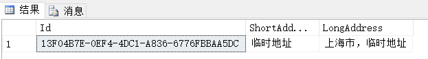
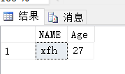
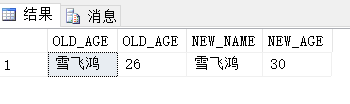

在前面的文章中对T-SQL的查询做了基本总结，接下来我们看下SQL中的另外一个常用操作——数据的修改。

## INSERT

#### INSERT

向数据表中插入数据的基本语句，句式：

```sql
INSERT INTO table_name(field1[,field2]...) 
VALUES(value1[,value2]...);
```

T-SQL对`VALUES`进行了增强，可以一条语句插入多条数据：

```sql
INSERT INTTO table_name(field1[,field2]...) 
VALUES(value1[,value2]...)[,(value3,[value4]...)];
```

示例如下：

```sql
USE WJChi;

-- 插入一条数据
INSERT INTO dbo.UserInfo(Id,Name,Age,IdentifyId,UAddressId)
VALUES
(NEWID(),N'xfh',26,NEWID(),NEWID());

-- 插入多条数据
INSERT INTO dbo.UserInfo(Id,Name,Age,IdentifyId,UAddressId)
VALUES
(NEWID(),N'xfh',26,NEWID(),NEWID()),
(NEWID(),N'雪飞鸿',28,NEWID(),NEWID());
```

#### BULK INSERT

该语句用于**将文件中的数据插入到一个现有表中**，句式：

```sql
BULK INSERT target_table FROM `data_file_path`
WITH
(
	DATAFILETYPE = '',
    FIELDTERMINATOR = '',
    ROWTERMINATOR = ''
)
```

#### INSERT...SELECT...

该语句向**已存在的目标表**中插入有SELECT查询返回的结果集，句式：

```
INSERT INTO target_table(field1[,field2]) 
SELECT column1[,column2] 
FROM raw_table 
WHERE...
```

#### SELECT...INTO...

`SELECT...INTO...`不是标准SQL，该语句会**创建新表并将查询结果集数据插入到表中**，句式：

```sql
SELECT field1[,field2]
INTO target_table
FROM raw_table;
```

目标表的结构和数据是基于源表的，但，不会从源表复制：约束、索引、触发器和权限。

#### INSERT...EXEC...

该语句可将存储过程或动态SQL处理的结果集插入到目标表中，句式：

```sql
INSERT INTO target_table(field1[,field2])
EXEC stored_procedure;
```

## UPDATE

#### UPDATE

UPDATE是标准SQL语句，用于更行表中的行，句式：

```sql
UPDATE target_table
SET field1[,field2]
WHERE ...
```

UPDATE操作不是幂等的，我们可以借助事务来防止误操作：

```sql
BEGIN TRAN
UPDATE ...
ROLLBACK -- or COMMIT
```

SQL中有all-at-once operations（同时操作）的概念，即出现在同一逻辑处理阶段的所有表达式在同一时间进行逻辑计算。基于同时操作的概念，注意以下语句的运算结果：

交换两个字段的值

```sql
UPDATE dbo.T1
SET col1 = col2, col2 = col1;
```

如果字段col1=100，col2=200

```sql
UPDATE dbo.T1
SET col1 = col1 + 10,col2 = col1 + 10;
```

执行以上语句后，col1和col2的值均为110。

#### 基于联接的UPDATE

基于联接的UPDATE操作是非标准的SQL。

```sql
UPDATE OD
SET discount += 0.5
FROM dbo.OrderDetails AS OD
JOIN dbo.Orders AS O
ON OD.orderid = O.orderid
WHERE O.custid = 1;
```

对上面SQL的理解，应按照SQL的执行顺序来，即：先FROM，后WHERE，最后再看UPDATE语句。该语句用于更新OD表中存在于查询结果集（FROM语句）中的数据。

## DELETE

T-SQL提供了两种删除数据的方式：`DELETE`与`TRUNCATE`，删除操作也是非幂等的，与UPDATE一样，我们可以借助事务防止误操作。

#### DELETE

```sql
DELETE FROM target_table WHERE...
```

#### 基于联接的DELETE

基于联接的DELETE操作是非标准的SQL。

示例如下：

```sql
DELETE FROM Sales.SalesPersonQuotaHistory   
FROM Sales.SalesPersonQuotaHistory AS spqh  
INNER JOIN Sales.SalesPerson AS sp  
ON spqh.BusinessEntityID = sp.BusinessEntityID  
WHERE sp.SalesYTD > 2500000.00;  
```

上述语句换一种写法，如下：

```sql
DELETE spqh  
  FROM  
        Sales.SalesPersonQuotaHistory AS spqh  
    INNER JOIN Sales.SalesPerson AS sp  
        ON spqh.BusinessEntityID = sp.BusinessEntityID  
  WHERE  sp.SalesYTD > 2500000.00;  
```

上面两条SQL的理解与`UPDATE...FROM...`类似：先看FROM，其次是WHERE，最后是DELETE。该语句用于删除spqh表中存在于查询结果集（FROM语句）中的数据。

删除符合条件的部分数据，如前20行：

```sql
DELETE TOP (20)   
FROM Purchasing.PurchaseOrderDetail  
WHERE DueDate < '20020701';  
```

## TRUNCATE


```sql
TRUNCATE TABLE target_table;
```

`TRUNCATE`会删除表中的所有数据并重置表结构，相当于删掉表然后重建。与`DELETE`相比，`TRUNCATE`使用最小日志记录方式而非完全日志记录方式，所以在性能上会有优势。

但，当目标表被外键约束引用时，即使引用表（父表）为空甚至外键被禁用，都不允许使用`TRUNCATE`操作。我们可以通过创建一个虚拟表，带有指向生产表的外键（甚至可以禁止外键以防影响性能），依此来避免`TRUNCATE`误操作。


## MERGE

MERGE是标准的SQL语句，T-SQL对其进行了一定的扩展。MERGE语句实现的功能通常可以转换为几个其他DML语句（INSERT、UPDATE、DELETE）的组合，使用MERGE语句可以使代码更为简洁。

```sql
MERGE target_table
USING raw_table
ON...
WHEN MATCHED THEN
// do something
WHEN NOT MATCHED THEN
// do something
;
```

注意，必须以分号来结束MERGE语句。示例代码如下：

```sql
MERGE INTO dbo.Customers AS CT
USING dbo.CustomersStage AS CS
	ON CT.Custid = CS.Custid
-- 源表中的数据与目标表相匹配
WHEN MATCHED THEN
	UPDATE SET CT.CompanyName = CS.CompanyName
--　源表中的数据与目标表不匹配
WHEN NOT MATCHED THEN
	INSERT(Custid,CompanyName) VALUES(CS.Custid,CS.CompanyName)
-- 目标表中的数据不被源表匹配
WHEN NOT MATCHED BY SOURCE THEN
	DELETE;
```

以上各个分支子句，如：`WHEN MATCHED THEN`可以附带额外的判断条件，即`WHEN MATCHED AND... THEN`。详细内容，可参考[MERGE (Transact-SQL)](https://docs.microsoft.com/en-us/sql/t-sql/statements/merge-transact-sql?view=sql-server-2017)。

## 通过表表达式修改数据

对较为复杂的语句进行故障排除时，首先看哪些行会被修改，而不是实际的修改它们。选择之一是将代码修改为SELECT语句，并在排除代码故障后，将其改回UPDATE语句。

可以使用表表达式来简化上述解决问题的思路，示例如下：

```sql
WITH Temp AS
(
	SELECT custid,OD.orderid,discount,discount+1 AS newDiscount
    FROM dbo.OrderDetails AS OD
    JOIN dbo.Orders AS O
    ON OD.orderid = O.orderid
    WHERE O.cusstid = 1
)
UPDATE Temp SET discount = newDiscount;
```

或者：

```sql
UPDATE Temp SET discount = newDiscount FROM
(
	SELECT custid,OD.orderid,discount,discount+1 AS newDiscount
    FROM dbo.OrderDetails AS OD
    JOIN dbo.Orders AS O
    ON OD.orderid = O.orderid
    WHERE O.cusstid = 1 
) AS Temp;
```

> :bulb:表表达式不仅可用于SELECT，也可用于其它DML语句（INSERT、UPDATE、DELETE和MERGE）

## TOP & OFFSET-FETCH

与SELECT语句一样，T-SQL也支持在INSERT、UPDATE、DELETE、MERGE语句中直接使用TOP选项用于修改部分数据。但，与SELECT不同的是，DML中使用TOP时无法使用ORDER BY子句，所以无法保证能按预期修改数据。但可以使用表表达式来避免这个问题：

```sql
WITH Temp AS
(
	SELECT TOP(50) * FROM dbo.Orders ORDER BY orderid DESC
)
UPDATE Temp SET freight += 10.00;
```

此外，可以使用OFFSET-FETCH来替代TOP：

```sql
WITH Temp AS
(
	SELECT * FROM dbo.Orders ORDER BY orderid DESC
    OFFSET 0 ROWS FETCH FIRST 50 ROWS ONLY;
)
UPDATE Temp SET freight += 10.00;
```

## OUTPUT

顾名思义，OUTPUT用于输出，句式：

```sql
INSERT[DELETE|UPDATE|MERGE]
OUTPUT
-- 输出修改前的数据
DELETED
-- 输出修改后的数据
INSERTED
WHERE...

```
示例代码如下：

```sql
USE WJChi;

INSERT INTO dbo.UAddress
(
    Id,
    ShortAddress,
    LongAddress
)
OUTPUT Inserted.Id,Inserted.ShortAddress,Inserted.LongAddress
VALUES
(   NEWID(), -- Id - uniqueidentifier
    N'临时地址',  -- ShortAddress - nvarchar(50)
    N'上海市，临时地址'   -- LongAddress - nvarchar(200)
);
```



```sql
USE WJChi;

DELETE TOP (1) FROM dbo.UserInfo
-- 输出被删除的行
OUTPUT DELETED.NAME,DELETED.Age;
```



```sql
USE WJChi;

UPDATE dbo.UserInfo SET Age=30 
-- 输出修改前的行
OUTPUT Deleted.Name AS OLD_AGE,Deleted.Age AS OLD_AGE,
-- 输出修改后的行
INSERTED.NAME AS NEW_NAME,INSERTED.Age AS NEW_AGE
WHERE Name='雪飞鸿';
```



## 小结

增删改相比于查询较为简单，通常语句本身也不会存在性能问题，一般所说的优化多指查询性能优化。但，我们需要注意增删改与查询间排它锁与共享锁问题。

SQL Server Management插件——SQL Prompt在执行`DELETE、UPDATE`但没有带`WHERE`子句的T-SQL时会弹出提示框，可以防止误删、误更新操作。

## 推荐阅读

[T-SQL基础（一）之简单查询](https://www.cnblogs.com/Cwj-XFH/p/9898835.html)

[SQL Server中锁与事务隔离级别](https://www.cnblogs.com/Cwj-XFH/p/9313882.html)

[SELECT INTO 和 INSERT INTO SELECT 两种表复制语句](https://www.cnblogs.com/freshman0216/archive/2008/08/15/1268316.html)