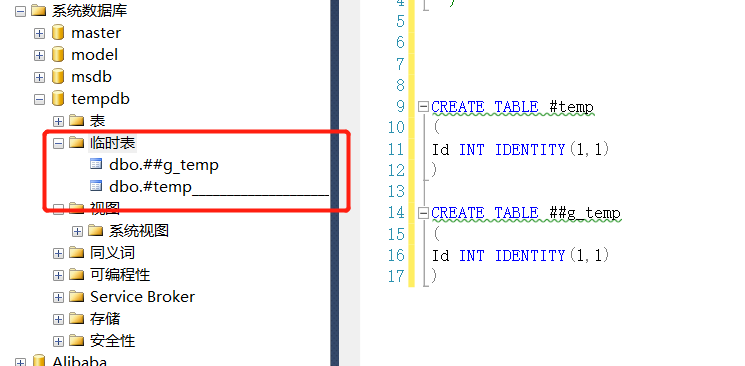
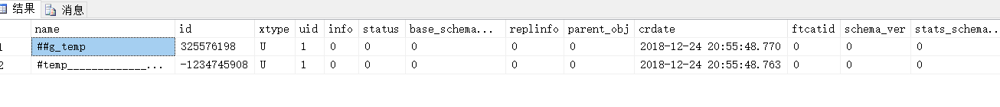
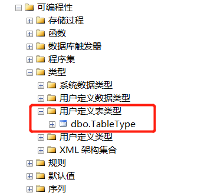
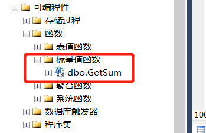
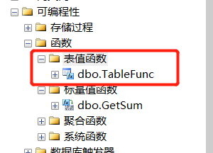

## 变量

```sql
-- 声明变量
DECLARE @variable_name [AS] variable_type;
-- 变量赋值
SET @variable_name = variable_value;
```

示例如下：

```sql
DECLARE @age INT;
-- SET一次只能操作一个变量
SET @age = 26;
```

T-SQL提供了使用SELECT语句来给变量赋值的扩展功能：

```sql
SELECT @age = 30;
```

也可以使用子查询来给变量赋值：

```sql
USE WJChi;

SET @age =
(
    SELECT Age FROM dbo.UserInfo WHERE Name = '雪飞鸿'
);
```

注意，上述SET语句中的子查询必须只能返回标量，否则会报错，示例如下：

```sql
USE WJChi;

SET @age =
(
    SELECT Age FROM dbo.UserInfo
);
```

执行报错：

<font color="red" size=3>子查询返回的值不止一个。当子查询跟随在 =、!=、<、<=、>、>= 之后，或子查询用作表达式时，这种情况是不允许的。</font>

## 批

批是一条或多条被客户端作为整体发送给SQL Server进行执行的T-SQL语句，SQL Server以GO命令来标识一个批的结束，注意，**GO语句不能使用分号结尾**。SQL Server以批为单位进行词法、语法分析及语句执行等工作。一个批中的错误不会影响另一个批中语句的执行，因为**不同的批在逻辑上彼此独立，不同批中包含的语句互相独立，彼此互不影响**。

批是一个解析单元，因此，即便在同一个批中修改了表结构，然后执行增删改查操作会引发解析错误，因为在同一批中的增删改查语句并不知道表结构已发生了变化。

**GO n**：表示执行n次批中的语句，如：

```sql
USE WJChi;

SELECT * FROM dbo.UserInfo;
GO 5
```

## 流程控制

#### IF...ELSE...

句式结构如下：

```sql
IF condition
BEGIN
	-- do something
END
ELSE IF condition
BEGIN
	-- do something
END
ELSE
BEGIN
	-- do something
END;
```

IF...ELSE...支持嵌套

#### WHILE

句式结构如下：

```sql
WHILE condition
BEGIN
	-- do something
END;
```

#### TRY...CATCH...  & 错误处理

句式结构如下：

```sql
BEGIN TRY
	-- do something
END TRY
BEGIN CATCH
	-- do something
END CATCH;
```

SQL Server提供了一组描述错误的函数：

| 函数           | 作用         |
| -------------- | ------------ |
| ERROR_NUMBER() | 获取错误编号 |
|ERROR_MESSAGE()|获取错误的文本信息|
|ERROR_SEVERITY()|获取错误严重级别|
|ERROR_STATE()|获取错误状态|
|ERROR_LINE()|获取错误发生行号|
|ERROR_PROCEDURE()|获取错误发生的过程名|

也可以通过语句：`SELECT * FROM sys.messages;`来获取错误相关信息。

可以使用[THROW](https://docs.microsoft.com/en-us/sql/t-sql/language-elements/throw-transact-sql?view=sql-server-2017)语句来抛出错误。

#### 其它

RETURN、CONTINUE、BREAK、WAITFOR、GOTO

更多详细内容，参考微软官方文档：[Control-of-Flow](https://docs.microsoft.com/en-us/sql/t-sql/language-elements/control-of-flow?view=sql-server-2017)

##  临时表

SQL Server支持三种临时表：本地临时表、全局临时表和表变量。<font color="purple">这三种临时表创建后都存储在tempdb数据库中</font>。

#### 本地临时表

创建本地临时表的方式不普通的数据表相同，但本地临时表仅在它被创建的会话中可见，会话结束后，临时表也会被销毁。

临时表以#开头，如：`#UserInfo`。临时表中的数据存储在磁盘中。

#### 全局临时表

与本地临时表最大的不同是：全局临时表对所有会话可见，当全局临时表不在被任何会话引用时，会被SQL Server销毁。

全局临时表以##开头，如：`##UserInfo`。




可通过语句：`SELECT * FROM tempdb..sysobjects WHERE name LIKE '%temp%'`来查看创建的临时表信息：



#### 表变量

表变量的声明与普通变量类似，使用DECLARE语句。表变量只在创建它的会话中可见，且只对当前批可见。

> 一个显式事务回滚，事务中对临时表的修改也会回滚，但对**已完成**的表变量修改，则不会回滚。数据量较少时建议使用表变量，数据量较大时推荐使用临时表。

#### 表变量 vs 临时表

表变量与临时表类似，但[二者有所区别](https://www.mssqltips.com/sqlservertip/1556/differences-between-sql-server-temporary-tables-and-table-variables/)。**临时表更多的强调它是数据表，表变量着重点则在于变量上**。

#### 表类型

当创建了表类型，就会在数据库中保留表的定义，可以复用它创建表变量，也可作为存储过程和自定义函数的输入参数。

```sql
CREATE TYPE TableType AS TABLE
(
	Id INT PRIMARY KEY
);

DECLARE @t TableType;
```



[删除表类型](https://docs.microsoft.com/en-us/sql/t-sql/statements/drop-type-transact-sql?view=sql-server-2017)：

```sql
DROP TYPE TableType;
```
[点击此处](https://docs.microsoft.com/en-us/sql/t-sql/statements/create-type-transact-sql?view=sql-server-2017)，查看有关类型的更多内容。

## 动态执行SQL

SQL Server中可以使用两种方式来执行动态SQL：EXEC命令与sql_executesql存储过程。

#### EXEC

EXEC是T-SQL提供的执行动态SQL的原始技术，接收一个字符串作为输入并执行字符串中的语句：

```sql
USE WJChi;

EXEC('SELECT * FROM dbo.UAddress');
```

EXEC支持正则与Unicode字符作为输入。

#### sql_executesql

sql_executesql存储过程在EXEC命令之后引入，与EXEC相比，sql_executesql更安全，更灵活，可以支持输入与输出参数。但，sql_executesql只支持Unicode字符作为输入。

ADO.NET发送到SQL Server的参数化查询语句就是使用sql_executesql来执行的，参数化查询可以有效避免SQL注入攻击。示例如下：

```sql
exec sp_executesql N'SELECT * FROM dbo.UAddress WHERE ShortAddress=@sd AND LongAddress=@ld',N'@sd nvarchar(4000),@ld nvarchar(4000)',@sd=N'河南省',@ld=N'河南省郑州市'
```

## 函数 & 存储过程 & 触发器

#### 函数

使用函数的目的在于计算逻辑的封装及代码的复用。SQL Server中函数返回值分为：标量与表值两种。

创建函数的`CREATE FUNCTION`语句必须是当前批中的第一条语句，否则报错：<font color="red" size=3>'CREATE FUNCTION' 必须是查询批次中的第一个语句</font>。

创建标量值函数：

```sql
CREATE FUNCTION dbo.GetSum
(
	@left AS INT,
	@right AS INT
)
RETURNS INT
AS
BEGIN
	RETURN @left+@right;
END;
```



创建表值函数：

```sql
CREATE FUNCTION dbo.TableFunc
(
    @name AS VARCHAR(8)
)
RETURNS TABLE
AS
RETURN
(
    SELECT *
    FROM dbo.UserInfo
    WHERE Name = @name
);
```




修改函数定义，将创建函数语句中的CREATE换为ALTER即可。如下所示：

```sql
ALTER FUNCTION [dbo].[TableFunc]
(
	@name AS VARCHAR(8)
)
RETURNS TABLE
AS
	RETURN 
	(
		SELECT * FROM dbo.UserInfo WHERE Name=@name
	);
```

删除函数：

```sql
DROP FUNCTION function_name;
```

[SQL Server内置常用函数]()

#### 存储过程

存储过程与函数有相似之处，如都体现了封装的思想，但存储过程可以执行更为复杂的逻辑，可以有多个返回值。创建存储过程语句如下：

```sql
CREATE PROCEDURE HumanResources.uspGetEmployeesTest2   
    @LastName nvarchar(50),   
    @FirstName nvarchar(50)   
AS   

    SET NOCOUNT ON;  
    SELECT FirstName, LastName, Department  
    FROM HumanResources.vEmployeeDepartmentHistory  
    WHERE FirstName = @FirstName AND LastName = @LastName  
    AND EndDate IS NULL;  
GO  
```

更多详细内容，请参阅：[存储过程（数据库引擎）](https://docs.microsoft.com/zh-cn/sql/relational-databases/stored-procedures/stored-procedures-database-engine?view=sql-server-2017)

> :warning:存储过程移植比较困难

#### 触发器

触发器是特殊的存储过程，在满足条件时（事件被触发），会隐式执行，从这个角度讲，触发器会增加复杂性。

触发器个人接触和使用较少，这里不多介绍。详细内容可参考：[CREATE TRIGGER (Transact-SQL)](https://docs.microsoft.com/zh-cn/sql/t-sql/statements/create-trigger-transact-sql?view=sql-server-2017)

## 小结

本章内容较为杂乱，但也都是平时编写T-SQL代码时较为常用的内容。

## 推荐阅读

[Control-of-Flow](https://docs.microsoft.com/en-us/sql/t-sql/language-elements/control-of-flow?view=sql-server-2017)

[存储过程与函数的区别](https://www.cnblogs.com/ttltry-air/archive/2012/08/19/2646262.html)

[存储过程（数据库引擎）](https://docs.microsoft.com/zh-cn/sql/relational-databases/stored-procedures/stored-procedures-database-engine?view=sql-server-2017)

[CREATE TYPE (Transact-SQL)](https://docs.microsoft.com/en-us/sql/t-sql/statements/create-type-transact-sql?view=sql-server-2017)

