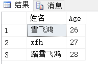
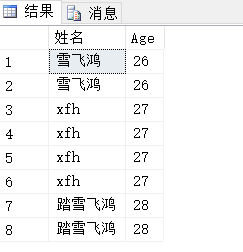
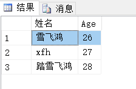
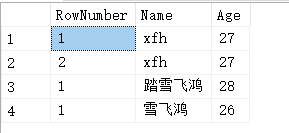
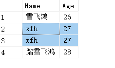
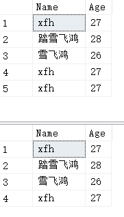
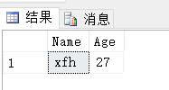

## 三个运算符

T-SQL支持三个集合运算符：UNION、INTERSECT、EXCEPT。

集合运算符查询的一般形式如下：

```mssql
Query1
<set_operator>
Query2
-- 这里，ORDER BY子句对最终结果集进行排序
[ORDER BY...]
```

## ORDER BY

在逻辑查询处理方面，**集合运算符应用于两个查询结果集，且外部的`ORDER BY`子句（如果有的话）应用于集合运算所得到的结果集**。

每个独立的查询可以使用除了`ORDER BY`之外的所有逻辑查询处理阶段，原因如下：

1. `ORDER BY`会对查询结果集进行排序
2. 排序后的结果集不在表示一个集合而是游标
3. 集合运算符只能用于集合间运算

因此，**每个独立的查询语句中不能使用`ORDER BY`子句**。

## 其它查询逻辑

对集合运算结果集使用除`ORDER BY`之外的查询逻辑则易引发逻辑错误：
```mssql
USE WJChi;

SELECT Name AS 姓名,Age FROM dbo.UserInfo AS U1 
UNION ALL
SELECT Name,Age AS 年龄 FROM dbo.UserInfo AS U2
WHERE Age>26;

-- 上述写法等价于（注意WHERE条件）
SELECT Name AS 姓名,Age FROM dbo.UserInfo AS U1 
UNION ALL
SELECT Name,Age AS 年龄 FROM dbo.UserInfo AS U2
WHERE U2.Age>26;
```

可以借助[表表达式](https://www.cnblogs.com/Cwj-XFH/p/10012936.html)对集合运算符运算结果集使用`ORDER BY`之外的查询逻辑：

```mssql
USE WJChi;

SELECT * FROM 
(
	SELECT Name AS 姓名,Age FROM dbo.UserInfo AS U1 
	UNION ALL
	SELECT Name,Age AS 年龄 FROM dbo.UserInfo AS U2 
) AS T
WHERE T.Age>26;
```

上述查询也可使用派生表之外的表表达式，如：CTE。

## 集合的列

用于集合运算符的两个查询必须返回**相同列数且对应列数据类型相互兼容**的结果集。在进行比较运算时，**集合运算符会认为两个NULL值是相等的**。

集合运算符返回结果集中的列名是第一个查询中的列名：

```mssql
USE WJChi;

SELECT Name AS 姓名,Age FROM dbo.UserInfo AS U1 
UNION
SELECT Name,Age AS 年龄 FROM dbo.UserInfo AS U2 
ORDER BY Age
```

返回结果如下：



## UNION

`UNION`用于获取两个集合的并集。

`UNION`运算符有两种形式：`UNION`、`UNION ALL`：

#### UNION

```mssql
USE WJChi;

SELECT Name AS 姓名,Age FROM dbo.UserInfo AS U1 
UNION
SELECT Name,Age AS 年龄 FROM dbo.UserInfo AS U2 
ORDER BY Age
```

返回结果如下：


#### UNION ALL

```mssql
USE WJChi;

SELECT Name AS 姓名,Age FROM dbo.UserInfo AS U1 
UNION ALL
SELECT Name,Age AS 年龄 FROM dbo.UserInfo AS U2 
ORDER BY Age
```

返回结果如下：



从上面两个结果集中可以看到，`UNION`与`UNION ALL`的区别是：`UNION`会去除结果集中的重复元素，而`UNION ALL`不会，从性能上来讲，`UNION ALL`优于`UNION`。严格来讲，`UNION ALL`运算结果集不能称为集合，因为集合不存在重复元素。

## INTERSECT

`INTERSECT`用于获取两个集合的交集，分为：`INTERSECT`和`INTERSECT ALL`两种形式，二者区别同`UNION`运算符。

#### INTERSECT

可以使用[内联接](https://www.cnblogs.com/Cwj-XFH/p/9960822.html)或者`EXSITS`谓词来替代`INTERSECT`，但在比较运算时，`INTERSECT`将两个NULL值视为相等，而替代方案不会。

`INTERSECT`只关注行的内容是否相同，不关注行出现的次数：

```mssql
USE WJChi;

SELECT Name AS 姓名,Age FROM dbo.UserInfo AS U1 
INTERSECT
SELECT Name,Age AS 年龄 FROM dbo.UserInfo AS U2 
ORDER BY Age;
```



#### INTERSECT ALL

SQL标准中包含`INTERSECT ALL`，但在SQL Server2014中未实现该特性，在SQL Server2014中使用`INTERSECT ALL`会报错：

<font color="red" size=3>不支持 INTERSECT 运算符的 'ALL' 版本。</font>

`UNION ALL`中`ALL`的含义是返回所有重复行。与之类似，`INTERSECT ALL`中`ALL`的含义是不删除交集中的重复项。换个角度看，`INTERSECT ALL`不仅关心两侧存在的行，还关心每一侧行出现的次数，即：

**如果某一数据在第一个输入中出现了a次，在第二个输入中出现了b次，那么在运算结果中该行出现min(a,b)次**。

下面，我们借助开窗函数`ROW_NUMBER()`实现了`INTERSECT ALL`的效果：

```mssql
USE WJChi;

SELECT 
ROW_NUMBER() OVER(PARTITION BY Name,Age ORDER BY Age) AS RowNumber,
Name,Age
FROM dbo.UserInfo;
```



经过开窗函数`ROW_NUMBER()`的处理后，原本相同的数据被视为不同。

```mssql
USE WJChi;

-- 实现INTERSECT ALL效果
SELECT T.Name,T.Age FROM 
(
	SELECT 
	ROW_NUMBER() OVER(PARTITION BY Name,Age ORDER BY Age) AS RowNumber,
	Name,Age
	FROM dbo.UserInfo
	
	INTERSECT
	
	SELECT 
	ROW_NUMBER() OVER(PARTITION BY Name,Age ORDER BY Age) AS RowNumber,
	Name,Age
	FROM dbo.UserInfo
) AS T
ORDER BY T.Age;
```

查询结果如下：



## EXCEPT

`EXCEPT`用于获取两个集合的差集，与`UNION`与`INTERSECT`类似，`EXCEPT`也分为两种形式：`EXCEPT`和`EXCEPT ALL`。同样，SQL Server2014也不支持`EXCEPT ALL`特性。

```mssql
Query1
EXCEPT
Query2
```

#### EXCEPT

与`UNION`、`INTERSECT`不同，`EXCEPT`运算符对于两个查询的先后顺序有要求：`EXCEPT`返回存在于Query1中出现且不在Query2中出现的行，`EXCEPT`只关注行是否重复，而不关注行出现的次数。

可以使用外联接或者`NOT EXISTS`来替代`EXCEPT`，但在比较运算时，`EXCEPT`将两个NULL值视为相等，而替代方案不会。

准备如下数据：

```mssql
USE WJChi;

SELECT Name,Age FROM #temp;
SELECT Name,Age FROM dbo.UserInfo;
```



那么，下面两条SQL的运算结果集均不包含任何数据：

```mssql
SELECT Name ,Age FROM #temp 
EXCEPT
SELECT Name,Age FROM dbo.UserInfo
ORDER BY Age;

SELECT Name ,Age FROM dbo.UserInfo 
EXCEPT
SELECT Name,Age FROM #temp
ORDER BY Age;
```

#### EXCEPT ALL

`EXCEPT ALL`与`EXCEPT`的差异在于，`EXCEPT ALL`不止考虑行是否重复，还会考虑行出现的次数：

**如果某一数据在第一个输入中出现了a次，在第二个输入中出现了b次，那么在运算结果中该行出现a-b次。若a<b则运算结果中不包含该行。**

同样，我们借助开窗函数`ROW_NUMBER()`来实现`EXCEPT ALL`效果：

```mssql
USE WJChi;

SELECT 
T.Name,T.Age 
FROM 
(
	SELECT 
	ROW_NUMBER() OVER(PARTITION BY Name,Age ORDER BY Age) AS RowNumber,
	Name,Age
	FROM #temp
	
	EXCEPT
	
	SELECT 
	ROW_NUMBER() OVER(PARTITION BY Name,Age ORDER BY Age) AS RowNumber,
	Name,Age
	FROM dbo.UserInfo
) AS T 
ORDER BY T.Age;
```



## 小结

标准SQL支持三个集合运算符：`UNION`、`INTERSECT`、`EXCEPT`，每个运算符均支持两种行为：去重（不带ALL关键字）和保留重复项（带上ALL关键字)。

T-SQL未提供对`INTERSECT ALL`与`EXCEPT ALL`的支持，我们可以通过开窗函数`ROW_NUMBER()`来实现。

另外需要注意一点，集合运算符认为两个`NULL`是相等的。

## 推荐阅读

[T-SQL基础（三）之子查询与表表达式](./T-SQL基础（三）之子查询与表表达式.md)