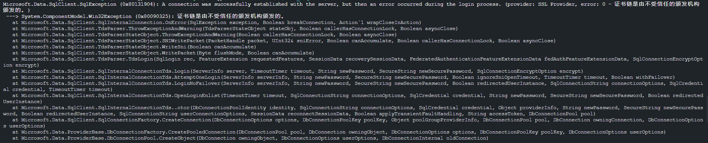
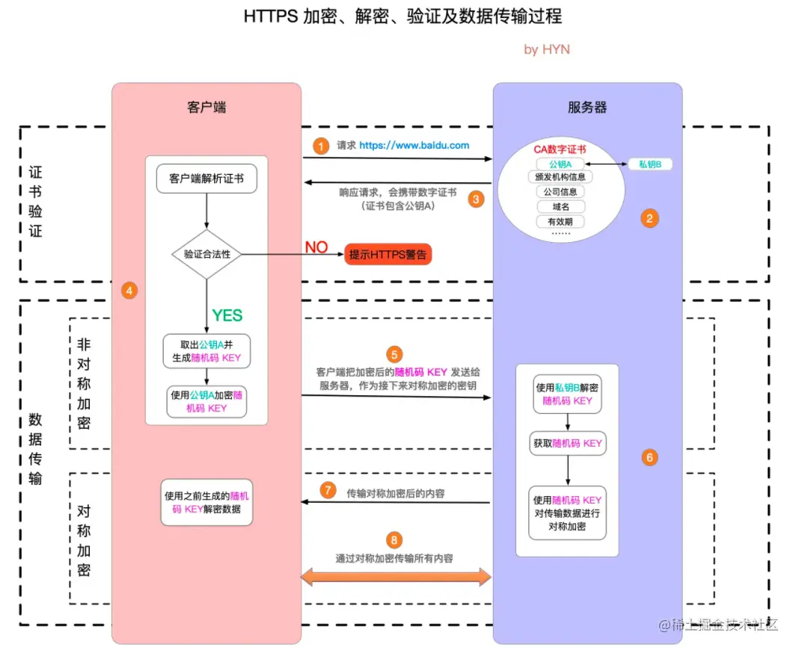

将框架从.NET6升级到8，顺便将各种依赖包也升级，容器化部署到测试环境后，SQL Server连接不了了：

```
[2024-05-13 13:48:10 ERR] [Microsoft.EntityFrameworkCore.Database.Connection] An error occurred using the connection to database 'Demo' on server '127.0.0.1'. 
[2024-05-13 13:48:10 ERR] [Microsoft.EntityFrameworkCore.Query] An exception occurred while iterating over the results of a query for context type 'DemoDbContext'.
Microsoft.Data.SqlClient.SqlException (0x80131904): A connection was successfully established with the server, but then an error occurred during the pre-login handshake. (provider: SSL Provider, error: 31 - Encryption(ssl/tls) handshake failed)
 ---> System.IO.IOException: Received an unexpected EOF or 0 bytes from the transport stream.
```

以前也遇到过类似的问题，是[通过修改TLS的最低支持版本来解决](./Docker容器访问SQL%20Server报错.md)，但这次是升级了依赖导致的无法连接数据库，之前的解决方式不起作用，说明对这个问题的理解还不到位。

在github上提了个[issue](https://github.com/dotnet/efcore/issues/33705)，原来是在EFCore 7这个版本有个[breaking change](https://learn.microsoft.com/en-us/ef/core/what-is-new/ef-core-7.0/breaking-changes?tabs=v7#encrypt-true)：连接字符串中的`Encrypt`参数的默认值有False变为了True，那么在连接数据库时就会尝试建立加密连接，也就是这个过程失败了。

> Encrypt=False，若SQL Server配置了强制使用加密连接也会取尝试建立加密连接

失败原因是SQL Server的证书没有在客户端通过校验。下面是本机进行复现的错误信息：



那么解决方案有以下几种：

+ 给SQL Server安装正确的证书
+ 在连接字符串中添加`TrustServerCertificate=True`
+ 连接字符串中设置`Encrypt=False`

> [后面两种比较简单，但官方不推荐](https://learn.microsoft.com/en-us/ef/core/what-is-new/ef-core-7.0/breaking-changes?tabs=v7#mitigations)


关于`Encrypt`和`TrustServerCertificate`参数，可参考：[Use TrustServerCertificate](https://learn.microsoft.com/en-us/sql/connect/ado-net/connection-string-syntax?view=sql-server-ver16#use-trustservercertificate)

| Encrypt connection string/attribute | Trust Server Certificate connection string/attribute | Result                                                       |
| :---------------------------------- | :--------------------------------------------------- | :----------------------------------------------------------- |
| No/Optional                         | Ignored                                              | No encryption occurs.                                        |
| Yes/Mandatory                       | No                                                   | Encryption occurs only if there's a verifiable server certificate, otherwise the connection attempt fails. |
| Yes/Mandatory                       | Yes                                                  | Encryption always occurs, but may use a self-signed server certificate. |
| Strict1                             | Ignored                                              | Encryption always occurs and must use a verifiable server certificate, otherwise the connection attempt fails. |


## 小结

结合本次及之前遇到的问题，SQL Server连接报错，有以下几种原因：

+ 客户端/服务端间TLS版本不兼容
+ 服务器证书有问题，客户端校验不通过

最后附一张[HTTPS连接的建立](https://juejin.cn/post/7033557989508251655)过程图：



## 参考资料

[MSSQL · 最佳实践 · 使用SSL加密连接](http://mysql.taobao.org/monthly/2019/04/02/)

[HTTPS介绍及加密的过程](https://juejin.cn/post/7033557989508251655)