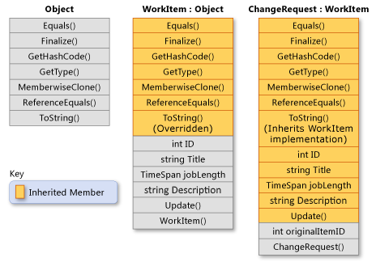
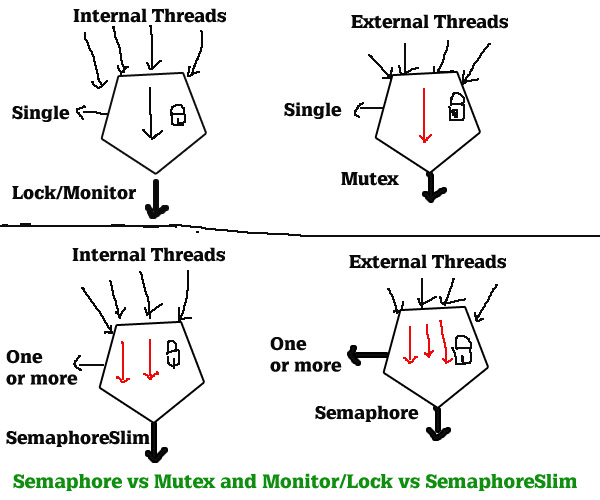

## 技术敏感度

当前用的.NET哪个版本

.NET最新版本是哪个

接触过哪些开源项目

## 基础

### 继承

#### .NET中子类可以继承父类中的哪些成员？

[Inheritance - derive types to create more specialized behavior](https://docs.microsoft.com/en-us/dotnet/csharp/fundamentals/object-oriented/inheritance)

#### 对象实例化机制

抽象类是否可以被实例化？是否可以有实例构造函数？不能实例化为什么要有实例构造函数？

#### 重写

##### 语法规范

方法签名不能变更

[Beginning with C# 9.0, read-only overriding properties support covariant return types.](https://docs.microsoft.com/en-us/dotnet/csharp/language-reference/keywords/override)

针对protected internal的方法进行跨程序集override时，访问修饰符需变更为protected，参考示例重写EF Core中DbContext的OnModelCreating或OnConfiguring方法。参考文档：[Override methods](https://docs.microsoft.com/en-us/dotnet/csharp/language-reference/language-specification/classes#override-methods)

##### new 和 override的区别

override只能用于virtual或者override成员

可使用sealed进制子类再override

new 可以是任意成员

参考：[Knowing When to Use Override and New Keywords (C# Programming Guide)](https://docs.microsoft.com/en-us/dotnet/csharp/programming-guide/classes-and-structs/knowing-when-to-use-override-and-new-keywords)

## 进阶

### GC

有哪几种模式？workstation vs. server GC

Background vs Concurrent GC

参考：[Fundamentals of garbage collection](https://docs.microsoft.com/en-us/dotnet/standard/garbage-collection/fundamentals)

运行时如何配置，[Run-time configuration options for garbage collection](https://docs.microsoft.com/en-us/dotnet/core/run-time-config/garbage-collector)

### 异步

### 多线程

.NET中线程有哪几种状态？状态间如何转换？

阻塞、等待、挂起什么区别？这三种状态下的线程是否还能被用于执行其他任务？对线程池的影响？

block vs waiting

[漫话：如何给女朋友解释为什么Java线程没有Running状态？](https://mp.weixin.qq.com/s/Vr5E68TEcU2tu7-5K03MBA)

### 线程安全

.NET provides a range of types that you can use to synchronize access to a shared resource or coordinate thread interaction: [Overview of synchronization primitives](https://docs.microsoft.com/en-us/dotnet/standard/threading/overview-of-synchronization-primitives)

#### ThreadStatic vs ThreadLocal vs AsyncLocal

#### lock/Monitor vs SemaphoreSlim vs WaitHandle

#### 并发集合

[System.Collections.Concurrent Namespace](https://docs.microsoft.com/en-us/dotnet/api/system.collections.concurrent?view=net-5.0)

### 性能与问题排查

#### 性能

性能问题分析通用套路
有哪些工具

#### 问题排查
dump文件

## 框架

### EF Core

#### DbContext

#### Model Configure

#### Migrations

#### CRUD

#### Change Tracking

[Change Tracking in EF Core](https://docs.microsoft.com/en-us/ef/core/change-tracking/)

Identity Resolution

Entity有几种状态？如何追踪Entity状态变化？

[Accessing Tracked Entities](https://docs.microsoft.com/en-us/ef/core/change-tracking/entity-entries)

#### 事务

#### 内部原理

### ASP.NET Core

#### 配置读取

IConfiguration

Options Pattern:

+ IOptions<TOptions>
+ IOptionsSnapshot<TOptions>
+ IOptionsMonitor<TOptions>

#### 环境变量

#### Middleware

#### 认证授权

Open Id/OAuth

JWT

ClaimIdentity

#### 打包发布

## Linux

[The Linux Command Line](https://www.kancloud.cn/thinkphp/linux-command-line)

### 常用命令

帮助命令 man  vs --help

#### 环境变量配置

[Linux 环境变量配置全攻略](https://mp.weixin.qq.com/s?__biz=MzI4MDEwNzAzNg==&mid=2649451028&idx=2&sn=5be74f9de3f480f9ad4c7ece04befdff&chksm=f3a24b67c4d5c2714207da434b47fd0dd2681fa6c216ef2c9e2577a192b69471fa7397a41913&scene=132#wechat_redirect)

#### 文件操作

文件内容查看 cat、head、tail

文件编辑 vim

文件搜索 find

文件内容搜索 grep、awk、sed

文件类型查看 file

文件权限及属主更改 chmod、chown

移动/复制文件 mv、cp

目录内容查看 ls -ahl

文件传输 scp、ftp/sftp

参考：[Linux 进程、线程、文件描述符的底层原理](https://mp.weixin.qq.com/s/doKM1ueDz9Ut_jfVTBbOJQ)

#### 磁盘

查看磁盘容量

#### 进程信息查看

top

ps/pstree

### ssh 登录

有几种方式？免密登录怎么做？

参考[图解 SSH 原理](https://mp.weixin.qq.com/s?__biz=MzI3MTI2NzkxMA==&mid=2247487942&idx=1&sn=c46f510ff119bd0bdfe30689f0398854&chksm=eac530efddb2b9f9a8b1bf08454084d68b200dc7d4d999fa65d0d1ed69e78c386a26331533ea&mpshare=1&scene=1&srcid=0717tNKunOWIHONN04dsyFgm&sharer_sharetime=1565775380935&sharer_shareid=266dc9451fd28ecaad4697cc057771d2&key=f8a84d04edd3d2627c2d51c9c20364a8bd050f0a5ca9f829c5af707ece4562aacd7b4fdbbec1b7c84456c246b76557464b98cb1e0f54505984994db9af068c8e5f2bdd283b7ac92eac272e3a4432b665&ascene=1&uin=MTI5MDA0NDAwOA%3D%3D&devicetype=Windows+10&version=62060833&lang=zh_CN&pass_ticket=VfTZzibTuvTk6Edv7m13QePmjxNCsWe1iJ8Cn5e7klB%2B5DWIlJVve3rADmcSPJu6)