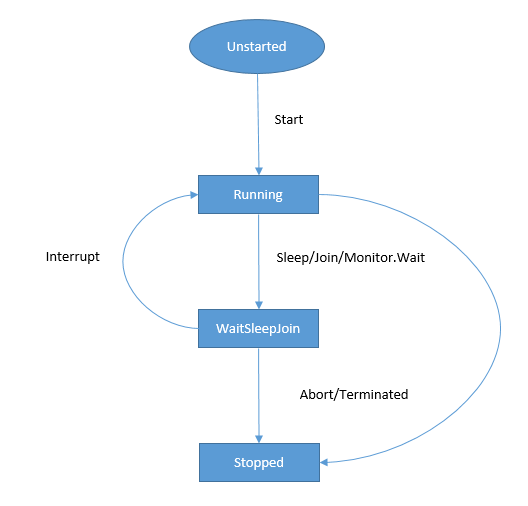
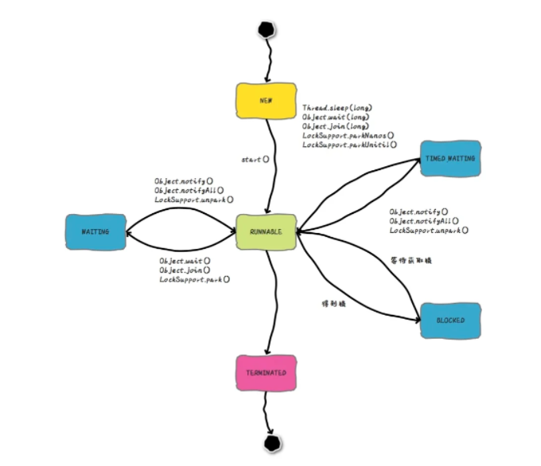

## 技术敏感度

当前用的.NET哪个版本？.NET最新版本是哪个？最新版本有哪些亮点？

C#语言发展到哪个版本了？C#最新版本特性有哪些？

接触过哪些开源项目？

除C#之外还使用过哪些编程语言？

问：听说过哪些开源基金会？他们有什么代表性项目？

答：

| 基金会  | 项目名  |
| ------- | ------- |
| APACHE  | Kafka   |
| APACHE  | JMeter  |
| OpenJS  | Node.js |
| OpenJS  | jQuery  |
| .NET    | .NET    |
| .NET    | Roslyn  |
| Mozilla |         |
| Linux   |         |


## 基础


问：值类型、引用类型区别

答：引用类型占用空间包括：数据+其他（同步快索引、引用类型指针等），值类型占用空间：数据；值类型属于非托管类型([Unmanaged types](https://docs.microsoft.com/en-us/dotnet/csharp/language-reference/builtin-types/unmanaged-types))；引用类型分配在托管堆上，值类型即可以在栈上也可以在托管堆上，分配到栈上的值类型无需GC；值类型传递时把数据拷贝一份进行传递，引用类型只传递引用。

](imgs/ref_type_vs_value_type_in_mem.png)

### 继承

问：.NET中子类可以继承父类中的哪些成员？

答：子类会继承父类中除构造函数和析构函数之外的所有成员，包括私有成员。不能在子类中访问父类的私有成员是因为访问修饰符的限制。可参考：[Inheritance - derive types to create more specialized behavior](https://docs.microsoft.com/en-us/dotnet/csharp/fundamentals/object-oriented/inheritance)


#### 对象实例化机制

问：抽象类是否可以被实例化？是否可以有实例构造函数？不能实例化为什么要有实例构造函数？

答：抽象类不能被实例化，可以有实例构造函数。抽象类中可以包含实例成员，子类在初始化时会调用父类的实例构造函数初始化实例成员。

#### 重写

##### 语法规范

方法签名不能变更

[Beginning with C# 9.0, read-only overriding properties support covariant return types.](https://docs.microsoft.com/en-us/dotnet/csharp/language-reference/keywords/override)

针对protected internal的方法进行跨程序集override时，访问修饰符需变更为protected，参考示例重写EF Core中DbContext的OnModelCreating或OnConfiguring方法。参考文档：[Override methods](https://docs.microsoft.com/en-us/dotnet/csharp/language-reference/language-specification/classes#override-methods)

##### new 和 override的区别

override只能用于virtual或者override成员

可使用sealed禁止子类再override

new 可以是任意成员

参考：[Knowing When to Use Override and New Keywords (C# Programming Guide)](https://docs.microsoft.com/en-us/dotnet/csharp/programming-guide/classes-and-structs/knowing-when-to-use-override-and-new-keywords)


### 泛型

问：为什么需要泛型约束？泛型约束存在的意义是什么？

答：如果没有泛型约束，那么泛型就退化为了Object类型，泛型也就没有了存在的意义。正是因为有了泛型约束，我们在编码时，在不知道实参的情况下可以抽象出部分公共逻辑代码，从而减少我们的编码工作量；泛型约束还可以避免装箱、拆箱操作，从而提高性能；最后，泛型约束可以在编译时进行类型检查，确保类型安全，以免运行时出现异常。

问：编译器如何编译泛型代码，和非泛型代码相比，编译后有什么不同？

答：泛型代码编译后代码量会比非泛型多。


## 进阶

### 设计模式

问：实际工作中使用过哪些设计模式？请举例说明

答：

### GC

问：什么是托管资源和非托管资源？

答：

问：如何清理非托管资源？

答：通常通过实现[dispose pattern](https://docs.microsoft.com/en-us/dotnet/standard/garbage-collection/implementing-dispose)来释放非托管资源，也可以通过[析构函数](https://docs.microsoft.com/en-us/dotnet/csharp/programming-guide/classes-and-structs/finalizers)的方式来实现对非托管资源的释放。 [Cleaning up unmanaged resources](https://docs.microsoft.com/en-us/dotnet/standard/garbage-collection/unmanaged)。

问：IDisposable接口的作用？

答：

有哪几种模式？如何切换？workstation vs. server GC

Background vs Concurrent GC

参考：[Fundamentals of garbage collection](https://docs.microsoft.com/en-us/dotnet/standard/garbage-collection/fundamentals)

运行时如何配置，[Run-time configuration options for garbage collection](https://docs.microsoft.com/en-us/dotnet/core/run-time-config/garbage-collector)

问：内存泄漏问题排查思路

答：

> 参考 [垃圾回收算法](https://github.com/CwjXFH/StudyNotes/blob/master/Blogs/垃圾回收算法.md)


### 常用数据结构

问：Dictionary<TKey,TValue>的内部实现？哈希冲突的解决方案有哪几种？

答：

问：List<T>的内部实现？

答：


### 异步

问：async void和async Task/async Task<T>的区别？

答：

问：什么是async/sync？什么是block/non-block？

答：根据任务发起者所在线程是否会被任务阻塞分为block和non-block，block模式，任务发起线程在获取到结果之前线程就等着，啥也不干。non-block则是任务发起线程会立即获得一个结果，这个结果不一定是任务计算后的实际值，实际任务的执行则有其他线程负责。 通常提到block和non-block时多指I/O操作。

​        根据任务发起者所在线程是否会等待任务结束分为async/sync。

### 多线程

问：.NET中线程有哪几种状态？状态间如何转换？

答：.NET中线程状态转换如下所示



问：Thread.Yield与Thread.Sleep的区别

答：Thread.Yield会让出当前线程的剩余时间片，处理器会调度其他已就绪的且和当前线程处于**同一处理器**的线程。Thread.Sleep(0)允许处理器调度和当前线程具有**相同或更高优先级**的已就绪线程，如果没有，则当前线程继续执行。Thread.Sleep(1)和Thread.Sleep(0)相比，不用考虑其他已就绪线程的优先级。

[Thread.Sleep(0) vs Sleep(1) vs Yeild](https://www.cnblogs.com/stg609/p/3857242.html)

阻塞、等待、挂起什么区别？这三种状态下的线程是否还能被用于执行其他任务？对线程池的影响？

block vs waiting

[漫话：如何给女朋友解释为什么Java线程没有Running状态？](https://mp.weixin.qq.com/s/Vr5E68TEcU2tu7-5K03MBA)




问：I/O thread 和 Worker thread有什么区别

答：本质上没区别，只是用处不同。主要用于防范线程池中线程都用于等待I/O操作而导致系统无法响应。


### 线程安全

问：什么是线程安全？

答：[Thread safety - Wikipedia](https://en.wikipedia.org/wiki/Thread_safety)

.NET provides a range of types that you can use to synchronize access to a shared resource or coordinate thread interaction: [Overview of synchronization primitives](https://docs.microsoft.com/en-us/dotnet/standard/threading/overview-of-synchronization-primitives)


#### 多线程操作文件

问：系统使用如NLog之类日志组件记录日志文件时，属于多线程场景。那么，NLog是如何避免多线程写冲突的？

答：


问：多线程读写文件如何做？

答：

```c#
// 运行这段代码，同时用记事本打开1.txt修改文件内容然后保存，控制台打印出新的文本内容
using var fs = new FileStream(@"C:\Users\eason\Desktop\1.txt", FileMode.Open, FileAccess.ReadWrite, FileShare.ReadWrite);
using var fr = new StreamReader(fs, Encoding.UTF8);
while (true)
{
    Console.WriteLine(fr.ReadToEnd());
    fs.Position = 0;
    Thread.Sleep(1 * 1000);
}
```


#### ThreadStatic vs ThreadLocal vs AsyncLocal


#### lock/Monitor vs SemaphoreSlim vs WaitHandle


问：lock语句中能不能使用await？若不能，为什么？

答：哪个线程使用lock加锁，就要有哪个线程负责释放。await/Task默认的调度机制是线程池，会有线程的切换，有可能导致锁无法释放。

```c#
class Program
{
    private static readonly object _obj = new object();

    static async Task Main(string[] args)
    {
        await LockAsync();
        Console.ReadKey();
    }
    
    static async Task LockAsync()
    {
        lock (_obj)
        {
            Console.WriteLine("lock");
            // Error CS1996: Cannot await in the body of a lock statement
            await Task.CompletedTask;
        }
    }
}
```

问：lock的实现原理？

答：通过引用类型对象的同步块索引来实现。

问：lock中所使用的对象，有哪些限制？

答：引用类型对象，因为lock实际调用的是`Monitor.Enter`方法，使用值类型会导致装箱操作，同一个值类型每次装箱后产生的对象是不同的，不能保证临界区线程安全；

不能是字符串，字符串有可能已被暂存，使用字符串会导致锁竞争甚至死锁；

不能是类型，其他地方也有可能使用类型信息，如：typeof操作符或反射；

同一临界区域lock所使用的对象必须是同一个，不同临界区域lock应使用不同的对象。

> 一句话总结，每个临界区lock所使用的对象必须是**专用且唯一**的，否则就会存在锁竞争，甚至导致死锁。

#### synchronized

JAVA语言层面有synchronized关键字，.NET则通过[MethodImplOptions](https://docs.microsoft.com/en-us/dotnet/api/system.runtime.compilerservices.methodimploptions?view=net-6.0)在IL层面提供了synchronized：

```c#
[MethodImpl(MethodImplOptions.Synchronized)]
static int Add(ref int num)
{
    num += 1;
    return num;
}
```

IL代码如下：


> :warning: Locking on the instance or on the type, as with the `Synchronized` flag, is not recommended for public types, because code other than your own can take locks on public types and instances. This might cause deadlocks or other synchronization problems.

#### 锁

可重入锁、读写锁、公平锁、乐观锁、分布式锁(RedLock)


问：如何避免死锁

答：不同线程获取多个资源的顺序保持一致；持有锁的时间尽可能短（锁的粒度尽可能细）；获取锁等待设置超时时间；

#### 无锁编程

CAS与自旋锁


#### 并发集合

[System.Collections.Concurrent Namespace](https://docs.microsoft.com/en-us/dotnet/api/system.collections.concurrent?view=net-5.0)


> 参考 [不可不说的Java“锁”事 - 美团技术团队](https://tech.meituan.com/2018/11/15/java-lock.html)
>
> 参考 

### 性能与问题排查

#### 性能

性能问题分析通用套路
有哪些工具

#### 问题排查
dump文件


## 框架

### IoC

[Dependency injection in .NET](https://docs.microsoft.com/en-us/dotnet/core/extensions/dependency-injection)

.NET provides a built-in service container, [IServiceProvider](https://docs.microsoft.com/en-us/dotnet/api/system.iserviceprovider). Services are typically registered at the app's start-up, and appended to an [IServiceCollection](https://docs.microsoft.com/en-us/dotnet/api/microsoft.extensions.dependencyinjection.iservicecollection). Once all services are added, you use [BuildServiceProvider](https://docs.microsoft.com/en-us/dotnet/api/microsoft.extensions.dependencyinjection.servicecollectioncontainerbuilderextensions.buildserviceprovider) to create the service container.


[Disposal of services](https://docs.microsoft.com/en-us/dotnet/core/extensions/dependency-injection-guidelines#disposal-of-services)

> The container is responsible for cleanup of types it creates, and calls Dispose on [IDisposable](https://docs.microsoft.com/en-us/dotnet/api/system.idisposable) instances. Services resolved from the container should never be disposed by the developer. If a type or factory is registered as a singleton, the container disposes the singleton automatically.


[Scope validation](https://docs.microsoft.com/en-us/dotnet/core/extensions/dependency-injection#scope-validation)

Scoped services are disposed by the container that created them. If a scoped service is created in the root container, the service's lifetime is effectively promoted to singleton because it's only disposed by the root container when the app shuts down. Validating service scopes catches these situations when `BuildServiceProvider` is called.

#### lifetime、scope、GC


### EF Core

#### DbContext

问：是否可以在async void方法中调用DbContext实例的异步方法？

答：不可用，DbContext不是线程安全的。async void方法无法被等待，有可能造成DbContext实例提前释放或者被多个线程使用的情况。

#### Model Configure


#### Migrations


#### CRUD


#### Change Tracking

[Change Tracking in EF Core](https://docs.microsoft.com/en-us/ef/core/change-tracking/)

Identity Resolution

问：Entity有几种状态？如何追踪Entity状态变化？

[Accessing Tracked Entities](https://docs.microsoft.com/en-us/ef/core/change-tracking/entity-entries)

#### 事务


#### 内部原理


### ASP.NET Core

#### 配置读取

问：ASP.NET Core中如何读取配置信息？

答：ASP.NET Core中配置信息的读取可使用IConfiguration接口，或者Options Pattern。Options Pattern提供了三个接口如下：

+ IOptions<TOptions>，生命周期是Singleton，应用启动后，无法感知配置信息的变化
+ IOptionsSnapshot<TOptions>，生命周期是Scope，每次使用时重新计算配置信息
+ IOptionsMonitor<TOptions>，生命周期是Singleton，可感知配置信息的变化

要告知配置信息的变化，在构建Host时要指定配置文件发生变化时重新加载配置文件：

```c#
public class Program
{
    public static void Main(string[] args)
    {
        new HostBuilder()
            .UseContentRoot(Directory.GetCurrentDirectory())
            .ConfigureAppConfiguration((hostBuilderContext, cfgBuilder) =>
            {
                // reloadOnChange参数设为true
                cfgBuilder.AddJsonFile("appsettings.json", false, true);
                cfgBuilder.AddJsonFile($"appsettings.{hostBuilderContext.HostingEnvironment.EnvironmentName}.json", false, true);
            })
            .ConfigureLogging(logBuilder =>
            {
                logBuilder.AddConsole();
                logBuilder.SetMinimumLevel(LogLevel.Information);
            })
            .ConfigureWebHostDefaults(hostBuilder =>
            {
                hostBuilder.UseStartup<Startup>();
            })
            .Build()
            .Run();
    }
}
```


>  IConfigureOptions<TOptions> vs IPostConfigureOptions<TOptions>


#### 环境变量

https://docs.microsoft.com/en-us/aspnet/core/fundamentals/configuration/?view=aspnetcore-5.0#environment-variables

#### IoC

问：内置IoC容器有哪几种生命周期？

答：Singleton、Scope、Transient

问：不同生命周期的对象分别在什么时候被GC回收？

答：Scope对象在Http请求结束后可以被GC回收、Transient对象在使用完后即可被GC回收，Scope对象和Transient对象的回收时机不确定。Signleton对象在整个应用生命周期内不会被GC回收。


#### Middleware


#### 认证授权

Open Id/OAuth

JWT

ClaimIdentity


#### 打包发布


## 中间件

#### Redis

缓存

限流

分布式锁

简单消息队列

排行榜

计数器

布隆过滤器

#### MQ

异步

解耦

削峰填谷

消息通讯，如：分布式事务（发件箱模式、可靠消息投递）

并行请求串行化

## 数据库

参考 [StudyNotes/Database at master · CwjXFH/StudyNotes (github.com)](https://github.com/CwjXFH/StudyNotes/tree/master/Database)

## Linux

参考《开发人员Linux面试》