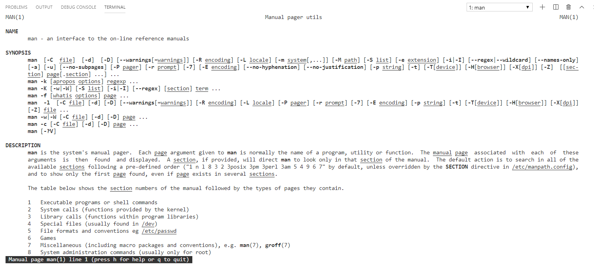
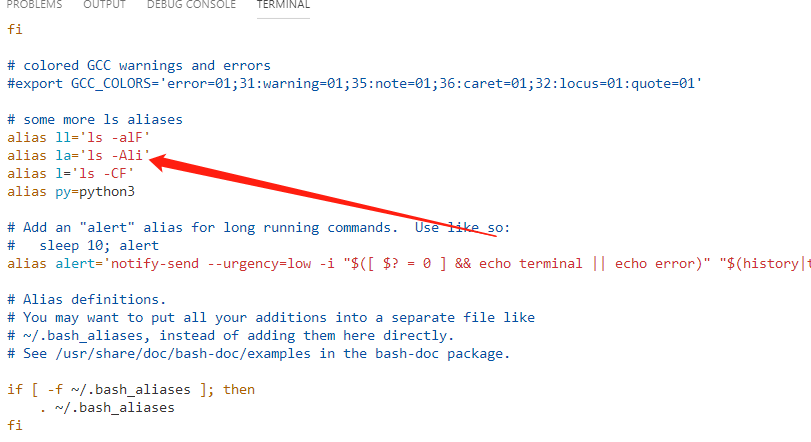
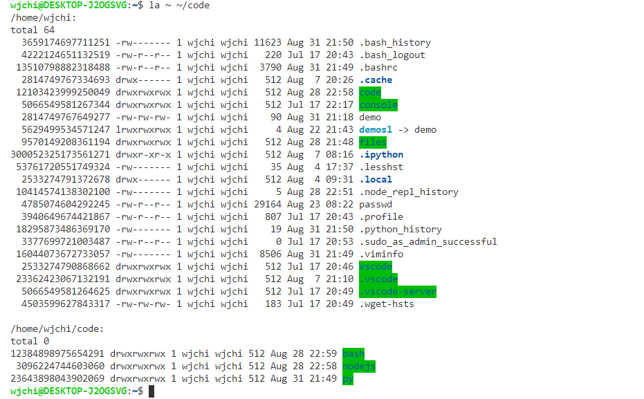

> 本文内容根据[Linux Command Line Basics & Excaples](https://fosspost.org/education/linux-command-line-basics-examples)进行改编

## **Linux命令行简要介绍**

AT&T公司于20世纪70年代发布了UNIX系统。经过多年的发展，Unix不再是某一个具体操作系统的名称，而是对遵循Unix规范、设计和哲学的一类操作系统的统称。还有一些操作系统，它们遵循Unix设计、有着与Unix类似的规范和标准，这些操作系统被称为类Unix系统（Unix-like），Linux就是其中的一员。

在设计上Unix包含一个**[Unix Shell](https://en.wikipedia.org/wiki/Unix_shell)**。它是一种命令行解释器（**[CLI](https://en.wikipedia.org/wiki/Command-line_interface)**）或者**[Shell](https://en.wikipedia.org/wiki/Shell_(computing))**，可以让用户通过输入命令与系统交互。Unix Shell既可以直接执行用户输入的命令，也可以从文件中读取命令执行（shell scripting）。最常用的Unix Shell是**[Bash](https://en.wikipedia.org/wiki/Bash_(Unix_shell))**，几乎所有的Linux发行版中都内置有Bash。通常所说的Linux命令行就是Bash命令或Bash脚本。

Linux命令行以强大灵活著称，使用少数命令就可以执行许多任务，还可以将许多任务自动化。

## **Linux命令行基础**

Linux启动后，就会创建一个shell会话（shell session）。shell session是一个基础环境，它允许系统与应用、及应用间进行通讯。可以一次打开多个会话，会话间可以存在父子关系，如果当前会话的父会话被关闭，当前会话也会被终止。


上图是[VSCode远程开发](https://code.visualstudio.com/docs/remote/remote-overview)模式下，连接到Windows10 WSL（Ubuntu18.04.2）的截图。光标前面的内容格式如下：

`username@hostname:locate`，对应到上图，即当前会话的用户名为wjchi，hostname是DESKTOP-J2OGSVG，当前目录为~，即当前用户的家目录：/home/wjchi。

下面是一些Linux常用符号的含义：

| SYMBOL | EXPLANATION                                                  | EXAMPLES                                                     |
| ------ | ------------------------------------------------------------ | ------------------------------------------------------------ |
| ~      | is equal to the current user's home directlry. E.g: /home/someone/ | cd ~ ls ~                                                    |
| *      | A symbol which stands for "everything". Let's say you want to remove all the .jpg files from your Downloads folder which have their name starting with the "E" character, then you can use this symbol to represent all the other letters except E. See the example. | rm ~/Downloads/E*.jpg ls /etc/*c nano /var/log/nginx/*       |
| &      | Run a command in the background. It will return the PID of the newly running process to you and won't show you the output. | sudo apt update &                                            |
| &&     | These symbols written together stand for "and". So if you want to run 2 commands together, you can use it. | sudo apt update && sudo apt upgrade                          |
| \      | Allows you to continue writing commands/Bash syntax in new line. | sudo \ apt \ update                                          |
| ..     | In many cases, especially in navigation, the two dots stand for the parent folder. | cd ..                                                        |
| .      | In navigation or referring to files/folders, the dot stands for the current folder. | ls .                                                         |
| #      | Everything after this symbol in the same line is considered to be a comment, so it won't be processed by the shell. | cd # This commands moves you somewhere.                      |
| \|     | This is called "Piping", which is the process of redirecting the output of one command to the input of another command. Very useful and common in Linux/Unix-like systems. | cat /etc/profile \| grep bash                                |
| >      | Take the output of a command and redirect it into a file (will overwrite the whole file). | ls ~ > output.txt                                            |
| <      | Read the contents of a file into the input of a command.     | grep bash < /etc/profile                                     |
| >>     | Append a text or a command output into the last line of a file. | echo "First Line" > output.txt echo "See this is the last line" >> output.txt |

我们可以使用`man`命令或者命令后加上`--help`来查看各个命令的说明，man是manual的简写。在命令行输入：`man man`，输出如下：



Linux中常用导航命令如下：

| BASE COMMAND | EXPLANATION                                                  | FAMOUS ARGUMENTS & OPTIONS                                   | EXAMPLES |
| ------------ | ------------------------------------------------------------ | ------------------------------------------------------------ | -------- |
| cd           | This command allows you to move into a different directory on your Linux system, which will make it the current folder of where your shell is running. It's just like as if you open a specific folder in any graphical file manager. | . Stands for the current directory. .. Stands for the parent directory. ../.. the parent of the parent directory. | cd /etc/ |
| ls           | Lists the current files and folders in a specific directory. | -a shows the hidden files too. -l shows metdata about files and folders, such as permissions, last modification date, size and so on. | ls ~     |
| pwd          | Gives you the current location                               | -                                                            | -        |

 

Linux中常用文件/目录操作命令入下：

| BASE COMMAND | EXPLANATION                                                  | FAMOUS ARGUMENTS & OPTIONS                                   | EXAMPLES                                                     |
| ------------ | ------------------------------------------------------------ | ------------------------------------------------------------ | ------------------------------------------------------------ |
| touch        | Make a new file.                                             | -                                                            | touch text.txt                                               |
| mkdir        | Make a new folder                                            | -p Make the requested path regardless if the sub-directories exist or not (because normally, mkdir would return an error if you try to make a 3rd-level directory while the 2nd-level directory doesn't exist). | mkdir newfolder mkdir something\ with\ spaces mkdir -p newfolder/subfolder/subsubfolder |
| rm           | Remove a file or a directory.                                | -rf Adds the ability to remove folders and their contents (because normal rm can't). | rm file.txt rm -rf foldername                                |
| head         | Get the first 10 lines of a text file (or the first n lines of a file) | -n Specify the number of lines to output from the beginning. | head /etc/profile head -n 19 /etc/profile                    |
| tail         | Get the last 10 lines of a text file (or the last n lines of a file). | -n Specify the number of lines to output from the end.       | tail /etc/profile tail -n 18 /etc/profile                    |
| cat          | Output all the contents of a file                            | -                                                            | cat /etc/profile                                             |
| grep         | Output the lines contain a certain string from a file only.  | -                                                            | cat /etc/profile \| grep "Bash"                              |
| chmod        | Change the permissions of a file.                            | +x Make the file executable 777 Allow the file to accessed, written and executed by everyone (very dangerous!). 755 Allow everyone to read the file, but only the owners to edit and execute it. | chmod +x test.sh chmod 755 test.sh                           |

## **Bash配置文件**

Unix设计哲学中包含一条准则：**一切皆文件，everything is a file**。这意味着，键盘、鼠标、会话、进程、I/O操作等，无论是软件还是硬件都被描述为一个文件存放于文件系统中，你可以像操作普通文件一样操作它们。Bash包含了许多配置文件，你可以通过修改这些配置文件对Bash做些定制，Bash配置文件包含以下内容：

| FILE LOCATION   | EXPLANATION                                                  |
| --------------- | ------------------------------------------------------------ |
| /etc/profile    | Executes many startup shell scripts that are located both in /etc/profile.d/ and other paths. This file is system-wide file, you better not change stuff here. |
| ~/.bashrc       | Commands that are executed once you enter the system. Usually, most people do modify this file according to their needs. |
| ~/.bash_logout  | Shell commands that are executed when you exit the system.   |
| ~/.bash_history | All the commands that you execute in your shell are saved in this file, it's like a log file for the commands that you write (You can avoid saving a command here by simply putting a whitespace (or multiple ones) before the command you are entering). |

通常我们执行命令：`ls -Ali`来列出当前目录中的文件信息，但每次执行都需要输入选项`-Ali`，有些繁琐。我们可以修改bashrc来达到简化的目的。

使用vim打开文件：`vim ~./bashrc`，在文件中输入`alias la='ls -Ali'`，然后执行`source ~/.bashrc`让修改立即生效即可：



然后在命令行中输入：`la ~ ~/code`可以看到列出了家目录及家目录下code文件中的文件信息： 

  

> ⚠️ 如果直接执行`alias la='ls -Ali'`，那么在终端关闭后，la命令也不复存在

## **Bash Scripting基础**

Bash脚本通常带有后缀sh（不带也行），写一段脚本如下：

```
vim demo.sh
```

 

```
# 这里是注释
la # 列出当前目录中的文件信息
```

然后使用`source`命令读取脚本中的命令并执行：

```
source demo.sh
```

`source`命令的简写形式为半角句号：**.**

即命令`source demo.sh`等价于`. demo.sh`。

## **资料推荐**

1. [The Linux Command Line: A Complete Introduction](http://linuxcommand.org/tlcl.php): A famous book to start learning the topic. Made in 544 pages that would explain everything you need about writing Bash commands and scripts. Very recommended to read. (It’s available PDF free from the website).
2. [Linux Command Line Tutorial for Beginners](https://www.youtube.com/watch?v=YHFzr-akOas&list=PLS1QulWo1RIb9WVQGJ_vh-RQusbZgO_As): If you are someone who prefers video content over written one, then this Youtube set of videos is for you. Made in 80 different videos averaging around 10 minutes each, this series takes your hand in explaining various Linux commands beside more advanced topics in writing shell scripts.
3. [ExplainShell.com](https://explainshell.com/): Here, let’s say that you encountered a very long command while browsing an online article or a book, and you didn’t know what does it do and how? Just paste it into the website and it will tell you what each part of it does. It’s amazing online website to explain Linux commands.
4. [LearnShell.org](https://www.learnshell.org/): A free online interactive website to learn the shell. You basically write everything and learn everything from inside your browser.

# **推荐阅读**

[The Linux Command Line 中文版](https://www.kancloud.cn/thinkphp/linux-command-line)  

[Linux中为什么执行自己的程序要在前面加./](https://links.jianshu.com/go?to=https%3A%2F%2Fmp.weixin.qq.com%2Fs%2FecemSjiWbzm7T1Jx1gQyig)  

[LINUX 的环境变量总结](https://mp.weixin.qq.com/s/0JZPdY6e9N2xAbzZHNMwaQ)