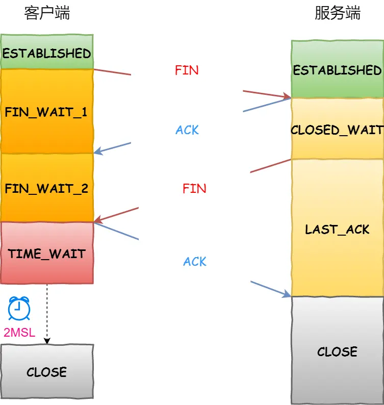

#### 三次握手建立连接

#### 面向连接

虽然就只是发了三次数据包，并且在各自的内存中维护了状态变量，但这么说总觉得太 low，你看这个过程相当于双方建立连接的过程，于是你灵机一动，就叫它**面向连接**吧。

注意：这个连接是虚拟的，是由通讯双方共同维护的，在网络中的设备根本就不知道连接这回事儿！

以下来自AI的回答：

> 在TCP（传输控制协议）中，面向连接是指在数据传输之前，通信双方需要建立一个逻辑连接。**这个连接并不是物理上的连接，而是一种虚拟的连接**，用于确保数据传输的可靠性和顺序性。具体来说，TCP的面向连接特性可以通过以下几个方面来理解：
>
> 1. **连接建立**：在数据传输之前，客户端和服务器需要通过三次握手（Three-way Handshake）建立连接。这个过程确保双方都准备好进行数据传输，并且确认了对方的网络地址和端口号。
>
> 传输控制协议（TCP，TransmissionControl Protocol）是一种面向连接的、可靠的、基于字节流的传输层通信协议，由IETF的RFC 793定义。
>
> 1. **连接维护**：一旦连接建立，TCP会维护一个连接状态，包括序列号、确认号等信息。这些信息用于确保数据包的顺序传输和重传机制，以保证数据的可靠性。
>
> 实际上就是在客户端和服务器端都维护一个变量，这个变量维护现在数据传输的状态，例如传输了哪些数据，下一次需要传输哪些数据，等等，并不是真的我们想象中的真的有什么东西连接着这两台主机。
>
> 1. **连接终止**：数据传输完成后，通信双方需要通过四次挥手（Four-way Handshake）来关闭连接。这个过程确保双方都知道连接已经结束，并且可以释放相关资源。

#### 四次握手断开连接

[你管这破玩意儿叫TCP](https://mp.weixin.qq.com/s/RsuuaC61b97-IM78kYRlIw?vid=1688855298418017&deviceid=f0774475-543e-4258-85a3-7234d867a804&version=4.1.0.6011&platform=win)  

[拔掉网线后，原本的TCP连接还存在吗？](https://mp.weixin.qq.com/s/h7bAjdyY83L6YoKTBcgGUA?vid=1688855298418017&deviceid=f0774475-543e-4258-85a3-7234d867a804&version=4.1.0.6011&platform=win)  

[TCP 三次握手与四次挥手面试题](https://www.xiaolincoding.com/network/3_tcp/tcp_interview.html#tcp-%E5%9F%BA%E6%9C%AC%E8%AE%A4%E8%AF%86)