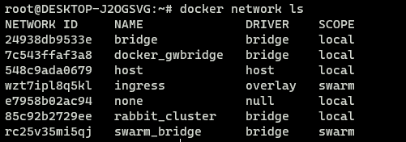

## Docker中的网络类型

Docker中网络按照驱动程序来分，常用的有[overlay](https://docs.docker.com/network/overlay/)和[bridge](https://docs.docker.com/network/bridge/)，需要注意，默认的bridge网络和用户自定义的bridge网络之间是[有差异](https://docs.docker.com/network/bridge/#differences-between-user-defined-bridges-and-the-default-bridge)的，主要一点是自定义bridge网络中，容器间可以通过hostname（默认为容器id）进行通讯，默认bridge只支持通过ip地址进行通讯，这点导致之前[在本地部署rabbitmq集群](../../../Blogs/中间件/MQ/RabbitMQ/使用Docker在本地搭建Rabbitmq集群.md)时花费了不少时间。

bridge网络用于同一个Docker host(on the same Docker daemon host)上的独立运行的容器实例间的通讯。bridge是默认的网络类型，在启动一个容器时未指定网络类型则网络类型就是bridge。

overlay网络可以将多个Docker daemon hosts连接到一起，实现swarm service之间互相通信。

除overlay和bridge之外还有，docker内置网络驱动还有：

none：表示禁用网络，该类型在swarm中不允许使用;   
host: 表示移除独立运行的容器和Docker host之间的网络隔离，直接使用host的网络;  
其它：ipvlan、macvlan、network plugins等。

### 作用域

作用域(Scope)主要有local、swarm、global几种，使用命令`docker network ls`可以查看相关信息：

在Swarm中无法使用local作用域的网络，反之亦然。

### IP & DNS

Docker会为每个网络分配一个私有的IP池，容器连到网络时就从池中取一个IP地址分配给容器。更多有关IP和DNS相关内容，可参考：[Container networking | Docker Documentation](https://docs.docker.com/config/containers/container-networking/)

### Docker Swarm网络

启用Docker Swarm或者加入一个Swarm集群时，会自动创建以下网络：

1. **ingress network**

   ingress是带有负载均衡功能的overlay网络，如果一个节点收到了请求，相应的容器不在当前节点上，那么该请求会被路由到运行所需容器的节点上：

   

2. **docker_gwbridge**

   docker_gwbridge是一个bridge网络，它将overlay网络连接到Docker守护进程的物理网络。默认情况下，Service下的每个容器都会连接到所在节点的docker_bridge网络。

Docker Swarm集群中每个节点的7946和4789两个端口要保持畅通：

+ 7946 用于容器网络发现(container network discovery)，支持TCP和UDP
+ 4789 用容器的overlay网络，支持UDP

## 推荐阅读
[Networking overview | Docker Documentation](https://docs.docker.com/network/#network-drivers)  

[Container networking | Docker Documentation](https://docs.docker.com/config/containers/container-networking/)  

[Use swarm mode routing mesh | Docker Documentation](https://docs.docker.com/engine/swarm/ingress/)