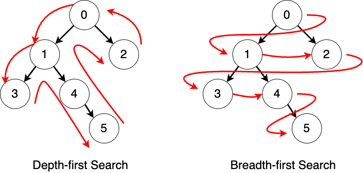

## 逻辑结构

### 二叉树


#### 平衡二叉树


#### 满二叉树


#### 完全二叉树


### B Tree


### B + Tree


## 存储结构

> 存储结构用来描述数据的特定表示形式


### 物理存储方式

顺序存储

链式存储


### 存储逻辑

1. **双亲表示法**：
   - **结构**：每个节点包含一个指向其父节点的指针。
   - **优点**：容易找到父节点。
   - **缺点**：查找子节点较为复杂，因为需要遍历整个结构来找到所有子节点。
2. **孩子表示法**：
   - **结构**：每个节点包含一个指向其第一个子节点的指针，子节点之间通过兄弟指针相连。
   - **优点**：容易找到子节点。
   - **缺点**：查找父节点较为复杂，需要额外的结构来存储父节点信息。
3. **孩子兄弟表示法**：
   - **结构**：结合了孩子表示法和兄弟表示法，每个节点有两个指针，一个指向第一个子节点，另一个指向下一个兄弟节点。
   - **优点**：能够高效地遍历树的所有节点。
   - **缺点**：结构相对复杂，维护成本较高。


## 遍历树

遍历方式可以分为：[广度优先 & 深度优先](https://moonbitlang.github.io/moonbit-textbook/trees/#binary-trees)



### 深度优先

> 深度优先搜索是一种沿着树的深度进行遍历的方式，直到访问到叶子节点后再回溯

1. **前序遍历（Pre-order Traversal）**:
   - 访问顺序：根节点 -> 左子树 -> 右子树。
   - 这种遍历方式首先访问根节点，然后递归地访问左子树和右子树。
   - 适用于需要在处理子节点之前处理父节点的场景.
2. **中序遍历（In-order Traversal）**:
   - 访问顺序：左子树 -> 根节点 -> 右子树。
   - 这种遍历方式在访问左子树后访问根节点，最后访问右子树。
   - 常用于二叉搜索树，因为它能按升序访问节点.
3. **后序遍历（Post-order Traversal）**:
   - 访问顺序：左子树 -> 右子树 -> 根节点。
   - 这种遍历方式在访问完所有子节点后才访问根节点。
   - 适用于需要在处理父节点之前处理子节点的场景，如计算树的高度或删除树.

深度优先使用递归或者栈来完成

> 深度优先遍历的空间复杂度主要取决于递归调用栈的深度。在最坏情况下（例如，树是一个链表），空间复杂度为 *O*(*V*)，其中 *V* 是节点的数量.

前序遍历

```py
class TreeNode:
    def __init__(self, value):
        self.value = value
        self.left = None
        self.right = None

def pre_order_traversal_non_recursive(root):
    if not root:
        return

    stack = [root]
    while stack:
        node = stack.pop()
        print(node.value, end=' ')  # 处理当前节点

        # 先将右子节点入栈，因为栈是后进先出，右子节点会后处理
        if node.right:
            stack.append(node.right)
        # 再将左子节点入栈
        if node.left:
            stack.append(node.left)

# 示例二叉树构建
root = TreeNode(1)
root.left = TreeNode(2)
root.right = TreeNode(3)
root.left.left = TreeNode(4)
root.left.right = TreeNode(5)
root.right.left = TreeNode(6)
root.right.right = TreeNode(7)

# 执行前序遍历（非递归）
pre_order_traversal_non_recursive(root)
```

中序遍历

```py
def in_order_traversal_non_recursive(root):
    stack = []
    current = root

    while stack or current:
        # 先遍历左子树
        while current:
            stack.append(current)
            current = current.left

        # 处理当前节点
        current = stack.pop()
        print(current.value, end=' ')

        # 遍历右子树
        current = current.right

# 执行中序遍历（非递归）
in_order_traversal_non_recursive(root)
```

后序遍历

```py
def post_order_traversal_non_recursive(root):
    if not root:
        return

    stack = []
    last_visited = None
    current = root

    while stack or current:
        if current:
            stack.append(current)
            current = current.left
        else:
            peek_node = stack[-1]
            # 如果右子节点存在且未被访问过，则先访问右子节点
            if peek_node.right and last_visited != peek_node.right:
                current = peek_node.right
            else:
                print(peek_node.value, end=' ')
                last_visited = stack.pop()

# 执行后序遍历（非递归）
post_order_traversal_non_recursive(root)
```


### 广度优先

> 广度优先搜索是一种逐层访问树节点的遍历方式，也称为**层次遍历（Level-order Traversal）**

- 访问顺序：从根节点开始，逐层从左到右访问每一层的节点。
- 这种遍历方式适用于需要按层次处理节点的场景，如最短路径问题.

基于队列实现广度优先

> 广度优先遍历的空间复杂度取决于队列中存储的节点数量。在最坏情况下，队列中可能会存储整棵树中某一层的所有节点，因此空间复杂度为 *O*(*w*)，其中 *w*是树的最大宽度.

```py
from collections import deque

class TreeNode:
    def __init__(self, value):
        self.value = value
        self.left = None
        self.right = None

def bfs(root):
    if not root:
        return

    queue = deque([root])  # 使用双端队列来实现队列

    while queue:
        current_node = queue.popleft()  # 从队列的左侧弹出节点
        print(current_node.value, end=' ')  # 处理当前节点

        # 将左子节点加入队列
        if current_node.left:
            queue.append(current_node.left)

        # 将右子节点加入队列
        if current_node.right:
            queue.append(current_node.right)

# 示例二叉树构建
root = TreeNode(1)
root.left = TreeNode(2)
root.right = TreeNode(3)
root.left.left = TreeNode(4)
root.left.right = TreeNode(5)
root.right.left = TreeNode(6)
root.right.right = TreeNode(7)

# 执行广度优先遍历
bfs(root)
```


## 推荐阅读

[Trees](https://moonbitlang.github.io/moonbit-textbook/trees)